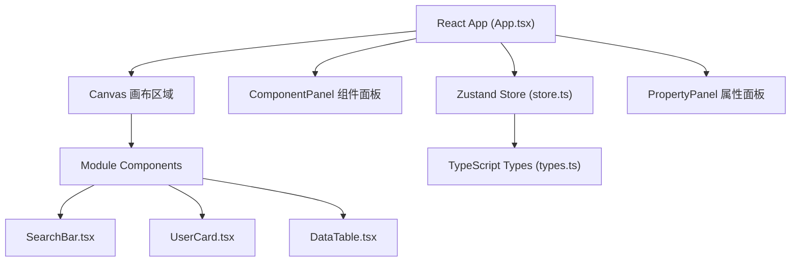

## 1. 架构设计



## 2. 技术描述

- **前端框架**：React 18 + TypeScript
- **状态管理**：Zustand
- **拖拽库**：@dnd-kit/core + @dnd-kit/sortable
- **构建工具**：Vite
- **唯一ID生成**：uuid

## 3. 文件结构

| 文件 | 职责 |
|-------|------|
| package.json | 依赖定义与启动脚本 |
| index.html | 入口HTML |
| tsconfig.json | TypeScript配置（严格模式，ES2020） |
| vite.config.js | Vite构建配置 |
| src/types.ts | 模块/属性/布局类型定义 |
| src/store.ts | Zustand全局状态管理 |
| src/App.tsx | 主组件，三栏布局容器 |
| src/Canvas.tsx | 画布组件，模块渲染+拖拽+缩放 |
| src/PropertyPanel.tsx | 属性编辑面板 |
| src/modules/SearchBar.tsx | 搜索栏模块组件 |
| src/modules/UserCard.tsx | 用户卡片模块组件 |
| src/modules/DataTable.tsx | 数据表格模块组件 |

## 4. 数据模型

### 4.1 核心类型定义

```typescript
type ModuleType = 'searchBar' | 'userCard' | 'dataTable';

interface SearchBarProps {
  placeholder: string;
  borderRadius: number;
  backgroundColor: string;
}

interface UserCardProps {
  avatarUrl: string;
  name: string;
  role: string;
  tagColor: string;
}

interface DataTableProps {
  columns: string[];
  rows: string[][];
}

interface ModuleInstance {
  id: string;
  type: ModuleType;
  x: number;
  y: number;
  width: number;
  height: number;
  props: SearchBarProps | UserCardProps | DataTableProps;
}

interface CanvasState {
  modules: ModuleInstance[];
  zoom: number;
  selectedId: string | null;
}
```

## 5. 状态管理 (Zustand Store)

- `modules: ModuleInstance[]` - 画布上所有模块实例
- `zoom: number` - 画布缩放比例 (0.5 - 2.0)
- `selectedId: string | null` - 当前选中模块ID
- Actions:
  - `addModule(type: ModuleType, x: number, y: number)` - 添加模块
  - `updateModule(id: string, updates: Partial<ModuleInstance>)` - 更新模块
  - `deleteModule(id: string)` - 删除模块
  - `setZoom(zoom: number)` - 设置缩放
  - `selectModule(id: string | null)` - 选中模块
  - `exportLayout(): string` - 导出JSON
  - `importLayout(json: string)` - 导入JSON
