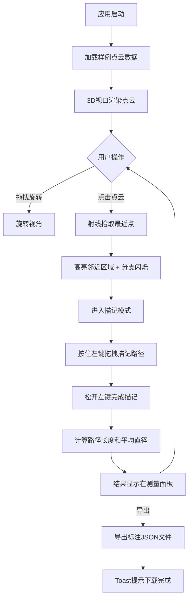

## 1. 产品概述

三维神经元树突结构标注与形态测量分析交互式可视化应用，面向生物科研人员，解决现有显微镜三维重建数据分析软件操作复杂且缺乏交互式标注功能的问题。通过3D点云可视化、射线拾取、路径描记和自动测量，实现树突分支直径和长度的快速定量分析。

- 目标用户：生物科研人员（神经科学、细胞生物学领域）
- 核心价值：将复杂的三维神经元形态分析流程简化为点击-拖拽的直觉操作，实时计算并展示测量结果

## 2. 核心功能

### 2.1 功能模块

1. **3D视口主页**：全屏3D点云渲染、交互拾取、路径描记、测量结果展示、控制面板

### 2.2 页面详情

| 页面名称 | 模块名称 | 功能描述 |
|----------|----------|----------|
| 3D视口主页 | 点云渲染模块 | 加载并渲染约2000个神经元点云粒子（小球体，半径0.03，6色调色板映射类别标签0-5），深色背景#0f172a，相机初始位置(3,2,5) |
| 3D视口主页 | 数据加载模块 | 自动加载内置样例JSON点云数据（5-8条树突分支），解析为点云对象数组 |
| 3D视口主页 | 拾取与描记模块 | 射线检测拾取最近点，邻近区域（半径0.15）高亮白色，分支闪烁2次确认，进入描记模式后拖拽生成半透明线管路径（#a78bfa，间隔0.1单位） |
| 3D视口主页 | 测量计算模块 | 路径长度=相邻点欧几里得距离累加（2位小数）；平均直径=每隔0.3单位取横截面，最近20点最小二乘圆拟合，取均值（2位小数） |
| 3D视口主页 | UI控制模块 | 左上角控制面板（重置视角、清除所有标注），右下角测量结果面板（路径编号、长度、直径、清除/导出按钮），Toast提示 |

## 3. 核心流程

用户启动应用 → 自动加载内置样例点云数据 → 3D视口渲染点云 → 用户鼠标拖拽旋转视角 → 点击点云区域拾取树突分支 → 高亮+闪烁确认 → 进入描记模式 → 按住左键拖拽描记路径 → 松开左键完成描记 → 自动计算路径长度和平均直径 → 结果显示在测量面板 → 可继续标注新路径 → 可导出全部标注JSON

## 4. 用户界面设计

### 4.1 设计风格

- **主色调**：深色科技风格，背景#0f172a，面板背景rgba(30,41,59,0.8)半透明磨砂
- **调色板**：6色点云[#3b82f6, #22c55e, #f59e0b, #ef4444, #8b5cf6, #ec4899]，高亮白色#ffffff，描记路径#a78bfa
- **按钮风格**：圆角6-8px，深色背景带悬停效果，点击缩放0.95倍过渡0.15s ease
- **字体**：Monaco 16px用于数值显示
- **布局**：全屏3D视口 + 浮动半透明磨砂玻璃面板
- **玻璃效果**：backdrop-filter: blur(8px)，边框1px solid rgba(255,255,255,0.1)

### 4.2 页面设计概览

| 页面名称 | 模块名称 | UI元素 |
|----------|----------|--------|
| 3D视口主页 | 3D视口 | 全屏canvas，深色背景#0f172a，2000个小球体点云，鼠标悬停pointer光标，描记模式crosshair光标 |
| 3D视口主页 | 控制面板（左上角） | 宽200px，磨砂玻璃效果，重置视角按钮（32x32图标，#334155圆角8px，悬停#475569），清除所有标注按钮 |
| 3D视口主页 | 测量结果面板（右下角） | 宽240px，背景#1e293b磨砂，圆角8px，内边距12px，路径编号递增，长度/直径数值Monaco/16px/#a78bfa，清除按钮（#ef4444，点击#dc2626），导出按钮（#22c55e） |
| 3D视口主页 | Toast提示 | 右上角，背景#1e293b，文字#22c55e，持续2秒 |

### 4.3 响应式

- 桌面优先设计，3D视口自适应窗口大小
- 面板采用fixed定位，随窗口缩放保持位置

### 4.4 3D场景指引

- **环境**：深色背景#0f172a，无环境光需求（点云自发光小球体渲染）
- **相机**：PerspectiveCamera，初始位置(3,2,5)，目标原点，支持鼠标拖拽旋转
- **交互**：OrbitControls旋转，Raycaster射线拾取，描记模式拖拽生成路径
- **性能**：2000点云粒子下帧率≥45FPS，拾取反馈延迟≤100ms，测量计算≤50ms

## 5. 技术约束

- 技术栈：TypeScript + Three.js + Vite
- 依赖：three, @types/three, typescript, vite, uuid
- 文件结构按功能模块划分：3D渲染模块、数据加载模块、拾取与描记模块、测量计算模块、UI控制模块
- 无后端，纯前端应用
- 所有交互操作伴平滑过渡动画（0.2s ease-out）
