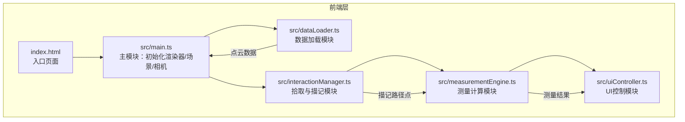

## 1. 架构设计



数据流向：文件(JSON) → dataLoader(解析) → main.ts(渲染) → interactionManager(拾取/描记) → measurementEngine(计算) → uiController(展示)

## 2. 技术说明

- **前端**：TypeScript + Three.js + Vite（纯前端，无框架）
- **构建工具**：Vite
- **3D渲染**：Three.js（PerspectiveCamera, OrbitControls, Raycaster）
- **后端**：无
- **数据库**：无（使用内置样例数据）
- **依赖**：three, @types/three, typescript, vite, uuid

## 3. 文件结构与调用关系

```
project/
├── package.json                  # 依赖与脚本
├── vite.config.js               # Vite配置
├── tsconfig.json                # TypeScript配置
├── index.html                   # 入口页面
└── src/
    ├── main.ts                  # 主模块：初始化Three.js、加载点云、动画循环
    ├── dataLoader.ts            # 数据加载模块：加载JSON点云
    ├── interactionManager.ts    # 拾取与描记模块：射线拾取、路径描记
    ├── measurementEngine.ts     # 测量计算模块：路径长度与直径计算
    └── uiController.ts          # UI控制模块：面板显示与交互
```

### 模块调用关系

| 调用方 | 被调用方 | 数据/功能 |
|--------|----------|-----------|
| main.ts | dataLoader.ts | 加载点云数据 |
| main.ts | interactionManager.ts | 注册鼠标事件 |
| interactionManager.ts | main.ts | 高亮选中区域、生成路径线 |
| interactionManager.ts | measurementEngine.ts | 传递描记路径点 |
| measurementEngine.ts | uiController.ts | 输出测量结果 |
| uiController.ts | DOM | 渲染面板、Toast |

## 4. 数据模型

### 4.1 点云数据结构

```typescript
interface PointCloudPoint {
  x: number;
  y: number;
  z: number;
  label: number; // 0-5 类别标签
}

interface PointCloudData {
  points: PointCloudPoint[];
}
```

### 4.2 描记路径数据结构

```typescript
interface TracePath {
  id: string;           // uuid
  index: number;        // 路径编号（从1递增）
  points: THREE.Vector3[]; // 描记路径点序列
  length: number;       // 路径长度（微米）
  avgDiameter: number;  // 平均直径（微米）
}
```

### 4.3 导出JSON结构

```typescript
interface ExportData {
  timestamp: string;
  annotations: {
    pathIndex: number;
    points: { x: number; y: number; z: number }[];
    length: number;
    avgDiameter: number;
  }[];
}
```

## 5. 核心算法

### 5.1 路径长度计算

相邻描记点之间的三维欧几里得距离累加：`L = Σ sqrt((x₂-x₁)² + (y₂-y₁)² + (z₂-z₁)²)`

### 5.2 平均直径计算

1. 沿路径每隔0.3单位取一个横截面位置
2. 在每个截面位置，计算垂直于路径方向的平面
3. 找到距离该平面最近的20个点云点
4. 对这20个点拟合最小二乘圆（投影到截面上）
5. 取所有截面直径的平均值

### 5.3 最小二乘圆拟合

将点投影到截面平面后，用代数拟合方法求解圆心(x₀,y₀)和半径r：
最小化 Σ(xᵢ-x₀)² + (yᵢ-y₀)² - r²
