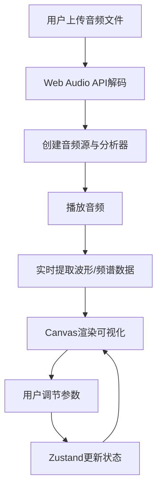

## 1. 产品概述

音画互动可视化工具，让用户自由组合音乐波形与频谱图案的创意平台。解决现有音乐可视化工具操作复杂或效果单一的痛点，目标用户为音乐爱好者、视觉设计师和创意人群。通过"搭积木"式的交互方式，让用户轻松创建个性化的音乐可视化效果。

## 2. 核心功能

### 2.1 功能模块
1. **音频上传与播放模块**: 文件选择器、音频解码、播放控制
2. **可视化渲染模块**: Canvas实时渲染、四种可视化模式
3. **参数控制面板**: 模式切换、动画参数调节、颜色选择器、主题切换
4. **状态管理模块**: 播放状态、可视化参数、主题状态

### 2.2 页面详情
| 页面名称 | 模块名称 | 功能描述 |
|---------|----------|---------|
| 主页面 | 可视化区域 | Canvas画布、音频播放控制、文件上传入口 |
| 主页面 | 控制面板 | 模式切换按钮组、参数调节滑块、颜色选择器、主题切换 |
| 主页面 | 预设色板 | 16种预设颜色选择、悬停放大效果、点击动画 |

## 3. 核心流程

用户上传本地音频文件 → 系统自动解码并播放 → 实时提取时域/频域数据 → Canvas渲染可视化效果 → 用户切换模式/调节参数/选择颜色 → 效果实时更新。

## 4. 用户界面设计

### 4.1 设计风格
- 主色调: 霓虹色系，默认主色 `#6366f1`，背景 `#0f172a`
- 按钮风格: 圆角设计，悬停亮度提升20%，点击缩放0.95
- 字体: 使用独特的现代无衬线字体组合，提升视觉品质
- 布局: 左侧可视化区最大化，右侧控制面板宽320px，半透明磨砂效果
- 动效: 模式切换0.3s淡入淡出，颜色切换0.4s ease-out，主题切换0.5s平滑过渡

### 4.2 页面设计概述
| 页面名称 | 模块名称 | UI元素 |
|---------|----------|--------|
| 主页面 | 可视化区域 | Canvas画布(1024x512)、播放控制按钮、文件上传按钮 |
| 主页面 | 控制面板 | 模式切换按钮组(4种)、参数滑块组(动态)、预设色板(16色)、主题切换单选框 |
| 主页面 | 分割线 | #334155 颜色的分割线分隔控件区域 |

### 4.3 响应式
- Desktop-first 设计
- 宽度 < 768px 时，右侧控制面板折叠到底部，变为横向滚动区域
- 核心可视化区始终占据最大空间
- 触控操作优化，滑块和按钮区域增大

### 4.4 性能要求
- 音频解码和可视化渲染全程不低于 55 FPS
- 使用 requestAnimationFrame 驱动数据计算和动画渲染
- UI交互无卡顿，参数调整实时反馈
