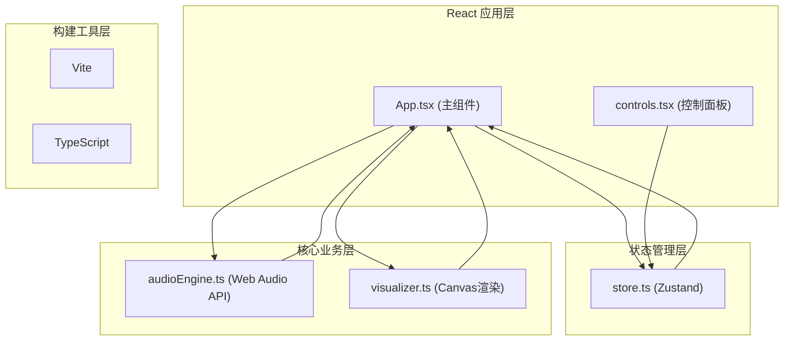

## 1. 架构设计



## 2. 技术描述
- 前端: React@18 + TypeScript@5 + Vite@5
- 状态管理: zustand@4
- 音频处理: 原生 Web Audio API (AudioContext, AnalyserNode)
- 图形渲染: 原生 Canvas 2D API
- 图标: lucide-react
- 工具库: uuid

## 3. 项目文件结构
```
auto124/
├── index.html
├── package.json
├── tsconfig.json
├── vite.config.js
└── src/
    ├── main.tsx          # React 入口
    ├── App.tsx           # 主组件，布局与协调
    ├── store.ts          # Zustand 状态管理
    ├── audioEngine.ts    # 音频解码与分析
    ├── visualizer.ts     # Canvas 可视化渲染
    └── controls.tsx      # 控制面板 UI
```

## 4. 核心数据模型

### 4.1 可视化模式
```typescript
type VisualizerMode = 'waveform' | 'spectrum' | 'circular' | 'particle';
```

### 4.2 Store 状态
```typescript
interface VisualizerState {
  mode: VisualizerMode;
  isPlaying: boolean;
  primaryColor: string;
  backgroundColor: string;
  theme: 'dark' | 'light';
  // 波形参数
  waveformLineWidth: number;
  // 频谱参数
  fftSize: number;
  spectrumBarWidth: number;
  spectrumColorMode: 'solid' | 'rainbow';
  // 环形频谱参数
  circularRadius: number;
  // 粒子参数
  particleCount: number;
  // Actions
  setMode: (mode: VisualizerMode) => void;
  setPlaying: (playing: boolean) => void;
  setPrimaryColor: (color: string) => void;
  setBackgroundColor: (color: string) => void;
  setTheme: (theme: 'dark' | 'light') => void;
  setParam: (key: string, value: number | string) => void;
}
```

### 4.3 音频引擎接口
```typescript
interface AudioEngine {
  audioContext: AudioContext | null;
  analyser: AnalyserNode | null;
  source: AudioBufferSourceNode | null;
  decodeAudioFile(file: File): Promise<AudioBuffer>;
  play(buffer: AudioBuffer): void;
  stop(): void;
  getWaveformData(): Uint8Array;
  getFrequencyData(): Uint8Array;
}
```

## 5. 渲染性能优化
- 使用 TypedArray (Uint8Array) 传递音频数据
- Canvas 渲染采用离屏缓冲避免频繁重绘
- requestAnimationFrame 与音频数据更新同步
- 控件事件防抖处理，避免频繁状态更新
- 粒子系统采用对象池模式，减少 GC 压力
