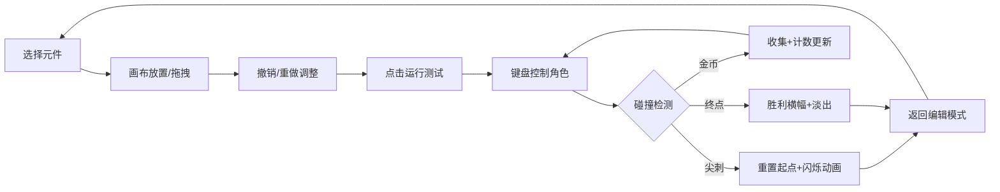

## 1. 产品概述

2D平台关卡原型编辑器是一款面向游戏设计师的浏览器应用，帮助用户快速制作并测试2D平台游戏关卡。解决传统纸笔或图片绘制方式无法直观判断跳跃距离、平台间距和道具摆放合理性，导致反复迭代耗时的问题。通过可视化编辑和即时物理模拟，让设计师能够高效验证关卡设计。

## 2. 核心功能

### 2.1 功能模块

1. **关卡编辑画布**：鼠标点击绘制平台、拖拽调整位置、元件渲染与交互反馈
2. **左侧工具栏**：平台、尖刺、金币、终点旗四种元件切换
3. **角色物理引擎**：2D角色移动、跳跃、重力模拟与碰撞检测
4. **撤销重做系统**：支持最近5次操作的撤销与重做
5. **底部状态栏**：显示当前绘制元件名称和鼠标位置
6. **游戏测试模式**：运行按钮启动角色测试，包含胜利/失败判定

### 2.2 页面详情

| 页面名称 | 模块名称 | 功能描述 |
|-----------|-------------|---------------------|
| 主编辑页面 | 左侧工具栏 | 48x48px图标元件按钮，选中状态边框高亮，按压缩放动画 |
| 主编辑页面 | 画布区域 | Canvas绘制平台/尖刺/金币/终点，支持点击创建、拖拽调整 |
| 主编辑页面 | 底部状态栏 | 12px字体显示当前工具和鼠标坐标 |
| 主编辑页面 | 运行按钮 | 切换到游戏测试模式 |
| 游戏测试模式 | 角色控制 | 方向键移动、空格跳跃，实时物理模拟 |
| 游戏测试模式 | HUD显示 | 右上角24px白色数字显示金币计数 |
| 游戏测试模式 | 胜利横幅 | 300px宽绿色横幅，1.5秒后淡出回到编辑模式 |

## 3. 核心流程

用户在左侧工具栏选择元件，在画布上点击或拖拽放置关卡元素，可随时撤销/重做操作。点击运行按钮后进入测试模式，通过键盘控制角色移动跳跃，验证关卡难度和设计合理性。测试完成或碰到尖刺后返回编辑模式，继续迭代设计。

## 4. 用户界面设计

### 4.1 设计风格
- **主色调**：深色主题，主背景#0f172a，面板背景#1e293b，文字#cbd5e1
- **元件颜色**：平台#8b5cf6，角色#facc15，胜利横幅#22c55e，选中边框#3b82f6
- **按钮样式**：圆角8px工具栏按钮，4px圆角平台矩形
- **动画效果**：0.15秒ease-out按压缩放，0.3秒红色闪烁，0.2秒蓝色光晕
- **布局**：左侧固定80px工具栏，右侧自适应画布，底部状态栏

### 4.2 页面设计概述

| 页面名称 | 模块名称 | UI元素 |
|-----------|-------------|-------------|
| 主编辑页面 | 工具栏 | 48x48px图标，#1e293b背景，8px圆角，选中时2px solid #3b82f6边框 |
| 主编辑页面 | 画布 | 最小宽度100%-80px，高度600px，平台#8b5cf6带4px圆角 |
| 主编辑页面 | 状态栏 | 12px字体，显示当前工具名和鼠标坐标 |
| 游戏测试模式 | 角色 | 32x32px #facc15像素角色，跳跃动画 |
| 游戏测试模式 | HUD | 右上角24px白色数字金币计数 |
| 游戏测试模式 | 胜利横幅 | 300px宽居中，#22c55e背景，16px圆角，28px白色Winner!文字 |

### 4.3 性能要求
- 关卡编辑时FPS不低于55（100个平台场景下）
- 角色物理模拟与碰撞检测更新间隔不超过16ms
- 撤销重做状态变化时显示蓝色环状光晕（半径20px，透明度0.6→0，0.2秒）

### 4.4 交互反馈
- 元件切换：0.15秒ease-out按压缩放效果
- 状态变化：画布边缘短暂蓝色环状光晕
- 碰到尖刺：0.3秒红色闪烁动画后重置
- 胜利横幅：1.5秒后淡出回到编辑模式
