## 1. 架构设计

```mermaid
graph TD
    A["React UI层"] --> B["Zustand状态管理"]
    B --> C["Canvas绘制层"]
    B --> D["物理引擎层"]
    C --> E["编辑器组件 (editor.tsx)"]
    D --> F["物理模块 (physics.ts)"]
    B --> G["Store (store.ts)"]
    
    style A fill:#1e293b,stroke:#3b82f6
    style B fill:#1e293b,stroke:#8b5cf6
    style C fill:#1e293b,stroke:#22c55e
    style D fill:#1e293b,stroke:#facc15
```



## 2. 技术描述

- **前端框架**：React@18 + TypeScript + Vite
- **状态管理**：Zustand
- **图形渲染**：Canvas API
- **唯一标识**：uuid
- **初始化工具**：vite-init

## 3. 文件结构

| 文件路径 | 职责描述 |
|----------|----------|
| package.json | 依赖管理（react, react-dom, zustand, uuid, typescript, vite, @vitejs/plugin-react） |
| vite.config.js | Vite基础配置，指定index.html入口 |
| tsconfig.json | TypeScript严格模式，target ES2020，module ESNext |
| index.html | 入口页面 |
| src/store.ts | Zustand状态管理，元件列表、当前工具、角色位置、分数、撤销重做 |
| src/editor.tsx | 关卡编辑画布组件，鼠标事件、元件渲染、交互反馈 |
| src/physics.ts | 物理引擎，角色位置/速度/重力、碰撞检测、道具拾取 |
| src/App.tsx | 主应用组件，整合工具栏、画布、状态栏 |
| src/main.tsx | React入口 |

## 4. 数据模型

### 4.1 元件类型定义

```typescript
type ToolType = 'platform' | 'spike' | 'coin' | 'goal';

interface PlatformElement {
  id: string;
  type: 'platform';
  x: number;
  y: number;
  width: number;
  height: number;
  color: string;
  borderRadius: number;
}

interface SpikeElement {
  id: string;
  type: 'spike';
  x: number;
  y: number;
  width: number;
  height: number;
}

interface CoinElement {
  id: string;
  type: 'coin';
  x: number;
  y: number;
  radius: number;
  collected: boolean;
}

interface GoalElement {
  id: string;
  type: 'goal';
  x: number;
  y: number;
  width: number;
  height: number;
}

type LevelElement = PlatformElement | SpikeElement | CoinElement | GoalElement;

interface CharacterState {
  x: number;
  y: number;
  vx: number;
  vy: number;
  width: number;
  height: number;
  onGround: boolean;
  startX: number;
  startY: number;
}

interface EditorState {
  elements: LevelElement[];
  currentTool: ToolType;
  score: number;
  isPlaying: boolean;
  character: CharacterState;
  history: LevelElement[][];
  historyIndex: number;
}
```

### 4.2 Store Action方法

| 方法名 | 功能描述 |
|--------|----------|
| addPlatform | 添加平台元件 |
| removePlatform | 移除指定元件 |
| updateElement | 更新元件位置/属性 |
| setCurrentTool | 设置当前绘制工具 |
| recordSnapshot | 记录操作快照用于撤销重做 |
| undo | 撤销最近操作 |
| redo | 重做已撤销操作 |
| setPlaying | 切换编辑/测试模式 |
| resetCharacter | 重置角色到起点 |
| collectCoin | 收集金币增加分数 |
| triggerWin | 触发胜利效果 |
| triggerHit | 触发受击动画 |

## 5. 核心模块说明

### 5.1 物理引擎模块 (physics.ts)

- **物理参数**：水平速度200px/s，跳跃初速度400px/s，重力800px/s²
- **碰撞检测**：AABB碰撞检测，分离X/Y轴检测防止穿墙
- **更新机制**：requestAnimationFrame，时间步长16ms，固定时间步更新
- **碰撞判定**：
  - 尖刺：重置角色到起点，触发0.3秒红色闪烁
  - 金币：标记已收集，分数+1
  - 终点：触发胜利横幅，1.5秒后返回编辑模式

### 5.2 编辑器组件 (editor.tsx)

- **鼠标事件**：mousedown/mousemove/mouseup处理元件创建和拖拽
- **Canvas渲染**：每帧重绘所有元件和角色
- **动画反馈**：
  - 状态变化光晕：canvas边缘蓝色光环，半径20px，透明度0.6→0，0.2秒
  - 受击闪烁：红色遮罩0.3秒
  - 胜利横幅：300px宽居中绿色横幅，1.5秒淡出
- **Ref暴露**：canvas元素ref供物理模块访问

### 5.3 撤销重做系统

- 历史栈深度：最近5次操作
- 快照时机：元件增删、位置变化时
- 快捷键：Ctrl+Z撤销，Ctrl+Shift+Z重做

## 6. 性能优化策略

- **Canvas分层**：静态元件缓存到离屏Canvas，减少重绘开销
- **增量渲染**：仅在状态变化时重绘，编辑模式下按需渲染
- **碰撞优化**：空间分区，仅检测邻近元件碰撞
- **requestAnimationFrame**：与浏览器刷新率同步，避免掉帧
- **对象池**：复用Canvas绘图上下文，减少GC压力
