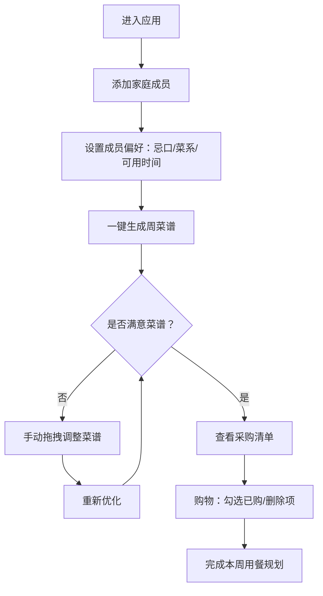

## 1. 产品概述

家庭用餐计划智能编排工具——帮助家庭成员协同管理饮食偏好与时间安排，自动生成每周三餐菜谱和采购清单，支持手动调整与重新优化，让家庭饮食规划高效、健康、省心。

- 解决家庭成员饮食偏好不统一、菜谱规划费时费力、采购清单易遗漏的问题
- 面向需要协同管理家庭饮食的用户群体，提供一站式用餐规划体验

## 2. 核心功能

### 2.1 用户角色

| 角色 | 说明 | 核心权限 |
|------|------|----------|
| 家庭管理员 | 默认添加的第一个成员 | 添加/编辑/删除成员，生成菜谱，管理采购清单 |
| 家庭成员 | 由管理员添加 | 查看菜谱和采购清单 |

### 2.2 功能模块

1. **首页**：产品介绍、快速导航、本周菜谱概览卡片
2. **成员管理页**：添加/编辑家庭成员，设置忌口、偏好菜系、每周餐段可用性
3. **周计划页**：7×3菜谱网格展示、拖拽交换、菜谱详情弹窗、一键生成
4. **采购清单页**：按类别分组的食材清单、合并数量、勾选已购、删除项

### 2.3 页面详情

| 页面名称 | 模块名称 | 功能描述 |
|----------|----------|----------|
| 首页 | Hero区域 | 产品名称、简介、快速操作按钮（生成菜谱、管理成员） |
| 首页 | 本周概览 | 展示本周已生成的菜谱缩略信息，点击跳转周计划页 |
| 首页 | 导航栏 | 四个页面切换入口，当前页高亮 |
| 成员管理页 | 添加成员表单 | 输入姓名、设置忌口（最多5项）、偏好菜系（最多3项） |
| 成员管理页 | 成员列表 | 展示所有成员卡片，可展开/折叠编辑偏好，折叠动画 |
| 成员管理页 | 餐段可用性日历 | 色块日历7×3网格，点击切换可用/不可用，淡入淡出动画 |
| 周计划页 | 菜谱网格 | 7天×3餐卡片网格，显示菜名和预估烹饪时间 |
| 周计划页 | 菜谱详情弹窗 | 点击卡片弹出：食材列表、简要步骤说明 |
| 周计划页 | 拖拽交换 | HTML5 Drag and Drop API，交换时3D翻转动画（400ms） |
| 周计划页 | 一键生成 | 根据成员偏好和可用性自动编排菜谱 |
| 采购清单页 | 分类食材列表 | 按蔬菜、肉类、调料等分组，同类合并数量 |
| 采购清单页 | 勾选已购 | 点击勾选时涟漪动画反馈 |
| 采购清单页 | 删除项 | 删除不需要的食材项 |

## 3. 核心流程

1. 用户进入应用，首先在成员管理页添加家庭成员（至少4个）
2. 每个成员设置忌口（不吃辣、素食、坚果过敏等，最多5项）、偏好菜系（中餐、西餐、日料等，最多3项）、每周各餐段可用性
3. 切换到周计划页，点击"一键生成"按钮，系统基于贪心+局部搜索策略自动编排一周菜谱
4. 菜谱以7×3网格展示，用户可点击查看详情、拖拽交换餐段
5. 系统根据菜谱自动生成采购清单，按食材类别分组、合并同类项
6. 用户在采购清单页勾选已购买项或删除不需要的项
7. 用户可手动调整菜谱后重新优化，采购清单同步更新

## 4. 用户界面设计

### 4.1 设计风格

- 主色调：暖色系——主背景 #FFF8E7，卡片背景 #FFFFFF，头部导航 #F4A460
- 按钮：圆角12px，主按钮使用 #F4A460 背景色，悬停加深
- 字体：标题使用 Noto Serif SC（衬线，温暖感），正文使用 Noto Sans SC（清晰易读）
- 布局：卡片式布局，顶部导航，12px圆角统一
- 图标：lucide-react 图标库，线性风格

### 4.2 页面设计概览

| 页面名称 | 模块名称 | UI要素 |
|----------|----------|--------|
| 首页 | Hero区域 | 居中大标题、副标题、两个操作按钮，暖色渐变背景 |
| 首页 | 本周概览 | 3张横向滚动卡片，悬停上浮阴影效果 |
| 成员管理页 | 添加成员表单 | 左侧表单区，右侧预览区，字段使用下拉多选 |
| 成员管理页 | 成员列表 | 卡片列表，点击展开/折叠，折叠动画300ms |
| 成员管理页 | 可用性日历 | 7列×3行色块网格，可用为#F4A460，不可用为#E0D5C5，点击淡入淡出200ms |
| 周计划页 | 菜谱网格 | 7列×3行卡片，卡片含菜名+烹饪时间标签，悬停上浮阴影 |
| 周计划页 | 菜谱详情弹窗 | 居中弹窗，食材列表+步骤说明，点击外部关闭 |
| 周计划页 | 拖拽交换 | 拖拽时卡片半透明，放置目标高亮边框，翻转动画3D perspective 1000px，400ms |
| 采购清单页 | 分类食材列表 | 按类别折叠分组，食材项含名称+数量+勾选框，勾选涟漪动画 |

### 4.3 响应式设计

- 桌面优先设计，断点768px
- 宽度 ≥ 768px：标准多列布局
- 宽度 < 768px：周视图改为逐日滑动（左滑右滑切换日期），表单改为全宽单列，导航改为底部标签栏

### 4.4 动画规范

| 动画类型 | 触发条件 | 参数 |
|----------|----------|------|
| 卡片悬停上浮 | hover | translateY(-2px), box-shadow 0 4px 12px rgba(0,0,0,0.1), 200ms ease |
| 折叠展开 | 点击成员卡片 | max-height过渡，300ms ease |
| 色块切换 | 点击日历格子 | opacity过渡，200ms ease |
| 3D翻转 | 拖拽交换餐段 | perspective 1000px, rotateY 180°, 400ms ease-in-out |
| 涟漪反馈 | 勾选采购项 | 从点击位置扩散圆形波纹，600ms |
| 页面切换 | 路由变化 | opacity 0→1, 300ms ease |
