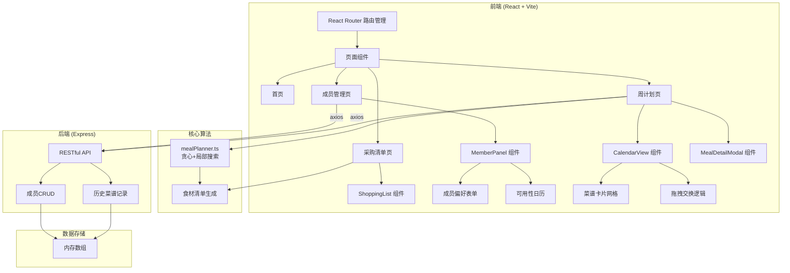
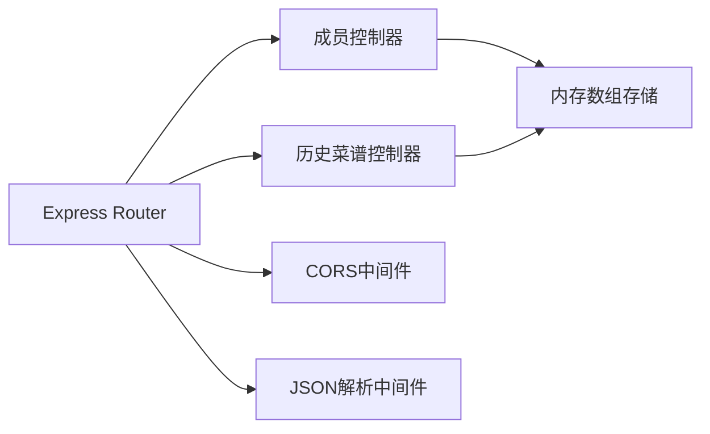
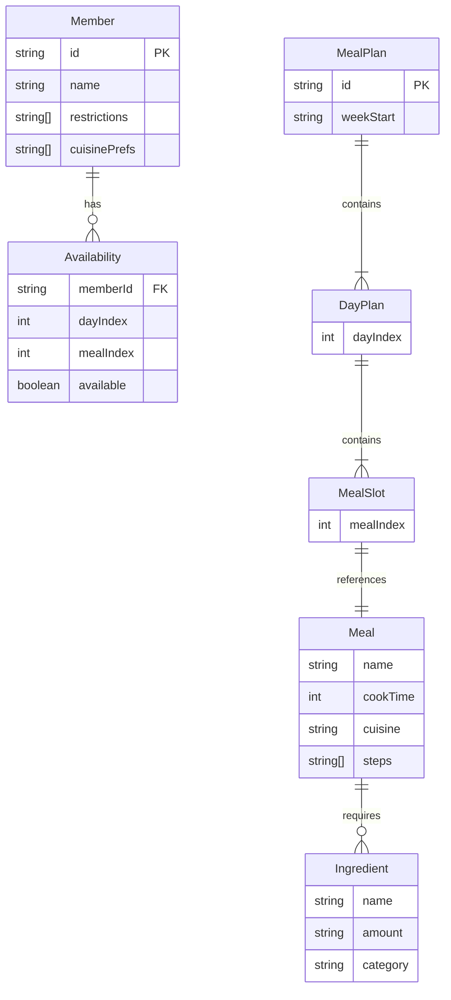

## 1. 架构设计



## 2. 技术说明

- 前端：React 18 + TypeScript + styled-components + Vite
- 初始化工具：vite-init（react-express-ts模板）
- 后端：Express 4 + TypeScript + CORS
- 数据库：内存数组（无持久化数据库，符合用户要求）
- 状态管理：Zustand
- 路由：React Router DOM v6
- 样式：styled-components（暖色系主题，CSS变量）
- 图标：lucide-react
- 拖拽：HTML5 Drag and Drop API

## 3. 路由定义

| 路由 | 用途 |
|------|------|
| / | 首页，产品介绍与快速导航 |
| /members | 成员管理页，添加/编辑成员及偏好 |
| /plan | 周计划页，查看/生成/调整每周菜谱 |
| /shopping | 采购清单页，查看/勾选/删除食材 |

## 4. API 定义

### 4.1 成员管理

```typescript
interface Member {
  id: string;
  name: string;
  restrictions: string[];    // 忌口，最多5项
  cuisinePrefs: string[];    // 偏好菜系，最多3项
  availability: boolean[][]; // [7天][3餐] 可用性矩阵
}

// GET /members - 获取所有成员
// Response: Member[]

// POST /members - 添加成员
// Request: Omit<Member, 'id'>
// Response: Member

// PUT /members/:id - 更新成员
// Request: Partial<Member>
// Response: Member

// DELETE /members/:id - 删除成员
// Response: { success: boolean }
```

### 4.2 历史菜谱

```typescript
interface MealPlan {
  id: string;
  weekStart: string;         // ISO日期
  meals: MealAssignment[][]; // [7天][3餐]
}

interface MealAssignment {
  name: string;
  cookTime: number;          // 分钟
  ingredients: Ingredient[];
  steps: string[];
  cuisine: string;
}

interface Ingredient {
  name: string;
  amount: string;
  category: string;          // 蔬菜/肉类/调料等
}

// GET /history - 获取历史菜谱
// Response: MealPlan[]

// POST /history - 保存菜谱
// Request: Omit<MealPlan, 'id'>
// Response: MealPlan
```

## 5. 服务端架构图



## 6. 数据模型

### 6.1 数据模型定义



### 6.2 核心算法说明

mealPlanner.ts 采用贪心+局部搜索策略：

1. **贪心阶段**：遍历每个餐段，根据该时段可用成员的偏好交集，从菜谱库中选择得分最高的菜品
2. **局部搜索阶段**：随机交换两个餐段的菜品，如果交换后整体满意度提升则保留，否则回退。迭代有限次数（≤100次）
3. **食材清单生成**：遍历最终菜谱中所有菜品的食材，按类别分组，同名食材合并数量
4. **性能要求**：客户端完成计算，100种组合以下响应时间 ≤ 500ms
