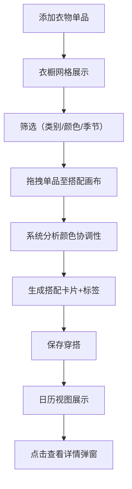

## 1. 产品概述

个人服装库存管理与穿搭推荐应用，帮助用户解决日常穿搭选择困难和服装利用率低的问题。通过数字化衣橱管理、智能搭配创建和穿搭日历回顾，让每一件衣服都得到充分利用。

- 目标用户：注重穿搭但常感选择困难的都市人群
- 核心价值：降低穿搭决策成本，提升服装利用率，记录穿搭历史

## 2. 核心功能

### 2.1 用户角色
| 角色 | 注册方式 | 核心权限 |
|------|----------|----------|
| 普通用户 | 无需注册 | 管理个人衣橱、创建穿搭、查看日历 |

### 2.2 功能模块
1. **衣橱页面**：衣物单品网格展示、添加/筛选/拖拽单品
2. **穿搭创建页面**：双栏布局搭配创建、颜色协调性标签推荐
3. **穿搭日历页面**：月历视图展示穿搭历史、点击查看详情

### 2.3 页面详情
| 页面名称 | 模块名称 | 功能描述 |
|----------|----------|----------|
| 衣橱页面 | 单品添加表单 | 输入名称、选择类别/颜色/图片URL，添加新衣物 |
| 衣橱页面 | 瀑布流网格 | 等大网格展示所有单品，支持类别/颜色/季节筛选 |
| 衣橱页面 | 筛选条件栏 | 按类别、颜色、季节筛选，切换时淡入淡出动画300ms |
| 穿搭创建页面 | 左侧衣橱面板 | 占比40%，可筛选衣橱，支持拖拽单品 |
| 穿搭创建页面 | 右侧搭配画布 | 占比60%，拖拽放置区，最多5件单品 |
| 穿搭创建页面 | 搭配保存 | 生成搭配卡片，基于颜色协调性给出建议标签 |
| 穿搭日历页面 | 月日历网格 | 每日展示穿搭缩略图，未记录日期灰色加点提示 |
| 穿搭日历页面 | 详情弹窗 | 点击日历格子弹出大图查看穿搭详情 |

## 3. 核心流程

用户添加衣物单品到衣橱 → 通过筛选快速定位单品 → 拖拽单品到搭配画布创建穿搭 → 系统基于颜色协调性生成标签 → 保存穿搭到历史记录 → 日历视图回顾每日穿搭

## 4. 用户界面设计

### 4.1 设计风格
- 主背景色：浅灰 #f5f5f0
- 衣橱卡片：白色背景 + 2px浅阴影
- 搭配画布背景：浅暖色 #fff8f0
- 圆角：12px
- 字体：无衬线字体（Noto Sans SC）
- 拖拽效果：卡片缩放1.1倍 + 半透明阴影跟随
- 筛选动画：淡入淡出 300ms ease

### 4.2 页面设计概述
| 页面名称 | 模块名称 | UI元素 |
|----------|----------|--------|
| 衣橱页面 | 单品添加表单 | 表单输入框、色块选择器、类别下拉、提交按钮 |
| 衣橱页面 | 瀑布流网格 | 等大卡片网格，每张含图片/名称/色块，白色卡片+阴影 |
| 衣橱页面 | 筛选条件栏 | 类别按钮组、颜色选择器、季节标签 |
| 穿搭创建页面 | 左侧衣橱面板 | 40%宽度，可筛选衣橱列表，拖拽源 |
| 穿搭创建页面 | 右侧搭配画布 | 60%宽度，浅暖色背景，5个放置槽位 |
| 穿搭创建页面 | 搭配保存区 | 颜色标签（色彩和谐/撞色对比）、保存按钮 |
| 穿搭日历页面 | 月日历网格 | 7列日历，穿搭缩略图，灰色未记录提示 |
| 穿搭日历页面 | 详情弹窗 | 居中弹窗，大图展示，遮罩层 |

### 4.3 响应式设计
- 桌面优先设计，断点768px
- 平板端：搭配创建页面改为上下布局
- 衣橱网格列数自适应屏幕宽度

### 4.4 3D场景指导
- 不适用
