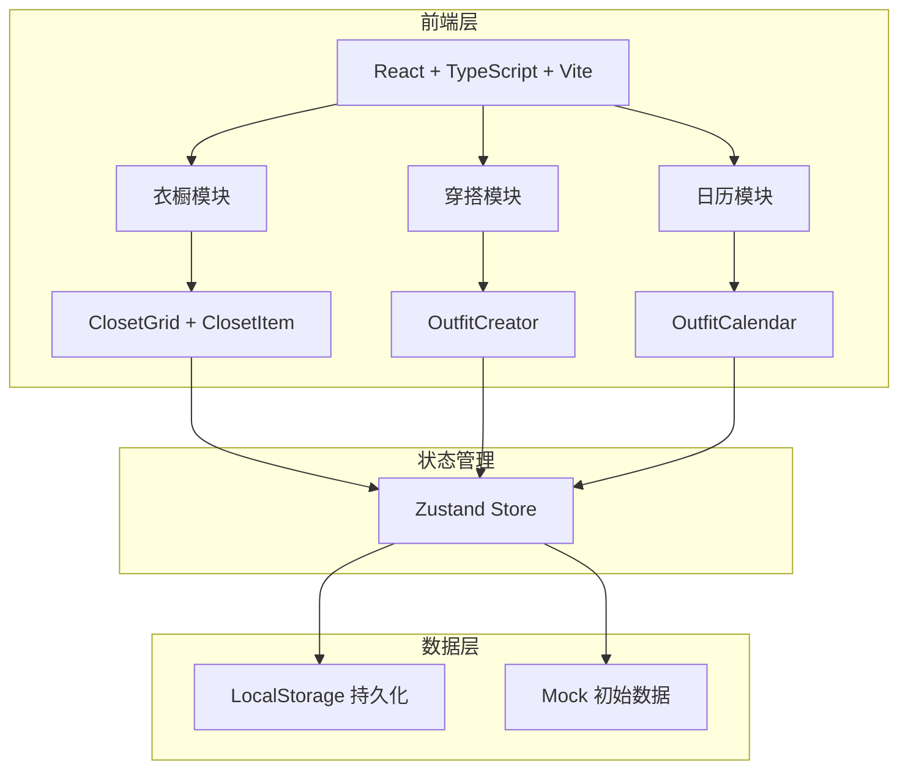
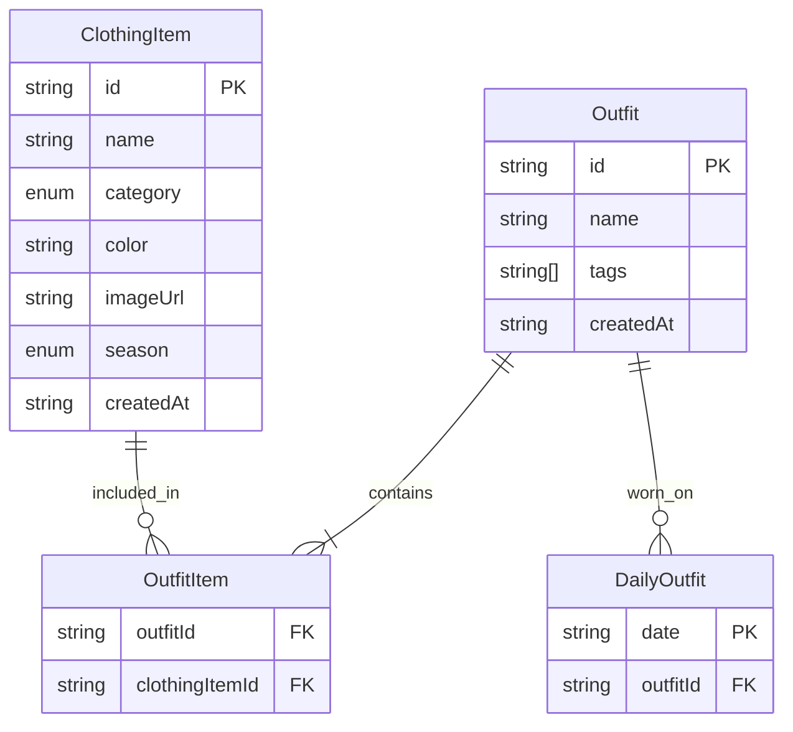

## 1. 架构设计

## 2. 技术说明
- 前端：React 18 + TypeScript + Vite + Tailwind CSS
- 初始化工具：vite-init（react-ts模板）
- 状态管理：Zustand（衣橱数据、搭配数据、筛选状态）
- 后端：无（纯前端应用，数据存储在LocalStorage）
- 数据库：无（使用LocalStorage + Mock数据）
- 拖拽库：@hello-pangea/dnd（react-beautiful-dnd的维护分支，支持React 18+）

## 3. 路由定义
| 路由 | 用途 |
|------|------|
| / | 衣橱页面 - 单品管理与筛选 |
| /outfit | 穿搭创建页面 - 拖拽搭配 |
| /calendar | 穿搭日历页面 - 历史回顾 |

## 4. API定义
- 无后端API，所有数据通过Zustand + LocalStorage管理

## 5. 服务器架构图
- 不适用（纯前端应用）

## 6. 数据模型

### 6.1 数据模型定义

### 6.2 数据定义

- ClothingItem类别枚举：上衣(TOP)、裤子(BOTTOM)、外套(OUTERWEAR)、鞋子(SHOES)、配饰(ACCESSORY)
- 季节枚举：春(SPRING)、夏(SUMMER)、秋(AUTUMN)、冬(WINTER)
- 穿搭标签：色彩和谐(HARMONIOUS)、撞色对比(CONTRAST)、单色系(MONOTONE)、暖色调(WARM)、冷色调(COOL)
- 颜色协调性算法：基于HSL色轮计算色相差异，差值<30°为和谐，>150°为撞色
