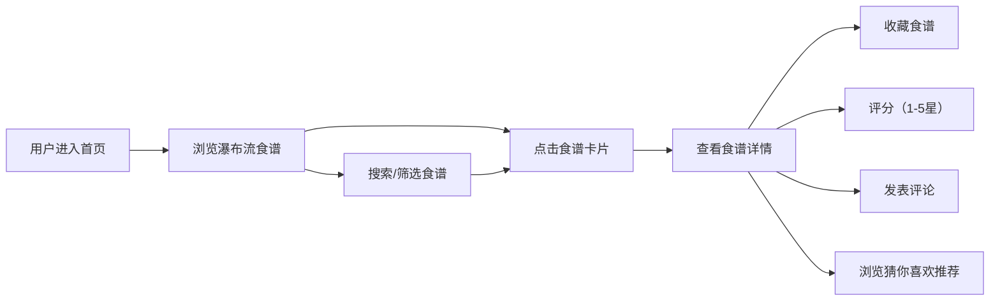

## 1. 产品概述

在线食谱分享平台，用户可浏览、搜索、收藏和评论食谱，并获得基于食材的智能推荐。

- 解决用户日常烹饪选择困难、寻找合适菜谱的问题，面向所有烹饪爱好者和家庭用户
- 通过智能推荐和食材匹配，提升用户烹饪体验，建立活跃的美食社区

## 2. 核心功能

### 2.1 用户角色

| 角色 | 注册方式 | 核心权限 |
|------|----------|----------|
| 普通用户 | 无需注册（本地存储） | 浏览食谱、搜索筛选、收藏食谱、评论评分、查看推荐 |

### 2.2 功能模块

1. **首页（食谱列表）**：食谱瀑布流展示、无限滚动加载、搜索筛选栏、收藏数量统计
2. **食谱详情页**：食谱大图、食材列表（可查看详情）、制作步骤、评论区、收藏按钮、猜你喜欢推荐

### 2.3 页面详情

| 页面名称 | 模块名称 | 功能描述 |
|----------|----------|----------|
| 首页 | 瀑布流列表 | 两列瀑布流布局，每页12个食谱，无限滚动加载，骨架屏占位 |
| 首页 | 搜索筛选栏 | 关键词搜索（匹配名称/食材）、菜系筛选、难度筛选，输入防抖300ms |
| 首页 | 食谱卡片 | 缩略图、名称、评分、收藏按钮，悬浮放大加深阴影效果 |
| 详情页 | 大图展示 | 60vh高度大图，渐变覆盖文字，懒加载 |
| 详情页 | 食材列表 | 完整食材清单，点击弹出食材详情（产地、替代品） |
| 详情页 | 制作步骤 | 分步展示，支持图文混排 |
| 详情页 | 收藏按钮 | 心形缩放动画，状态持久化到本地存储 |
| 详情页 | 评分系统 | 1-5星评分，渐变填充动画，toast提示 |
| 详情页 | 评论区 | 用户名、头像、内容、时间，新评论从底部滑入动画 |
| 详情页 | 猜你喜欢 | 基于菜系/食材标签推荐3个相似食谱，水平滚动，悬浮暂停 |

## 3. 核心流程

用户打开首页 → 浏览食谱瀑布流 → 使用搜索/筛选找到目标食谱 → 点击卡片进入详情页 → 查看食材和步骤 → 收藏/评分/评论 → 浏览推荐食谱

## 4. 用户界面设计

### 4.1 设计风格

- 主色调：#FF6F00（橙），辅色：#FFB300（金黄），背景：#FFF8E1（暖米白）
- 卡片圆角16px（手机端8px），阴影 `0 2px 8px rgba(0,0,0,0.1)`，悬浮时加深阴影并上移4px（0.2s过渡）
- 字体：系统无衬线字体（system-ui, -apple-system, sans-serif）
- 布局：卡片式分组布局，顶部导航栏，最大宽度1200px居中

### 4.2 页面设计概览

| 页面名称 | 模块名称 | UI元素 |
|----------|----------|--------|
| 首页 | 头部导航 | Logo、收藏数量统计、暖色调背景 |
| 首页 | 搜索筛选 | 搜索框、菜系下拉、难度下拉、圆角输入框 |
| 首页 | 瀑布流卡片 | 16px圆角、阴影、悬浮上移、心形收藏按钮、星级评分 |
| 详情页 | 大图区域 | 60vh高度、渐变覆盖文字层、懒加载占位 |
| 详情页 | 食材卡片 | 分组卡片、可点击食材标签、弹出层详情 |
| 详情页 | 步骤卡片 | 有序步骤编号、图文混排、进度感视觉层次 |
| 详情页 | 评论区 | 圆形随机色头像、评论卡片、滑入动画、输入框 |
| 详情页 | 推荐区 | 水平滚动容器、卡片悬浮暂停滚动、相似标签高亮 |

### 4.3 响应式设计

- 桌面端（≥1024px）：最大宽度1200px居中，两列瀑布流
- 平板端（768-1023px）：单列瀑布流布局
- 手机端（<768px）：卡片宽度100%，圆角8px，单列布局，触控优化

### 4.4 动画与交互

- 收藏按钮：心形图标 1 → 1.2 → 1 缩放动画
- 评分星星：颜色渐变填充动画
- 筛选切换：卡片列表 300ms 淡入淡出
- Toast提示：右下角弹出/消失动画
- 新评论：从底部滑入动画
- 推荐卡片：水平自动滚动，鼠标悬浮暂停
