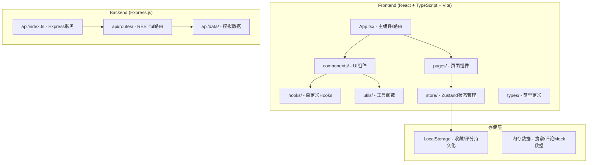
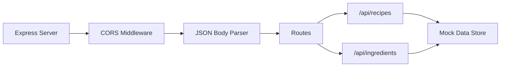
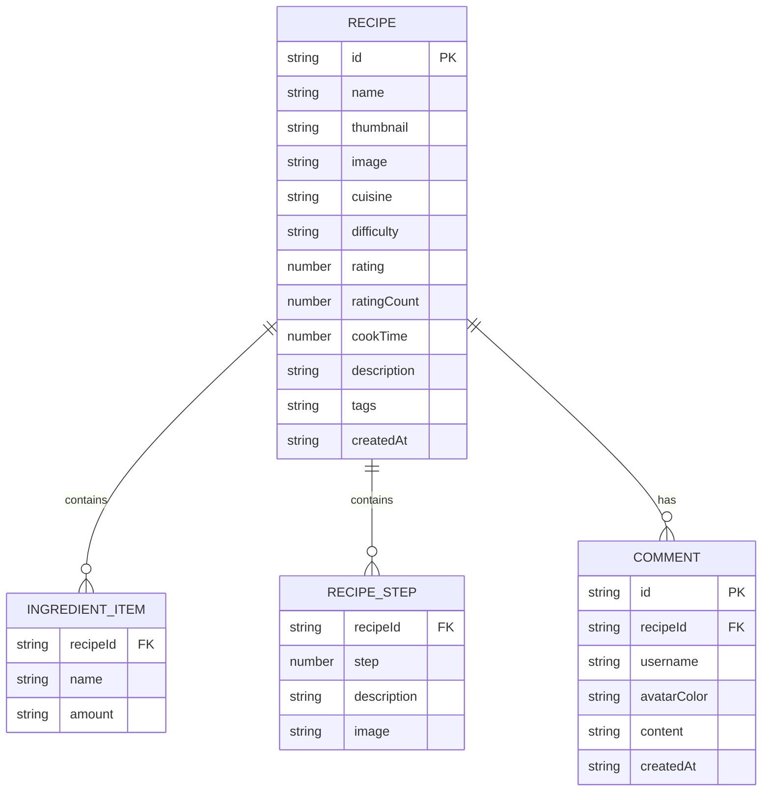

## 1. 架构设计



## 2. 技术选型说明

- **前端框架**：React 18 + TypeScript（严格模式），构建工具 Vite
- **路由管理**：react-router-dom v6
- **HTTP客户端**：axios
- **状态管理**：zustand（全局状态：收藏列表、toast）
- **样式方案**：CSS Modules / 全局CSS（不使用Tailwind，按用户指定颜色）
- **后端框架**：Express.js 4 + TypeScript + ts-node
- **数据生成**：uuid（唯一ID）
- **跨域支持**：cors

## 3. 路由定义

| 前端路由 | 页面目的 |
|----------|----------|
| `/` | 首页 - 食谱瀑布流列表、搜索筛选 |
| `/recipe/:id` | 食谱详情页 - 完整信息、评论、推荐 |

| 后端API路由 | 方法 | 目的 |
|-------------|------|------|
| `/api/recipes` | GET | 获取食谱列表（支持分页、搜索、筛选） |
| `/api/recipes/:id` | GET | 获取单个食谱详情 |
| `/api/recipes/:id/comments` | GET | 获取食谱评论列表 |
| `/api/recipes/:id/comments` | POST | 新增评论 |
| `/api/recipes/:id/rating` | POST | 提交评分 |
| `/api/ingredients/:name` | GET | 获取食材详情 |
| `/api/recipes/recommend` | GET | 获取智能推荐食谱 |

## 4. API数据模型定义

```typescript
interface Recipe {
  id: string;
  name: string;
  thumbnail: string;
  image: string;
  cuisine: 'chinese' | 'western' | 'japanese' | 'korean' | 'italian' | 'french' | 'other';
  difficulty: 'easy' | 'medium' | 'hard';
  rating: number;
  ratingCount: number;
  cookTime: number;
  description: string;
  ingredients: IngredientItem[];
  steps: RecipeStep[];
  tags: string[];
  createdAt: string;
}

interface IngredientItem {
  name: string;
  amount: string;
}

interface RecipeStep {
  step: number;
  description: string;
  image?: string;
}

interface IngredientDetail {
  name: string;
  origin: string;
  substitutes: string[];
  description: string;
}

interface Comment {
  id: string;
  recipeId: string;
  username: string;
  avatarColor: string;
  content: string;
  createdAt: string;
}

interface RecipeListResponse {
  recipes: Recipe[];
  total: number;
  page: number;
  pageSize: number;
}
```

## 5. 服务器架构（Express）



## 6. 数据模型

### 6.1 数据模型ER图



### 6.2 项目文件结构

```
auto15/
├── package.json
├── vite.config.js
├── tsconfig.json
├── index.html
├── api/
│   ├── index.ts              # Express入口
│   ├── data/
│   │   └── mockRecipes.ts    # 50条模拟食谱数据
│   └── types.ts              # 共享类型
└── src/
    ├── App.tsx
    ├── main.tsx
    ├── index.css
    ├── types/
    │   └── index.ts
    ├── store/
    │   └── useStore.ts       # Zustand全局状态
    ├── hooks/
    │   ├── useDebounce.ts
    │   ├── useInfiniteScroll.ts
    │   └── useLazyImage.ts
    ├── components/
    │   ├── Header.tsx
    │   ├── Footer.tsx
    │   ├── RecipeCard.tsx
    │   ├── SearchBar.tsx
    │   ├── RecipeDetail.tsx
    │   ├── CommentSection.tsx
    │   ├── RecommendSection.tsx
    │   ├── RatingStars.tsx
    │   ├── Toast.tsx
    │   └── Skeleton.tsx
    ├── pages/
    │   ├── HomePage.tsx
    │   └── RecipePage.tsx
    └── utils/
        ├── api.ts            # axios封装
        └── helpers.ts
```
