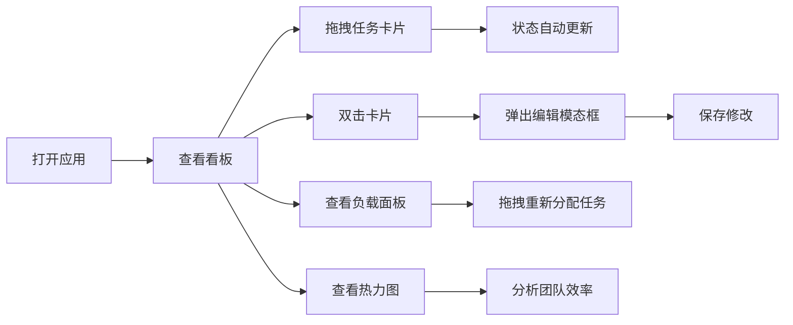

## 1. 产品概述

智能任务分配与协作看板是为小型创业团队设计的办公自动化工具，解决团队日常任务分配、进度追踪和跨团队协作信息同步问题。通过可视化看板、负载均衡分析和效率热力图，帮助团队提升协作效率。

- 核心功能：拖拽式看板任务管理、团队负载均衡分析、效率热力图
- 目标用户：小型创业团队成员及项目负责人
- 市场价值：提升团队协作效率，降低沟通成本，实时掌握团队工作状态

## 2. 核心特性

### 2.1 用户角色

| 角色 | 注册方式 | 核心权限 |
|------|----------|----------|
| 团队成员 | 无需注册（本地应用） | 查看看板、编辑任务、拖拽调整状态 |
| 项目负责人 | 无需注册（本地应用） | 所有成员权限 + 管理泳道配置、查看团队负载 |

### 2.2 功能模块

1. **看板主页面**：多泳道任务看板、拖拽排序、任务卡片管理
2. **任务编辑模态框**：任务详情编辑、负责人分配、优先级设置
3. **团队负载均衡面板**：成员负载条形图、任务重新分配
4. **效率热力图**：团队活动热力图、时间维度分析
5. **左侧导航栏**：团队信息、成员列表、设置入口

### 2.3 页面详情

| 页面名称 | 模块名称 | 功能描述 |
|-----------|-------------|---------------------|
| 看板主页面 | 泳道区域 | 4个默认泳道（待分配、进行中、审核中、已完成），支持自定义名称和顺序，数量限制2-6个 |
| 看板主页面 | 任务卡片 | 展示标题、负责人、优先级标签、截止日期，双击打开编辑面板 |
| 看板主页面 | 进度指示条 | 每个泳道顶部显示已完成数量/总数，绿色渐变进度条 |
| 任务编辑模态框 | 表单编辑 | 编辑标题、负责人、优先级、预计工时、截止日期，毛玻璃背景效果 |
| 负载均衡面板 | 条形图 | 展示每人当前任务数、总工时和负载百分比，超过80%红色高亮 |
| 效率热力图 | 7x24热力图 | 按周生成团队活动热力图，颜色从浅绿到深红渐变，悬停显示详情 |
| 左侧导航栏 | 导航菜单 | 团队名称、成员列表、设置入口，深蓝色背景 |

## 3. 核心流程

### 主操作流程
用户打开应用 → 查看看板泳道布局 → 拖拽任务卡片调整状态/顺序 → 双击卡片编辑任务详情 → 查看右侧负载均衡面板 → 查看效率热力图分析团队状态

## 4. 界面设计

### 4.1 设计风格
- 主背景色：浅色主题 #f4f5f7
- 泳道背景：白色 #ffffff
- 导航栏背景：深蓝 #1a237e
- 按钮/卡片 hover 效果：transform: scale(1.02)，transition 200ms ease
- 优先级颜色：紧急（红色）、高（橙色）、中（黄色）、低（绿色）
- 进度条：绿色渐变
- 字体选择：使用 Noto Sans SC 作为主要字体，搭配 Poppins 作为标题字体
- 卡片风格：圆角 8px，微妙阴影，左侧竖条标识优先级

### 4.2 页面设计概述

| 页面名称 | 模块名称 | UI元素 |
|-----------|-------------|-------------|
| 看板主页面 | 泳道区域 | 竖向排列泳道，白色背景，顶部进度条，卡片弹性弹簧动画 |
| 看板主页面 | 任务卡片 | 左侧优先级颜色竖条，标题、负责人头像、优先级标签、截止日期 |
| 任务编辑模态框 | 编辑表单 | 毛玻璃背景，表单字段，确认/取消按钮 |
| 负载均衡面板 | 条形图 | recharts 水平条形图，成员头像，红色高亮过载项 |
| 效率热力图 | 热力图区域 | 7x24 网格，颜色渐变，悬停提示框 |
| 左侧导航栏 | 导航区域 | 深蓝色背景，团队名称，成员头像列表，设置图标 |

### 4.3 响应式
- 桌面端（默认）：三栏布局（导航240px + 看板 + 右侧面板）
- 平板（768px-1024px）：两栏布局，右侧面板可折叠
- 移动端（768px以下）：看板切换为竖向列表，卡片宽度100%，导航栏可收起
- 触摸优化：拖拽支持触摸操作，按钮最小尺寸44px

### 4.4 动画与交互
- 卡片拖拽：弹性弹簧动画，阻尼系数0.7
- 悬停效果：按钮和卡片放大1.02倍，200ms过渡
- 模态框：背景毛玻璃效果（backdrop-filter: blur(10px)）
- 进度条：绿色渐变动画
- 热力图：颜色平滑过渡
