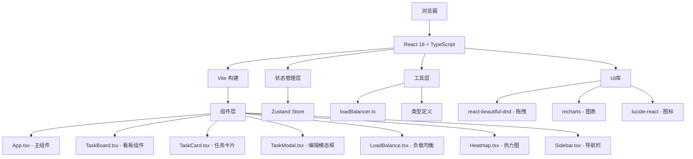
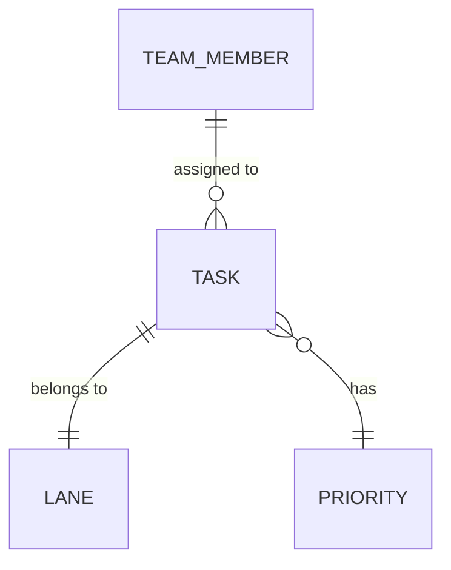

## 1. 架构设计



## 2. 技术描述

- **前端框架**: React 18 + TypeScript 5
- **构建工具**: Vite 5
- **状态管理**: Zustand
- **样式方案**: TailwindCSS 3 + CSS 变量
- **拖拽库**: react-beautiful-dnd
- **图表库**: recharts
- **图标库**: lucide-react
- **初始化工具**: vite-init
- **后端**: 无（纯前端应用，使用Mock数据）
- **数据持久化**: localStorage

## 3. 路由定义

| 路由 | 页面 | 说明 |
|------|------|------|
| / | 看板主页 | 主应用入口，展示完整看板视图 |

## 4. 数据模型

### 4.1 核心数据类型

```typescript
// 任务优先级
type Priority = 'urgent' | 'high' | 'medium' | 'low';

// 任务状态（对应泳道）
type TaskStatus = 'todo' | 'in-progress' | 'review' | 'done';

// 团队成员
interface TeamMember {
  id: string;
  name: string;
  avatar: string;
  color: string;
}

// 任务
interface Task {
  id: string;
  title: string;
  description?: string;
  assigneeId: string | null;
  priority: Priority;
  estimatedHours: number;
  status: TaskStatus;
  dueDate: string;
  createdAt: string;
  updatedAt: string;
}

// 泳道
interface Lane {
  id: string;
  name: string;
  status: TaskStatus;
  order: number;
}

// 负载数据
interface LoadData {
  memberId: string;
  taskCount: number;
  totalHours: number;
  loadPercentage: number;
}

// 热力图数据
interface HeatmapCell {
  day: number; // 0-6 (周一到周日)
  hour: number; // 0-23
  count: number;
  activities: ActivityType[];
}

type ActivityType = 'create' | 'update' | 'complete' | 'comment';
```

### 4.2 数据结构关系图



## 5. 项目结构

```
auto16/
├── package.json
├── vite.config.ts
├── tsconfig.json
├── tsconfig.node.json
├── index.html
├── tailwind.config.js
├── postcss.config.js
├── .gitignore
├── src/
│   ├── main.tsx
│   ├── App.tsx
│   ├── vite-env.d.ts
│   ├── index.css
│   ├── components/
│   │   ├── TaskBoard.tsx
│   │   ├── TaskCard.tsx
│   │   ├── TaskModal.tsx
│   │   ├── LoadBalance.tsx
│   │   ├── Heatmap.tsx
│   │   └── Sidebar.tsx
│   ├── store/
│   │   └── useStore.ts
│   ├── utils/
│   │   ├── loadBalancer.ts
│   │   ├── mockData.ts
│   │   └── types.ts
│   └── hooks/
│       └── useVirtualList.ts
└── .trae/
    └── documents/
        ├── prd.md
        └── tech-arch.md
```

## 6. 核心模块说明

### 6.1 状态管理 (Zustand)

```typescript
// useStore.ts
interface StoreState {
  tasks: Task[];
  members: TeamMember[];
  lanes: Lane[];
  editingTask: Task | null;
  setTasks: (tasks: Task[]) => void;
  updateTask: (task: Task) => void;
  addTask: (task: Task) => void;
  deleteTask: (id: string) => void;
  setEditingTask: (task: Task | null) => void;
}
```

### 6.2 拖拽逻辑

使用 `react-beautiful-dnd` 实现拖拽功能，支持：
- 同一泳道内排序
- 跨泳道移动任务
- 拖拽到成员头像重新分配
- 弹性动画效果

### 6.3 性能优化

- **虚拟列表**: 自定义 `useVirtualList` hook 处理100+卡片渲染
- **Memo优化**: React.memo 包裹卡片组件
- **防抖处理**: 拖拽更新防抖
- **按需渲染**: 泳道独立渲染

### 6.4 工具函数

`loadBalancer.ts`:
- 计算成员任务数、总工时
- 计算负载百分比（基于40小时工作周）
- 生成推荐分配方案
- 识别过载成员（>80%）

## 7. 关键技术点

1. **拖拽响应时间**: < 50ms，通过memo和虚拟列表优化
2. **100张卡片帧率**: >= 30fps，虚拟列表实现
3. **弹性动画**: 阻尼系数0.7，使用CSS spring动画
4. **毛玻璃效果**: backdrop-filter: blur(10px)
5. **响应式断点**: 768px 切换布局
