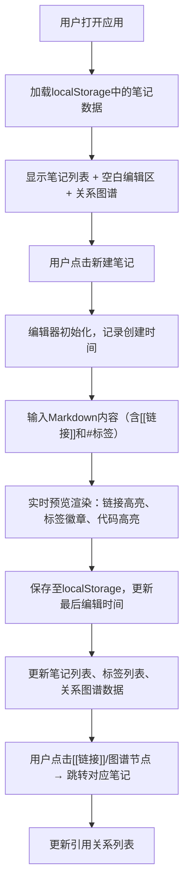

## 1. 产品概述

数字花园（Digital Garden）是一款帮助用户记录日常灵感、创作片段及关联笔记的个人知识管理应用。解决碎片化想法容易丢失、笔记之间缺乏连接的问题，通过双向链接和可视化图谱构建有机的知识网络。

- 目标用户：内容创作者、程序员、研究人员、终身学习者
- 核心价值：将零散的想法沉淀为可连接、可探索的知识花园

## 2. 核心功能

### 2.1 用户角色
| 角色 | 注册方式 | 核心权限 |
|------|----------|----------|
| 个人用户 | 无需注册，本地存储 | 笔记的增删改查、双向链接管理、图谱浏览、标签系统 |

### 2.2 功能模块
1. **笔记编辑模块**：Markdown编辑器（实时预览、代码高亮、行号），自动记录时间戳
2. **双向链接模块**：[[笔记标题]]语法解析，蓝色下划线高亮，点击跳转，侧边栏引用关系
3. **关系图谱模块**：力导向图可视化，节点大小随被引用次数变化，缩放平移（0.2x-3x），600ms动画
4. **标签管理模块**：#标签语法，可点击徽章，侧边栏按标签过滤，300ms淡入动画
5. **搜索过滤模块**：标题关键词搜索，标签筛选

### 2.3 页面详情
| 页面名称 | 模块名称 | 功能描述 |
|----------|----------|----------|
| 主工作台 | 左侧面板 | 笔记列表、搜索框、标签筛选器，毛玻璃效果（backdrop-filter: blur(10px)） |
| 主工作台 | 中间编辑器区 | Markdown编辑区 + 实时预览，可拖拽调整宽度的分隔栏 |
| 主工作台 | 右侧图谱区 | D3力导向关系图谱，带浅色网格辅助线，支持缩放平移 |
| 主工作台 | 引用侧边栏 | 当前笔记的"被引用列表"和"引用来源列表" |

## 3. 核心流程

## 4. 用户界面设计

### 4.1 设计风格
- **设计方向**：深邃科技感暗色主题，打造沉浸式创作空间
- **主背景色**：#1a1a2e（深空蓝紫）
- **侧栏背景**：#16213e（深海蓝）
- **卡片背景**：#0f3460（藏青色）
- **主文本色**：#e0e0e0（柔和灰白）
- **可点击高亮**：#e94560（珊瑚玫红）
- **链接高亮**：蓝色下划线
- **标签徽章**：背景#4a90d9，白色文字，圆角4px
- **字体**：标题使用 JetBrains Mono 等宽字体，正文使用 Noto Sans SC，营造极客美学
- **按钮风格**：扁平化 + 微圆角（6px），hover时背景透明度变化，200ms过渡
- **布局**：三栏弹性布局，可拖拽调整宽度的分隔条
- **动效**：所有状态切换 300ms ease-out，图谱切换动画 600ms

### 4.2 页面设计概述
| 页面模块 | UI元素 | 设计描述 |
|----------|--------|----------|
| 左侧面板 | 搜索框、标签云、笔记列表 | 毛玻璃backdrop-filter: blur(10px)，半透明背景，笔记项hover时左边框高亮#e94560 |
| 编辑器区 | 行号栏、textarea输入区、Markdown预览区 | 左右分栏拖拽布局，等宽字体，代码块深色背景，语法高亮配色 |
| 关系图谱 | SVG画布、节点圆、连线、网格辅助线 | 节点渐变填充（#0f3460 → #4a90d9），hover脉冲动画，连线低透明度 |
| 引用列表 | 被引用/引用来源两个分组 | 折叠卡片式，点击项跳转，进入时fadeIn 300ms |

### 4.3 响应式
- 桌面优先（≥1200px）：三栏完整布局
- 平板（768-1200px）：图谱区可折叠收起
- 移动端（<768px）：标签式切换列表/编辑器/图谱视图

### 4.4 性能要求
- 图谱渲染 ≥60fps
- 支持 ≥100 个节点同时流畅显示
- D3力导向模拟使用 requestAnimationFrame 优化
- 搜索过滤使用 debounce 300ms
