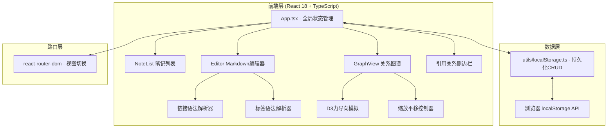
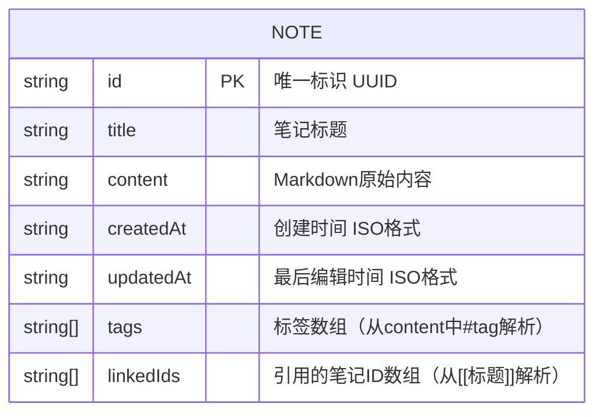

## 1. 架构设计



## 2. 技术选型

- **前端框架**：React 18 + TypeScript（严格模式 strict: true）
- **构建工具**：Vite + @vitejs/plugin-react
- **路由**：react-router-dom v6
- **力导向图谱**：d3-force（仅力模拟，SVG手动渲染保证性能）
- **状态管理**：React useState + useContext（轻量，无需zustand）
- **样式方案**：原生CSS + CSS Variables（主题变量定义）
- **数据持久化**：localStorage（Promise封装）
- **字体**：JetBrains Mono（代码/编辑器）+ Noto Sans SC（正文）

## 3. 路由定义

| 路由 | 用途 |
|------|------|
| `/` | 主工作台，默认视图，显示第一篇笔记或空白编辑区 |
| `/note/:id` | 指定笔记编辑视图，通过ID加载笔记内容 |

## 4. 数据模型

### 4.1 数据结构定义



### 4.2 TypeScript 类型定义

```typescript
interface Note {
  id: string;
  title: string;
  content: string;
  createdAt: string;
  updatedAt: string;
  tags: string[];
  linkedIds: string[];
}

interface AppState {
  notes: Note[];
  currentNoteId: string | null;
  searchKeyword: string;
  selectedTag: string | null;
  view: 'editor' | 'graph' | 'split';
}
```

### 4.3 localStorage 存储 Key

```
DG_NOTES_KEY = 'digital_garden_notes_v1'
```

序列化方式：JSON.stringify(notes)，初始化时 JSON.parse。

## 5. 项目文件结构

```
auto17/
├── index.html               # 入口，title: 数字花园
├── package.json             # 依赖定义
├── vite.config.js           # Vite构建配置
├── tsconfig.json            # TS严格模式配置
└── src/
    ├── App.tsx              # 主应用：全局状态、布局、路由
    ├── main.tsx             # React入口
    ├── index.css            # 全局样式 + CSS变量 + 动画
    ├── components/
    │   ├── Editor.tsx       # Markdown编辑器 + 预览 + 链接/标签解析
    │   ├── GraphView.tsx    # D3力导向图谱（SVG + d3-force）
    │   ├── NoteList.tsx     # 笔记列表 + 搜索 + 标签过滤
    │   ├── TagPanel.tsx     # 标签面板
    │   └── ReferencePanel.tsx # 引用/被引用列表侧边栏
    └── utils/
        └── localStorage.ts  # localStorage CRUD，Promise封装
```

## 6. 关键实现说明

### 6.1 双向链接解析
正则：`/\[\[([^\]]+)\]\]/g` 匹配标题 → 遍历 notes 数组按 title 查找对应 id → 生成 linkedIds 数组。

### 6.2 标签解析
正则：`/#(\S+)/g` 提取所有 #tag → 去重 → tags 数组。

### 6.3 图谱渲染性能
- 使用纯 SVG + d3-force 模拟（不引入完整d3）
- 节点 `<circle>` + `<text>` 组合，使用 transform 平移
- forceSimulation tick 时只更新 transform，避免重排
- 100节点时节点半径按 √(被引用次数) 缩放
- 缩放范围 0.2 ~ 3，使用 d3-zoom 或原生 wheel 事件

### 6.4 代码高亮方案
使用内置正则匹配简单高亮：
- ` ```language ` 代码块：深色背景 + 等宽字体
- 关键字：function/const/let/import 等变色
- 无需引入 highlight.js 等重型依赖
