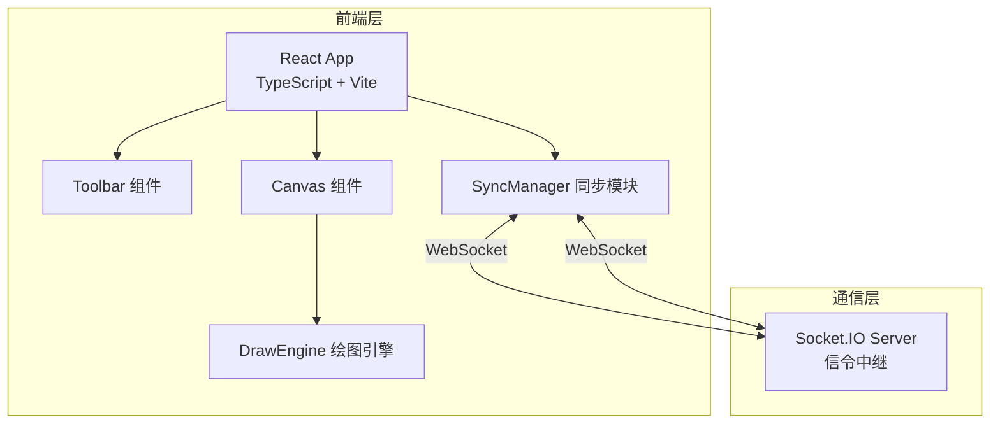
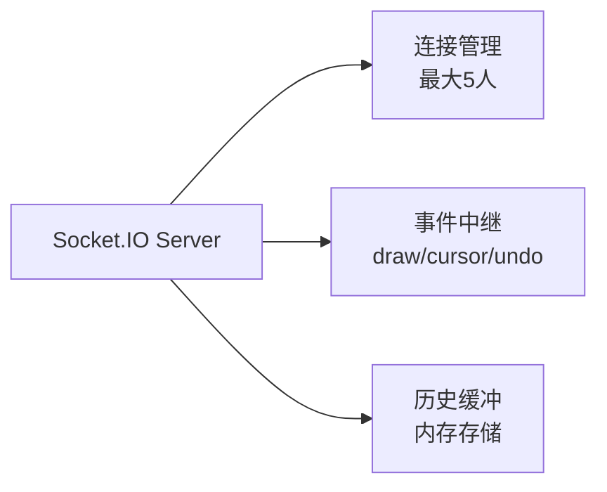

## 1. 架构设计



## 2. 技术说明

- 前端：React@18 + TypeScript + Vite
- 初始化工具：vite-init（react-ts 模板）
- 实时通信：Socket.IO（客户端 socket.io-client + 服务端 socket.io）
- 状态管理：Zustand
- 样式：全局CSS + CSS变量
- 后端：Express + Socket.IO（简单信令服务器，仅转发绘图数据和光标位置）
- 数据库：无（纯内存中继，不持久化）

## 3. 路由定义

| 路由 | 用途 |
|------|------|
| / | 白板主页面，全屏画布+工具栏 |

## 4. API 定义

### Socket.IO 事件定义

**客户端 → 服务器：**

| 事件名 | 数据类型 | 说明 |
|--------|----------|------|
| join | `{ username: string, color: string }` | 用户加入白板 |
| draw | `{ tool: ToolType, points: Point[], style: DrawStyle, userId: string }` | 绘制数据 |
| cursor | `{ x: number, y: number, userId: string }` | 光标位置 |
| undo | `{ userId: string }` | 用户撤销 |
| redo | `{ userId: string }` | 用户重做 |
| sticky | `{ id: string, x: number, y: number, text: string, userId: string }` | 便签数据 |

**服务器 → 客户端：**

| 事件名 | 数据类型 | 说明 |
|--------|----------|------|
| users | `User[]` | 在线用户列表 |
| draw | DrawEvent | 其他用户的绘制数据 |
| cursor | CursorEvent | 其他用户的光标位置 |
| drawHistory | DrawEvent[] | 加入时获取历史绘制数据 |
| userJoined | User | 新用户加入通知 |
| userLeft | `{ userId: string }` | 用户离开通知 |

### TypeScript 类型定义

```typescript
type ToolType = 'pen-thin' | 'pen-medium' | 'pen-thick' | 'rectangle' | 'circle' | 'sticky' | 'arrow';

interface Point {
  x: number;
  y: number;
}

interface DrawStyle {
  color: string;
  lineWidth: number;
}

interface DrawEvent {
  id: string;
  userId: string;
  tool: ToolType;
  points: Point[];
  style: DrawStyle;
  text?: string;
  timestamp: number;
}

interface User {
  id: string;
  username: string;
  color: string;
}

interface CursorEvent {
  userId: string;
  x: number;
  y: number;
  username: string;
  color: string;
}
```

## 5. 服务器架构图



## 6. 数据模型

不适用——纯实时中继，不使用数据库。绘制历史保存在内存中，服务器重启后清空。
