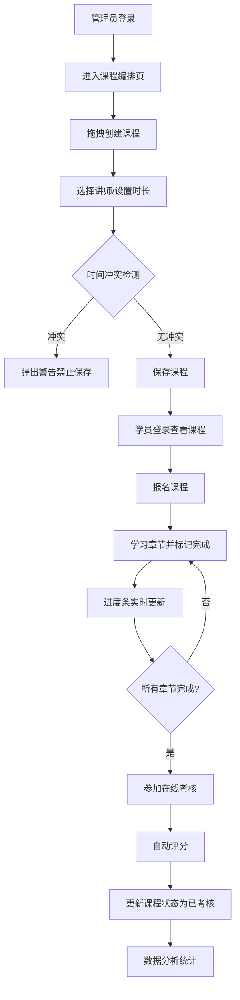

## 1. 产品概述

本平台是企业内部培训课程编排与学习进度追踪系统，旨在解决培训管理员手动协调讲师、学员和时间效率低下且易冲突的问题。通过自动化的课程编排、冲突检测、进度追踪和数据分析，提升培训管理效率。

- 核心用户：培训管理员、企业讲师、内部学员
- 核心价值：自动化排期、实时进度追踪、数据驱动决策

## 2. 核心功能

### 2.1 用户角色

| 角色 | 登录方式 | 核心权限 |
|------|----------|----------|
| 培训管理员 | 模拟登录 | 课程编排、讲师排期、查看数据分析、学员管理 |
| 学员 | 模拟登录 | 浏览课程、报名课程、学习章节、参加考核、查看进度 |

### 2.2 功能模块

1. **课程编排页**：周视图日历、课程卡片展示、拖拽创建/调整课程、讲师冲突检测
2. **学员管理页**：学员列表表格、选课记录查看、详情卡片展开
3. **学习进度页**：课程卡片列表、圆形进度环、章节完成标记、实时进度动画
4. **数据分析页**：平均评分、学员完成率、课程时段统计图表（Recharts）

### 2.3 页面详情

| 页面名称 | 模块名称 | 功能描述 |
|---------|----------|----------|
| 课程编排页 | 周视图日历 | 按周一至周日展示课程，支持日期切换，显示讲师头像和课程时间 |
| 课程编排页 | 课程创建表单 | 选择讲师、设置时长（1-4小时）、检测时间冲突、保存课程 |
| 课程编排页 | 拖拽交互 | 拖拽创建新课程，拖拽调整课程时间，拖拽时阴影跟随效果 |
| 学员管理页 | 学员列表 | 表格展示学员信息，每行可展开查看选课详情 |
| 学员管理页 | 选课记录 | 显示学员已报名课程、完成状态、考核分数 |
| 学习进度页 | 课程进度卡片 | 圆形进度环（conic-gradient）、完成百分比、剩余章节数 |
| 学习进度页 | 章节学习 | 章节列表、完成标记、进度条动画效果 |
| 学习进度页 | 在线考核 | 5道选择题、自动评分、更新完成状态 |
| 数据分析页 | 统计概览 | 平均评分、完成率、课程总数、学员总数卡片 |
| 数据分析页 | 可视化图表 | 最受欢迎时段柱状图、课程完成率饼图（Recharts） |

## 3. 核心流程

## 4. 用户界面设计

### 4.1 设计风格

- **主题色**：渐变蓝色 #4f8cf7 → #6aafff（选中态）
- **背景色**：主背景 #f5f7fa，卡片背景 #ffffff
- **阴影效果**：0 2px 8px rgba(0,0,0,0.1)
- **字体**：系统默认字体
- **按钮样式**：圆角8px，悬停时阴影加深，渐变背景
- **卡片样式**：白色背景，圆角8px，柔和阴影，悬停微上浮

### 4.2 页面设计概述

| 页面名称 | 模块名称 | UI元素 |
|---------|----------|--------|
| 全局布局 | 左侧导航栏 | 240px固定宽度，三个入口，渐变选中态，移动端折叠 |
| 全局布局 | 主内容区 | 自适应宽度，浅色背景，内边距24px |
| 课程编排页 | 周视图日历 | 7列网格，时间轴，课程卡片带讲师头像 |
| 课程编排页 | 课程卡片 | 白色卡片，渐变蓝色标签，时间标签，讲师头像 |
| 学习进度页 | 圆形进度环 | conic-gradient实现，带动画，中心显示百分比 |
| 学习进度页 | 章节列表 | 勾选框，完成状态绿色对勾，进度条动画 |
| 数据分析页 | 统计卡片 | 大数字展示，图标点缀，渐变边框 |
| 数据分析页 | Recharts图表 | 柱状图+饼图，响应式布局，自定义提示框 |

### 4.3 响应式设计

- **桌面端（≥1024px）**：左侧240px导航 + 主内容区
- **平板端（768-1023px）**：左侧导航缩小为图标栏，主内容自适应
- **移动端（<768px）**：单栏堆叠布局，底部导航或汉堡菜单

### 4.4 动效设计

- 页面加载：渐入动画，元素依次显现
- 进度环：CSS transition动画，≥30fps
- 拖拽：跟随阴影效果，位置平滑过渡
- 按钮悬停：阴影加深，轻微上浮
- 课程卡片：悬停时轻微放大+阴影增强
