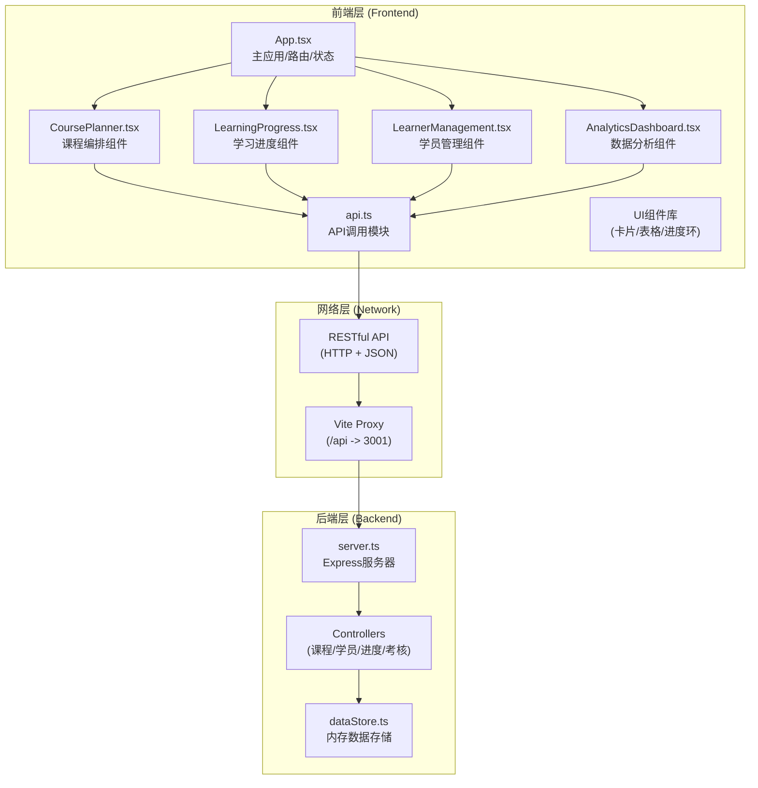
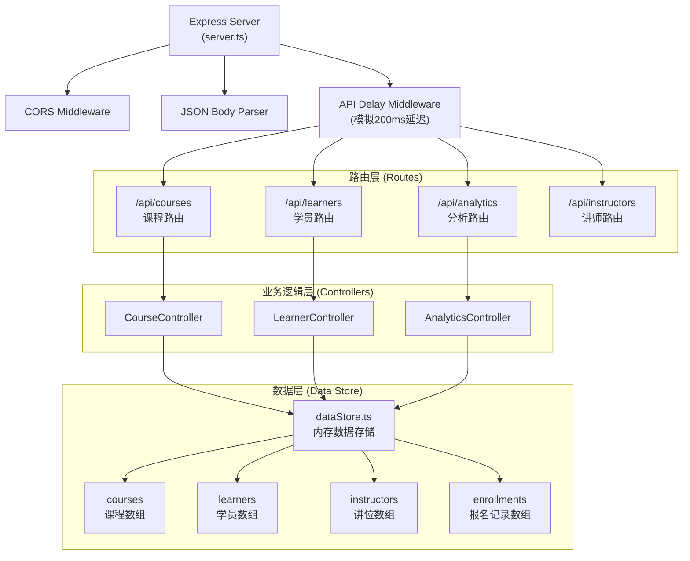
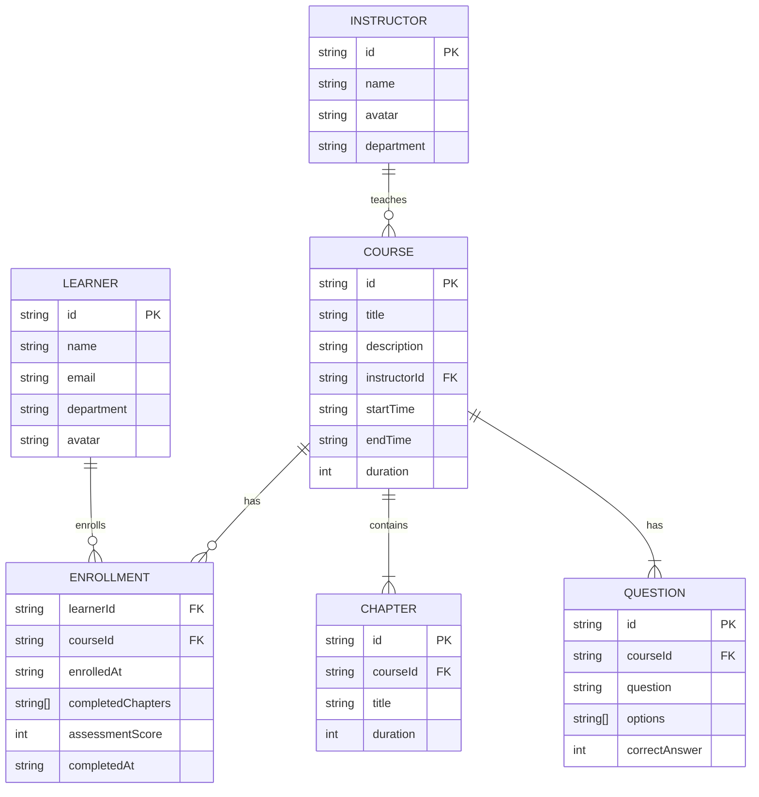

## 1. 架构设计



## 2. 技术描述

### 2.1 技术栈

| 层级 | 技术选型 | 版本 | 说明 |
|------|----------|------|------|
| 前端框架 | React | 18.x | 用户界面构建 |
| 前端语言 | TypeScript | 5.x | 类型安全 |
| 构建工具 | Vite | 5.x | 开发构建，启用React插件 |
| 路由 | react-router-dom | 6.x | 单页路由管理 |
| HTTP客户端 | axios | 1.x | API请求封装 |
| 图表库 | recharts | 2.x | 数据可视化 |
| 后端框架 | Express.js | 4.x | RESTful API服务 |
| 后端语言 | TypeScript | 5.x | 通过ts-node运行 |
| CORS | cors | 2.x | 跨域资源共享 |
| 唯一ID | uuid | 9.x | 数据ID生成 |
| 开发运行 | concurrently | 8.x | 同时启动前后端 |

### 2.2 项目初始化

- 使用模板：`react-express-ts`（React + TypeScript + Express）
- 包管理器：npm
- 运行环境：Node.js（已安装）

## 3. 路由定义

### 3.1 前端路由

| 路径 | 页面/组件 | 说明 |
|------|-----------|------|
| `/` | `/courses` 重定向 | 默认页 |
| `/courses` | CoursePlanner | 课程编排（周视图日历） |
| `/learners` | LearnerManagement | 学员管理（表格+详情） |
| `/progress` | LearningProgress | 学习进度（卡片+进度环） |
| `/analytics` | AnalyticsDashboard | 数据分析（统计+图表） |

### 3.2 后端API路由

| 方法 | 路径 | 说明 |
|------|------|------|
| GET | `/api/courses` | 获取所有课程 |
| GET | `/api/courses/schedule` | 获取排期数据 |
| POST | `/api/courses` | 创建课程（含冲突检测） |
| PUT | `/api/courses/:id` | 更新课程 |
| DELETE | `/api/courses/:id` | 删除课程 |
| GET | `/api/instructors` | 获取讲师列表 |
| GET | `/api/learners` | 获取学员列表 |
| POST | `/api/learners/:learnerId/enroll/:courseId` | 学员报名课程 |
| GET | `/api/learners/:learnerId/progress` | 获取学员学习进度 |
| PUT | `/api/learners/:learnerId/courses/:courseId/chapters/:chapterId` | 更新章节完成状态 |
| POST | `/api/learners/:learnerId/courses/:courseId/assessment` | 提交考核并评分 |
| GET | `/api/analytics/stats` | 获取统计数据 |
| GET | `/api/analytics/time-slots` | 获取时段统计 |

## 4. API类型定义

### 4.1 数据类型

```typescript
interface Instructor {
  id: string;
  name: string;
  avatar: string;
  department: string;
}

interface Chapter {
  id: string;
  title: string;
  duration: number;
}

interface Question {
  id: string;
  question: string;
  options: string[];
  correctAnswer: number;
}

interface Course {
  id: string;
  title: string;
  description: string;
  instructorId: string;
  startTime: string;
  endTime: string;
  duration: number;
  chapters: Chapter[];
  assessment: Question[];
  createdAt: string;
}

interface Enrollment {
  learnerId: string;
  courseId: string;
  enrolledAt: string;
  completedChapters: string[];
  assessmentScore: number | null;
  completedAt: string | null;
}

interface Learner {
  id: string;
  name: string;
  email: string;
  department: string;
  avatar: string;
}
```

### 4.2 请求/响应类型

```typescript
// 创建课程请求
interface CreateCourseRequest {
  title: string;
  description: string;
  instructorId: string;
  startTime: string;
  duration: number;
}

// 创建课程响应
interface CreateCourseResponse {
  success: boolean;
  course?: Course;
  conflict?: boolean;
  message?: string;
}

// 进度更新请求
interface UpdateChapterRequest {
  completed: boolean;
}

// 考核提交请求
interface SubmitAssessmentRequest {
  answers: number[];
}

// 考核响应
interface AssessmentResponse {
  score: number;
  total: number;
  percentage: number;
  passed: boolean;
}
```

## 5. 服务器架构图



## 6. 数据模型

### 6.1 ER图



### 6.2 初始化数据

- **讲师数据**：5名预设讲师，含姓名、头像、部门
- **学员数据**：20名模拟学员，含姓名、邮箱、部门
- **课程数据**：300门模拟课程（性能测试用）
- **报名数据**：随机生成的报名记录

## 7. 项目文件结构

```
auto21/
├── package.json
├── vite.config.js
├── tsconfig.json
├── index.html
└── src/
    ├── frontend/
    │   ├── App.tsx                    # 主应用组件
    │   ├── api.ts                     # API调用模块
    │   ├── types.ts                   # 类型定义
    │   ├── components/
    │   │   ├── CoursePlanner.tsx      # 课程编排组件
    │   │   ├── LearningProgress.tsx   # 学习进度组件
    │   │   ├── LearnerManagement.tsx  # 学员管理组件
    │   │   ├── AnalyticsDashboard.tsx # 数据分析组件
    │   │   ├── Sidebar.tsx            # 侧边导航栏
    │   │   ├── CircularProgress.tsx   # 圆形进度环组件
    │   │   ├── CourseCard.tsx         # 课程卡片组件
    │   │   └── Modal.tsx              # 弹窗组件
    │   └── styles/
    │       └── global.css             # 全局样式
    └── backend/
        ├── server.ts                  # Express服务器
        ├── dataStore.ts               # 内存数据存储
        └── types.ts                   # 后端类型定义
```

### 7.1 调用关系与数据流向

1. **App.tsx** → 管理路由，根据URL渲染对应页面组件
2. **页面组件**（CoursePlanner等） → 调用 **api.ts** 中的方法获取/提交数据
3. **api.ts** → 使用axios发送HTTP请求到 `/api/**` 端点
4. **Vite代理** → 将 `/api` 请求转发到后端端口3001
5. **server.ts** → 接收请求，调用对应控制器逻辑
6. **Controller逻辑** → 调用 **dataStore.ts** 进行数据操作
7. **dataStore.ts** → 操作内存数组，返回结果
8. **数据返回** → 原路返回至前端组件，更新UI状态

### 7.2 性能优化

- **前端**：300门课程使用虚拟列表/懒加载，进度环使用CSS动画（≥30fps）
- **后端**：API响应加入200ms模拟延迟，内存数据操作O(1)或O(n)
- **构建**：Vite HMR，代码分割，按需加载
