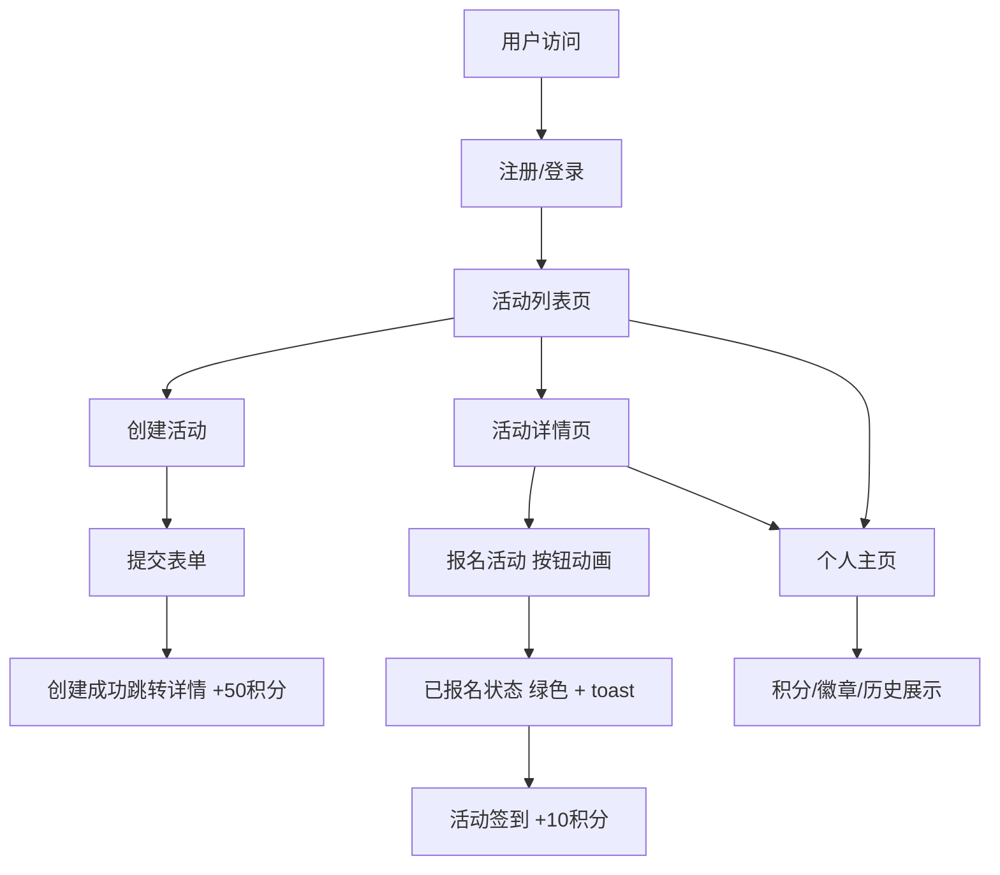

## 1. 产品概述

社区环保公益活动管理与参与平台，旨在连接环保爱好者与公益活动，让用户能够便捷地发起、浏览和参与各类环保公益活动，并通过积分系统激励用户持续参与环保行动。

- 核心目标：降低环保公益活动的组织门槛，提升公众参与度，培养绿色环保习惯
- 目标用户：关注环保的社区居民、学生、志愿者及公益组织

## 2. 核心功能

### 2.1 用户角色

| 角色 | 注册方式 | 核心权限 |
|------|---------|---------|
| 普通用户 | 用户名注册登录 | 浏览活动、报名活动、创建活动、查看个人主页、获取积分 |

### 2.2 功能模块

1. **活动列表页**：活动卡片展示、列表/网格视图切换、按日期排序、搜索筛选
2. **创建活动页**：富文本表单、封面图上传、日期选择、地点输入、人数限制
3. **活动详情页**：活动信息展示、地图占位区、报名/取消报名、签到功能
4. **个人主页**：头像昵称、环保积分、等级徽章、参与历史记录

### 2.3 页面详情

| 页面名称 | 模块名称 | 功能描述 |
|---------|---------|---------|
| 登录/注册 | 表单模块 | 用户输入用户名密码进行注册或登录，信息存储于localStorage |
| 活动列表页 | 活动卡片组 | 卡片形式展示活动（封面、标题、日期、地点、剩余名额、报名按钮），hover悬浮上升效果 |
| 活动列表页 | 视图切换 | 列表视图与网格视图切换，旋转淡入动画0.5s ease-in-out |
| 活动列表页 | 排序筛选 | 活动按日期排序，支持关键词搜索 |
| 创建活动页 | 富文本编辑器 | 支持加粗、斜体、列表格式编辑活动描述 |
| 创建活动页 | 日期选择器 | 选择活动日期和时间 |
| 创建活动页 | 地理建议 | 输入地点时显示地理建议 |
| 创建活动页 | 表单校验 | 必填项校验，正整数校验参与人数 |
| 活动详情页 | 双栏布局 | 左侧活动信息区，右侧地图占位区 |
| 活动详情页 | 报名模块 | 报名按钮带按压缩放动画，报名成功变绿色，显示toast提示 |
| 活动详情页 | 签到功能 | 已报名用户可签到，签到后+10积分 |
| 个人主页 | 用户信息区 | 展示头像、昵称、积分（数字递增动画） |
| 个人主页 | 徽章展示 | 青铜(100分)、白银(500分)、黄金(1000分)圆形徽章，渐变色微光效 |
| 个人主页 | 参与历史 | 按时间倒序展示参与过的活动列表 |

## 3. 核心流程

用户首先进行注册或登录，登录成功后进入活动列表页浏览活动。用户可选择创建新活动（填写表单后创建成功跳转详情页，并获得+50积分），或在活动列表中点击卡片进入详情页进行报名（按压缩放动画反馈）。报名成功后可在活动当天签到获得+10积分。用户可随时进入个人主页查看自己的积分、徽章等级和参与历史记录。

## 4. 用户界面设计

### 4.1 设计风格

- **主色调**：森林绿 (#2D6A4F, #40916C, #52B788) - 体现环保自然主题
- **辅色调**：大地棕 (#8B5A2B, #A67B5B, #D4A373) - 营造温暖质朴氛围
- **背景色**：米白 (#FEFAE0)、浅绿 (#F0F7EE) - 清新柔和
- **按钮风格**：圆角10px，柔和阴影，hover有按压缩放(200ms)反馈
- **卡片风格**：圆角12px，柔和阴影，hover时translateY(-4px) + 阴影增强，过渡0.3s ease
- **字体**：主字体使用系统无衬线字体，标题加粗加大，正文舒适行距
- **图标风格**：线性环保主题图标（叶子、回收、树木等）

### 4.2 页面设计概述

| 页面名称 | 模块名称 | UI元素 |
|---------|---------|--------|
| 登录/注册 | 表单卡片 | 居中卡片，圆角阴影，绿棕配色渐变按钮 |
| 活动列表页 | 顶部导航栏 | 品牌Logo、搜索框、创建按钮、用户头像入口 |
| 活动列表页 | 视图切换栏 | 网格/列表图标切换，活动计数显示 |
| 活动列表页 | 活动卡片 | 封面图、标签、标题、日期地点图标文字、名额进度条、报名按钮 |
| 创建活动页 | 表单分区 | 分区块展示表单字段，左侧标签右侧输入，底部提交按钮 |
| 创建活动页 | 富文本工具栏 | 加粗/斜体/列表按钮悬浮于编辑器顶部 |
| 活动详情页 | 双栏容器 | 桌面端左7右5布局，移动端自动单列 |
| 活动详情页 | 地图占位区 | 渐变背景+位置图标+地点文字，模拟地图样式 |
| 个人主页 | 头部区域 | 大尺寸头像+昵称+积分大数字+徽章横排展示 |
| 个人主页 | 历史列表 | 垂直时间轴样式展示参与活动，卡片圆角柔和阴影 |

### 4.3 响应式设计

- **设计策略**：桌面端优先，移动端自适应
- **断点**：768px以下切换为单列布局，活动卡片宽度100%
- **触控优化**：按钮最小尺寸44px，点击区域适当扩大
- **列表详情页**：移动端地图区域移至活动信息下方

### 4.4 动效规范

- **卡片悬浮**：transform: translateY(-4px) + box-shadow增强，transition: 0.3s ease
- **视图切换**：opacity 0→1 + rotateY 10°→0°，transition: 0.5s ease-in-out
- **按钮点击**：transform: scale(0.96) → scale(1)，transition: 200ms
- **积分数字**：从0递增到目标值，requestAnimationFrame平滑动画
- **徽章光效**：box-shadow微光+渐变背景，hover时轻微放大
- **Toast提示**：从上方滑入，停留2s后淡出，transition: 0.3s ease
