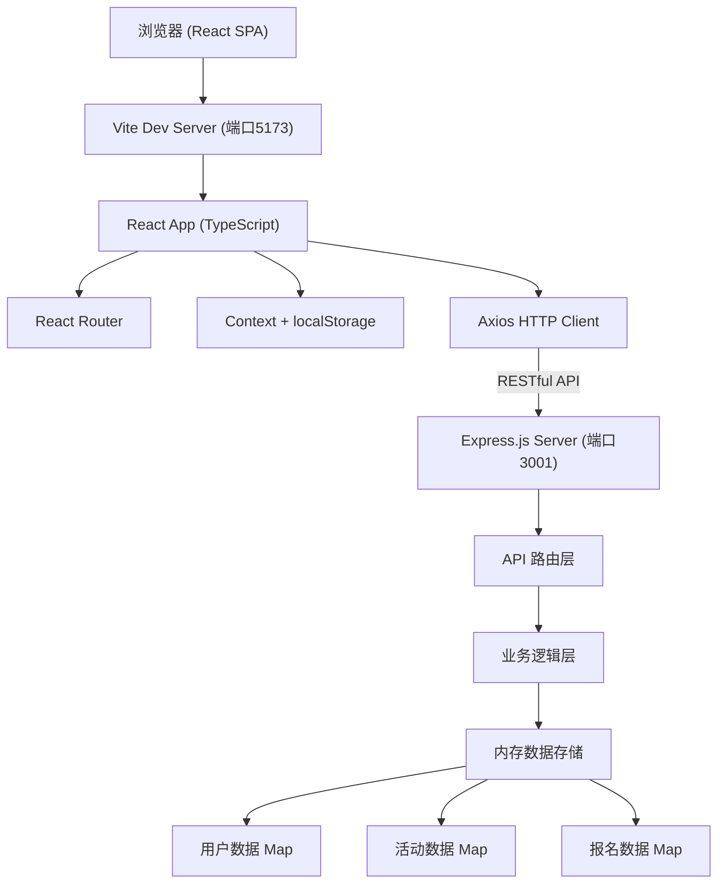
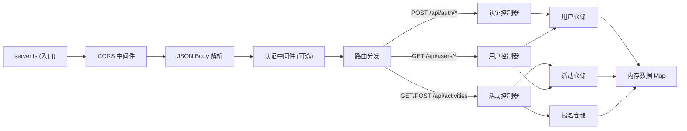
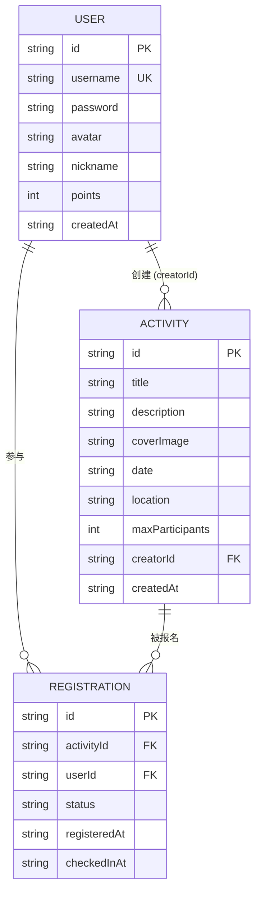

## 1. 架构设计



## 2. 技术描述

- **前端框架**：React 18 + TypeScript（严格模式）
- **前端构建**：Vite 5 + @vitejs/plugin-react
- **前端路由**：React Router DOM 6
- **HTTP 客户端**：Axios
- **状态管理**：React Context + useReducer + localStorage 持久化
- **UI 样式**：原生 CSS (CSS Modules + CSS Variables)，无第三方 UI 库
- **图标方案**：内联 SVG 图标（避免第三方依赖）
- **后端框架**：Express.js 4 + TypeScript + ts-node
- **后端 CORS**：cors 中间件
- **唯一 ID**：uuid 库
- **数据存储**：Node.js 内存存储（Map 数据结构），无数据库
- **启动脚本**：`npm start` 启动后端，`npm run dev` 启动前端 Vite

## 3. 路由定义

| 路由路径 | 页面组件 | 说明 |
|---------|---------|------|
| `/` | 重定向到 `/activities` | 首页重定向 |
| `/login` | Login 组件 | 登录/注册页面 |
| `/activities` | ActivityList | 活动列表页（默认页） |
| `/activities/create` | CreateActivity | 创建活动页（需登录） |
| `/activities/:id` | ActivityDetail | 活动详情页 |
| `/profile` | UserProfile | 个人主页（需登录） |
| `*` | 404 页面 | 未匹配路由 |

## 4. API 定义

### 4.1 TypeScript 类型定义

```typescript
interface User {
  id: string;
  username: string;
  password: string;
  avatar: string;
  nickname: string;
  points: number;
  createdAt: string;
}

interface Activity {
  id: string;
  title: string;
  description: string;
  coverImage: string;
  date: string;
  location: string;
  maxParticipants: number;
  creatorId: string;
  createdAt: string;
}

interface Registration {
  id: string;
  activityId: string;
  userId: string;
  status: 'registered' | 'checked-in';
  registeredAt: string;
  checkedInAt: string | null;
}

interface ActivityWithStats extends Activity {
  registeredCount: number;
  isRegistered: boolean;
  isCheckedIn: boolean;
  creator: Pick<User, 'id' | 'nickname' | 'avatar'>;
}
```

### 4.2 API 端点定义

| Method | Path | Request | Response | 说明 |
|--------|------|---------|----------|------|
| POST | `/api/auth/register` | `{ username, password, nickname }` | `{ user: UserWithoutPassword, token }` | 用户注册 |
| POST | `/api/auth/login` | `{ username, password }` | `{ user: UserWithoutPassword, token }` | 用户登录 |
| GET | `/api/activities` | query: `?search=&sort=` | `ActivityWithStats[]` | 获取活动列表（需登录） |
| GET | `/api/activities/:id` | - | `ActivityWithStats` | 获取单个活动详情 |
| POST | `/api/activities` | `{ title, description, coverImage, date, location, maxParticipants }` | `ActivityWithStats` | 创建活动（需登录，+50分） |
| POST | `/api/activities/:id/register` | - | `{ registration, message }` | 报名活动（需登录） |
| DELETE | `/api/activities/:id/register` | - | `{ message }` | 取消报名 |
| POST | `/api/activities/:id/checkin` | - | `{ message, points: number }` | 签到（+10分） |
| GET | `/api/users/me` | - | `UserWithoutPassword` | 获取当前用户信息 |
| GET | `/api/users/me/activities` | - | `{ created: Activity[], participated: (ActivityWithStats & { regStatus })[] }` | 用户参与历史 |

### 4.3 认证机制

- 前端登录后后端返回简单 token（userId + 时间戳 + uuid）
- 前端存储 token 和 userId 到 localStorage
- 后端通过请求头 `Authorization: Bearer <token>` 解析用户
- 后端简单校验 token 格式，无 JWT（演示用途）

## 5. 服务端架构



## 6. 数据模型

### 6.1 实体关系图



### 6.2 内存数据初始化

```typescript
// 初始种子数据 - 模拟用户
const seedUsers = [
  { username: 'admin', password: '123456', nickname: '环保大使', avatar: 'leaf' },
  { username: 'greenlover', password: '123456', nickname: '绿色爱好者', avatar: 'tree' },
];

// 初始种子数据 - 模拟活动（8-10条）
const seedActivities = [
  { title: '朝阳公园清洁日', date: '2026-06-21T09:00', location: '北京市朝阳区朝阳公园南门', maxParticipants: 50, ... },
  { title: '社区垃圾分类宣传周', date: '2026-06-28T14:00', location: '上海市浦东新区张江社区中心', maxParticipants: 30, ... },
  // ... 更多种子活动
];
```

### 6.3 积分规则定义

| 行为 | 积分奖励 | 触发时机 |
|------|---------|---------|
| 注册新用户 | +0 分 | 注册成功 |
| 创建环保活动 | +50 分 | 创建活动 API 成功返回 |
| 活动签到 | +10 分 | 签到 API 成功返回 |
| 取消报名 | -0 分 | 取消报名不扣分 |

### 6.4 徽章等级定义

| 徽章等级 | 所需积分 | 渐变色 | 名称 |
|---------|---------|--------|------|
| 青铜徽章 | ≥ 100 | #CD7F32 → #F4A460 | 青铜环保者 |
| 白银徽章 | ≥ 500 | #C0C0C0 → #E8E8E8 | 白银守护者 |
| 黄金徽章 | ≥ 1000 | #FFD700 → #FFF8DC | 黄金环保领袖 |
