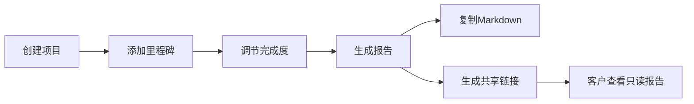

## 1. 产品概述

自由职业者项目协作管理应用，帮助自由职业者追踪和管理多项目里程碑节点，自动生成进度报告并支持客户分享，解决多项目并行时里程碑容易遗忘、进度汇报沟通成本高的问题。

## 2. 核心功能

### 2.1 功能模块
1. **项目列表页**：网格卡片展示所有项目，支持新增项目表单
2. **项目详情页（时间轴）**：里程碑时间轴视图，支持添加节点、调节完成度、生成报告、共享链接
3. **报告视图页**：Canvas 柱状图展示、文本摘要、Markdown 复制、共享链接生成
4. **共享只读视图**：通过短链接访问的只读报告页面

### 2.2 页面详情
| 页面名称 | 模块名称 | 功能描述 |
|---------|---------|---------|
| 项目列表页 | 项目卡片网格 | 卡片展示项目信息，hover 上移 4px + 阴影，颜色标签圆点 |
| 项目列表页 | 新增项目表单 | 项目名称、起止日期、12色颜色标签、描述文本 |
| 项目详情页 | 里程碑时间轴 | 垂直居中线条、圆形节点、完成度滑块、对勾图标、节点连线 |
| 项目详情页 | 添加里程碑表单 | 标题、截止日期、完成度滑块、备注文字（最多15个） |
| 报告视图页 | Canvas 柱状图 | 每项目一根柱子，颜色匹配项目，顶部百分比，500ms 升起动画 |
| 报告视图页 | 文本摘要 & Markdown 复制 | 结构化报告摘要，一键复制为 Markdown |
| 共享视图 | 短链接生成 | 6位随机短码，只读报告视图，无需登录 |

## 3. 核心流程

用户创建项目 → 添加里程碑节点 → 调节完成度 → 生成报告 → 复制 Markdown 或生成共享链接 → 客户通过短链接查看只读报告

## 4. 用户界面设计

### 4.1 设计风格
- 主背景色：#F8F9FA，卡片背景：白色
- 文字主色：#333333，辅助色：#6C757D
- 12种预设项目颜色标签
- 按钮 hover：scale 1.05，200ms ease
- 卡片 hover：translateY(-4px)，阴影增加，0.3s ease-out
- 时间轴滚动淡入：opacity 0→1，translateY(20px→0)，0.6s ease

### 4.2 响应式设计
- 桌面端：网格卡片多列布局，时间轴垂直居中
- 移动端（<768px）：网格卡片单列，时间轴左对齐
