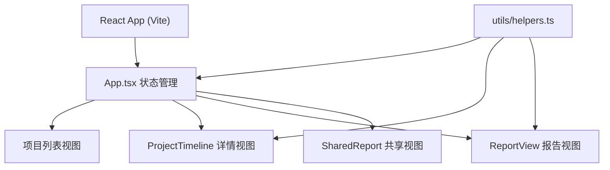

## 1. 架构设计



## 2. 技术说明
- 前端：React 18 + TypeScript + Vite
- 构建工具：Vite（@vitejs/plugin-react，自动导入 React）
- 状态管理：React useState（简单路由切换）
- 图表：原生 Canvas API 绘制柱状图
- 样式：纯 CSS + CSS 变量
- 图标：Lucide React

## 3. 文件结构
| 文件路径 | 用途 |
|---------|------|
| package.json | 依赖：react, react-dom, typescript, vite, @vitejs/plugin-react, lucide-react |
| vite.config.js | Vite 配置，启用 React 插件 |
| tsconfig.json | 严格模式，JSX: react-jsx，ESModule |
| index.html | 入口页面，div#root |
| src/main.tsx | ReactDOM.createRoot 渲染 App |
| src/App.tsx | 主组件，状态管理，路由切换 |
| src/components/ProjectTimeline.tsx | 项目详情页，时间轴 |
| src/components/ReportView.tsx | 报告视图，Canvas 柱状图 |
| src/components/SharedReport.tsx | 共享只读报告视图 |
| src/utils/helpers.ts | 工具函数：短码生成、日期格式化、完成度计算、报告摘要 |

## 4. 数据模型

```typescript
interface Milestone {
  id: string;
  title: string;
  dueDate: string;
  completion: number;
  note: string;
}

interface Project {
  id: string;
  name: string;
  startDate: string;
  endDate: string;
  color: string;
  description: string;
  milestones: Milestone[];
}

interface ReportData {
  projects: Project[];
  startDate: string;
  endDate: string;
  completions: { projectId: string; completion: number }[];
}
```

## 5. 性能要求
- 图表渲染响应时间 < 300ms
- 所有动画帧率 ≥ 50fps
- 使用 CSS transforms 而非 top/left 实现动画
- Canvas 动画使用 requestAnimationFrame
