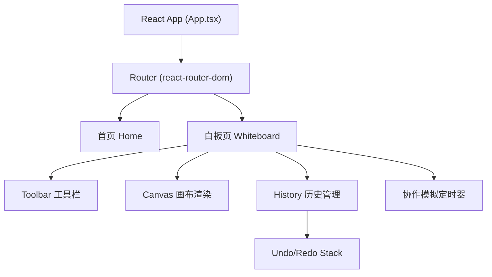

## 1. 架构设计



## 2. 技术说明

- **前端框架**：React@18 + TypeScript
- **构建工具**：Vite + @vitejs/plugin-react
- **路由**：react-router-dom
- **状态管理**：React useState/useReducer（应用组件内状态，无需额外全局库）
- **图标库**：lucide-react
- **ID生成**：uuid
- **辅助工具**：canvas-sketch-util
- **后端**：无，纯前端实现，协作效果通过定时器模拟
- **数据库**：无，历史记录保存在内存中

## 3. 路由定义

| 路由 | 用途 |
|-----|------|
| `/` | 首页，创建/加入房间入口 |
| `/room/:roomId` | 白板页面，接收URL参数房间ID |

## 4. 文件结构

```
src/
├── App.tsx              # 主组件：路由、全局状态
├── Whiteboard.tsx       # 核心白板组件：画布元素管理、实时同步、撤销/重做
├── Toolbar.tsx          # 工具栏组件：工具选择、颜色/粗细调整
├── history.ts           # 操作历史管理模块：撤销/重做栈
├── main.tsx             # 入口文件
└── index.css            # 全局样式
```

## 5. 数据模型

### 5.1 画布元素类型

```typescript
type ToolType = 'brush' | 'rectangle' | 'circle' | 'text';

interface BaseElement {
  id: string;
  type: ToolType;
  color: string;
  strokeWidth: number;
  userId?: string;       // 操作用户标识（用于协作模拟）
  userColor?: string;    // 用户边框色（用于协作模拟区分）
  createdAt: number;
}

interface BrushElement extends BaseElement {
  type: 'brush';
  points: { x: number; y: number }[];
}

interface RectangleElement extends BaseElement {
  type: 'rectangle';
  x: number;
  y: number;
  width: number;
  height: number;
}

interface CircleElement extends BaseElement {
  type: 'circle';
  x: number;
  y: number;
  radiusX: number;
  radiusY: number;
}

interface TextElement extends BaseElement {
  type: 'text';
  x: number;
  y: number;
  text: string;
  fontSize: number;
}

type CanvasElement = BrushElement | RectangleElement | CircleElement | TextElement;
```

### 5.2 历史记录数据结构

```typescript
interface HistoryState {
  past: CanvasElement[][];   // 已撤销的操作栈
  present: CanvasElement[];  // 当前画布状态
  future: CanvasElement[][]; // 可重做的操作栈
  maxHistory: number;        // 最大历史记录数（50）
}
```

## 6. 核心函数定义

### history.ts
```typescript
// 记录一次操作（将当前状态推入past，清空future）
function record(state: HistoryState, newPresent: CanvasElement[]): HistoryState;

// 撤销：pop past → present，当前present推入future
function undo(state: HistoryState): HistoryState;

// 重做：pop future → present，当前present推入past
function redo(state: HistoryState): HistoryState;
```

## 7. 性能优化策略

- Canvas 渲染：使用 requestAnimationFrame 批量绘制，避免重复重绘
- 历史记录：限制最多 50 步，防止内存膨胀
- 协作模拟：使用 2s 定时间隔，避免过于频繁的渲染
- 响应式：窗口 resize 使用 debounce 处理
- 元素渲染：使用 CSS transform 而非 top/left 进行位移
