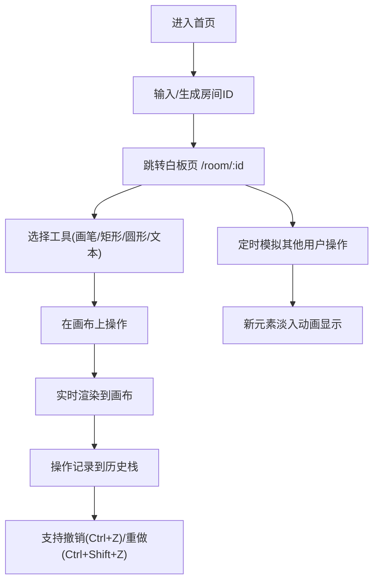

## 1. 产品概述

多用户在线实时协作白板应用，支持多人同时在画布上绘画、添加文本和图形，并能回放操作历史。

- 主要功能：实时协作绘画、多工具支持（画笔/矩形/圆形/文本）、操作历史撤销/重做
- 目标用户：需要远程协作头脑风暴、方案讨论的团队或个人
- 产品价值：提供即时、可视化的协作空间，替代线下白板讨论场景

## 2. 核心功能

### 2.1 用户角色
无需用户注册登录，通过URL房间ID标识协作空间。

### 2.2 功能模块
1. **首页**：创建/加入房间入口，房间ID输入
2. **白板页**：核心协作画布，包含工具栏、画布区域、协作模拟

### 2.3 页面详情
| 页面名称 | 模块名称 | 功能描述 |
|---------|---------|----------|
| 首页 | 房间入口 | 输入房间ID或随机生成，跳转到白板页面 |
| 白板页 | 工具栏 | 画笔、矩形、圆形、文本工具选择，颜色/粗细调整，撤销/重做按钮 |
| 白板页 | 画布区域 | 自适应窗口的画布，支持绘制、选择、移动元素 |
| 白板页 | 协作模拟 | 每2秒模拟其他用户添加随机形状，区分不同用户颜色 |

## 3. 核心流程

用户通过首页输入或生成房间ID → 进入白板页面 → 选择工具进行绘制操作 → 实时看到自己的绘制和其他模拟用户的操作 → 通过撤销/重做回退或恢复操作。

## 4. 用户界面设计

### 4.1 设计风格
- **主题颜色**：深色主题，背景 `#1e1e1e`，画布背景 `#ffffff`，工具栏背景 `#2d2d2d`
- **强调色**：8种预设色块供选择；不同用户边框色区分（用户A蓝色、用户B红色等）
- **按钮样式**：圆角 8px，hover时背景变亮为 `#3d3d3d`，transition 0.2s
- **字体**：使用系统无衬线字体，文本工具字号 24px
- **布局风格**：左侧工具栏 + 右侧画布区域，桌面端水平布局，移动端工具栏折叠为底部浮动菜单
- **图标风格**：使用 lucide-react 简洁线性图标，选中状态高亮显示

### 4.2 页面设计概述
| 页面名称 | 模块名称 | UI元素 |
|---------|---------|--------|
| 首页 | 房间入口 | 深色背景居中卡片，输入框+创建按钮，简洁优雅 |
| 白板页 | 工具栏 | 垂直排列工具按钮，颜色选择面板，粗细滑块，撤销/重做按钮 |
| 白板页 | 画布区域 | 白色画布带浅灰网格（20px间隔），元素选中高亮，拖拽半透明 |
| 白板页 | 响应式 | <768px时工具栏折叠为底部浮动菜单，点击图标展开 |

### 4.3 响应式设计
- Desktop-first，窗口宽度 <768px 时切换为移动端布局
- 工具栏从左侧折叠为底部可展开浮动菜单
- 画布区域始终自适应剩余空间
- 触控操作优化

### 4.4 动效细节
- 工具切换：200ms ease 颜色高亮动画
- 元素添加：400ms ease-in-out 淡入动画
- 撤销/重做：200ms ease 逐个恢复或移除
- 拖拽移动：元素半透明显示，松开恢复
- 所有操作反馈：transition 0.2s 平滑过渡
