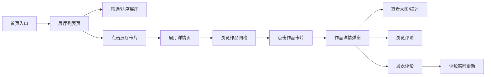
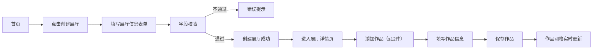

## 1. 产品概述

虚拟艺术展馆策划与管理平台，为策展人提供数字作品分组展示、自定义展厅布局的创作空间，为观众提供在线浏览和互动评论的艺术体验。

- 主要目的：让艺术作品突破物理空间限制，打造沉浸式线上展览体验
- 目标用户：策展人（创建管理展厅）、观众（浏览评论作品）
- 市场价值：连接艺术家、策展人与观众，构建数字艺术生态

## 2. 核心功能

### 2.1 用户角色

| 角色 | 说明 | 核心权限 |
|------|------|----------|
| 策展人 | 平台内容创作者 | 创建展厅、添加作品、管理展品 |
| 观众 | 平台内容消费者 | 浏览展厅、查看作品详情、发表评论 |

### 2.2 功能模块

1. **展厅列表页（GalleryPage）**：展厅卡片展示、主题关键词筛选（防抖300ms）、创建时间/名称排序
2. **展厅详情页（ExhibitionPage）**：作品网格展示（4列响应式）、作品详情弹窗、评论区
3. **作品管理**：作品卡片（ArtworkCard）、hover遮罩效果、详情模态框（大图+描述+评论）
4. **评论系统**：评论列表（时间倒序）、评论输入（≤100字）、用户名+时间戳显示
5. **展厅创建**：展厅表单（名称≤20字、描述≤200字、封面URL）

### 2.3 页面详情

| 页面名称 | 模块名称 | 功能描述 |
|----------|----------|----------|
| 展厅列表页 | 导航栏 | 固定顶部、滚动半透明、平台Logo + 入口 |
| 展厅列表页 | 筛选排序区 | 关键词搜索框（防抖）、排序下拉（时间/名称） |
| 展厅列表页 | 展厅卡片网格 | 卡片阴影、hover加深、封面图+标题+主题 |
| 展厅列表页 | 创建展厅按钮 | 模态框表单、字段校验 |
| 展厅详情页 | 展厅信息头 | 封面横幅、展厅名称、主题描述、返回按钮 |
| 展厅详情页 | 作品网格 | 4列布局、响应式调整、虚拟化渲染 |
| 展厅详情页 | 作品详情弹窗 | 毛玻璃背景、缩放淡入动画、大图+信息+评论区 |
| 评论区组件 | 评论列表 | 头像/用户名/时间/内容、倒序排列 |
| 评论区组件 | 评论输入 | 用户名输入、内容输入（≤100字）、提交按钮 |

## 3. 核心流程

### 3.1 观众浏览流程

观众进入首页 → 浏览展厅卡片（可筛选/排序）→ 点击进入展厅 → 浏览作品网格 → 点击作品查看详情 → 查看大图/描述 → 发表评论/浏览已有评论

### 3.2 策展人创建展厅流程

策展人进入首页 → 点击"创建展厅" → 填写表单（名称/描述/封面）→ 提交校验 → 展厅创建成功 → 进入展厅 → 添加作品（≤12件）→ 作品管理完成

## 4. 用户界面设计

### 4.1 设计风格

- **主色调**：极简白色与浅灰调，背景 #F5F5F5，主文字 #333333
- **辅助色**：边框/分割线 #E0E0E0，次要文字 #666666，强调色 #2C2C2C
- **卡片样式**：box-shadow: 0 4px 12px rgba(0,0,0,0.1)，hover时 0 8px 24px rgba(0,0,0,0.15)
- **按钮风格**：圆角4px，扁平化，深色填充#333配白色文字，hover微透明
- **字体**：主标题使用 'Playfair Display'（艺术感衬线体），正文使用 'Inter'（现代无衬线体）
- **布局风格**：固定宽度中央容器 max-width:1200px, margin:0 auto，卡片网格布局
- **图标风格**：极简线性图标（lucide-react），线条粗细统一

### 4.2 页面设计概述

| 页面名称 | 模块名称 | UI 元素 |
|----------|----------|----------|
| 展厅列表页 | 导航栏 | 固定顶部、高度64px、背景rgba(255,255,255,0.95) + backdrop-filter、滚动后透明度0.8 |
| 展厅列表页 | Hero区 | 大标题"虚拟艺术展馆"、副标题、简洁留白 |
| 展厅列表页 | 筛选工具栏 | 搜索框（左对齐）、排序下拉（右对齐）、创建展厅按钮（醒目） |
| 展厅列表页 | 展厅卡片 | 封面图（16:10，object-fit:cover）、标题、主题标签、创建时间、hover上浮4px |
| 展厅列表页 | 页脚 | 版权信息、分隔线、极简风格 |
| 展厅详情页 | 展厅头图 | 大幅封面（高度280px）、渐变遮罩、展厅名称叠加显示 |
| 展厅详情页 | 作品网格 | CSS Grid 4列、gap:24px、移动端响应式1-2列 |
| 作品卡片 | 交互态 | hover时 translateY(-4px) + 半透明rgba(0,0,0,0.3)遮罩 + 标题浮现 |
| 详情弹窗 | 动画 | scale(0.9)→scale(1)、opacity 0→1、300ms ease-out、毛玻璃backdrop-filter: blur(4px) |
| 评论区 | 条目 | 头像占位符、用户名（加粗）、时间（灰色小字）、评论内容（14px行高1.6） |

### 4.3 响应式设计

- **设计策略**：桌面优先（Desktop-first），移动端自适应
- **断点定义**：
  - ≥1200px：作品网格4列，展厅卡片3列
  - 768-1199px：作品网格3列，展厅卡片2列
  - 480-767px：作品网格2列，展厅卡片2列
  - <480px：作品网格1列，展厅卡片1列
- **触摸优化**：移动端按钮最小尺寸44×44px，弹窗关闭按钮增大，滚动区域优化

### 4.4 动画与微交互

- **页面过渡**：路由切换时轻微淡入（opacity 0→1，200ms）
- **卡片悬停**：transform: translateY(-4px) + box-shadow 加深 + 遮罩层渐变显示
- **弹窗显示**：scale 0.9→1 + opacity 0→1，背景遮罩 fade-in
- **评论提交**：新评论从上方滑入 + 背景高亮闪烁后消退
- **输入反馈**：focus时边框变色，提交按钮loading态旋转
- **导航栏**：滚动时background-color从透明渐变半透明白色（0.3s过渡）
