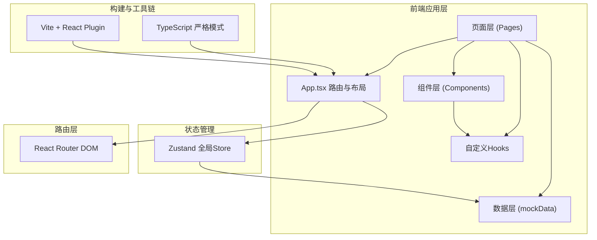
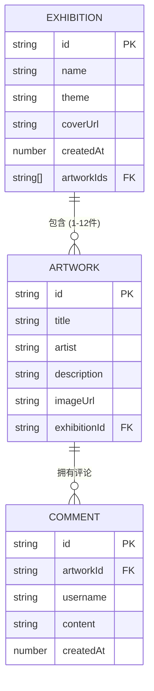

## 1. 架构设计



**调用关系与数据流向**：
1. `src/main.tsx` → 渲染 `App.tsx`（注入BrowserRouter）
2. `App.tsx` → 通过 `react-router-dom` 管理路由，维护导航栏/页脚，调用Zustand全局Store
3. `src/pages/GalleryPage.tsx` → 从Store/mockData获取展厅列表 → 传入筛选排序 → 渲染展厅卡片 → 查询参数跳转ExhibitionPage
4. `src/pages/ExhibitionPage.tsx` → 从路由参数获取展厅ID → 查询作品数据 → 使用虚拟列表渲染ArtworkCard → 点击弹窗展示详情+CommentSection
5. `src/components/ArtworkCard.tsx` → 接收作品props → hover/点击交互 → 触发onSelect回调
6. `src/components/CommentSection.tsx` → 接收评论props → 渲染列表 → 输入提交 → 回调父组件更新Store
7. `src/data/mockData.ts` → 导出类型定义 + 初始数据 → 被Store和页面组件导入
8. `src/hooks/useDebounce.ts` → 自定义Hook → 被GalleryPage筛选器使用

## 2. 技术描述

- **前端框架**：React@18 + TypeScript（strict模式 + esModuleInterop）
- **构建工具**：Vite@5 + @vitejs/plugin-react
- **路由管理**：react-router-dom@6（BrowserRouter + useParams + useSearchParams）
- **状态管理**：zustand（轻量级全局Store，管理展厅/作品/评论状态）
- **工具库**：uuid（生成唯一ID）、lucide-react（图标库）
- **虚拟化列表**：react-window（仅渲染视窗内卡片，优化长列表性能）
- **样式方案**：原生CSS + CSS Modules（或全局CSS配合类命名规范BEM），CSS Variables主题系统
- **后端/数据库**：无（纯前端，数据持久化于localStorage + 初始mock数据）

## 3. 路由定义

| 路由路径 | 页面组件 | 用途 |
|----------|----------|------|
| `/` | GalleryPage | 展厅列表首页，展示所有展厅卡片 |
| `/exhibition/:id` | ExhibitionPage | 单个展厅详情页，展示该展厅作品网格 |
| `*` | GalleryPage（重定向） | 404兜底，重定向回首页 |

**路由参数说明**：
- `/` 查询参数：`?theme=关键词&sort=createdAt|name` —— 用于展厅筛选与排序状态持久化
- `/exhibition/:id` 路径参数：`id` —— 展厅唯一标识，用于查询对应展厅及作品数据

## 4. 类型定义与数据接口

```typescript
// ========== 核心实体类型 ==========
export interface Exhibition {
  id: string;           // uuid
  name: string;         // 展厅名称（≤20字）
  theme: string;        // 主题描述（≤200字）
  coverUrl: string;     // 封面图片URL
  createdAt: number;    // 创建时间戳（ms）
  artworkIds: string[]; // 关联作品ID（≤12件）
}

export interface Artwork {
  id: string;           // uuid
  title: string;        // 作品标题（≤30字）
  artist: string;       // 艺术家名
  description: string;  // 作品描述
  imageUrl: string;     // 作品图片URL
  exhibitionId: string; // 所属展厅ID
}

export interface Comment {
  id: string;           // uuid
  artworkId: string;    // 关联作品ID
  username: string;     // 评论用户名
  content: string;      // 评论内容（≤100字）
  createdAt: number;    // 评论时间戳（ms）
}

// ========== 全局Store类型 ==========
export interface GalleryState {
  exhibitions: Exhibition[];
  artworks: Artwork[];
  comments: Comment[];
  
  // Actions
  addExhibition: (data: Omit<Exhibition, 'id' | 'createdAt' | 'artworkIds'>) => void;
  addArtwork: (data: Omit<Artwork, 'id'> & { exhibitionId: string }) => boolean;
  addComment: (data: Omit<Comment, 'id' | 'createdAt'>) => void;
  getExhibitionById: (id: string) => Exhibition | undefined;
  getArtworksByExhibition: (exhibitionId: string) => Artwork[];
  getCommentsByArtwork: (artworkId: string) => Comment[];
}

// ========== 筛选与排序 ==========
export type SortKey = 'createdAt' | 'name';
export interface FilterOptions {
  themeKeyword: string;
  sortBy: SortKey;
}
```

## 5. 数据模型与关系



### 初始Mock数据策略

`src/data/mockData.ts` 提供：
- 3个初始展厅（不同主题：当代抽象、数字水墨、赛博朋克）
- 每个展厅8-10件作品（图片使用 picsum.photos + 固定seed）
- 每件作品2-4条初始评论（测试用户名）
- 所有类型定义与校验工具函数

### 持久化方案

- Zustand Store使用 `persist` middleware，将数据写入 `localStorage`
- 初始化时优先读取localStorage，若为空则加载mockData
- 所有增删改操作同步持久化，刷新页面不丢失
- 评论提交后立即更新Store → 触发React重渲染（<300ms响应）

## 6. 性能优化方案

| 优化点 | 实现方案 | 预期效果 |
|--------|----------|----------|
| 列表虚拟化 | react-window FixedSizeGrid，仅渲染视窗内卡片 | 长列表滚动60fps，内存占用降低80% |
| 首屏加载 | Vite 代码分割 + 浏览器缓存 + CDN资源 | 首屏加载≤1.5s（模拟环境） |
| 筛选防抖 | useDebounce Hook（300ms），避免输入时重复计算 | 输入流畅无卡顿 |
| 评论更新 | Zustand 局部状态更新 + React immutable 渲染 | 评论提交后更新<300ms |
| 动画性能 | 优先 transform/opacity 属性（GPU加速）+ will-change | 所有过渡≥60fps |
| 图片优化 | 使用 loading="lazy" + object-fit + 指定宽高 | 避免重排，渐进式加载 |
| 重渲染优化 | React.memo 包裹 ArtworkCard/CommentItem | 父组件更新时不必要子组件不重渲染 |
