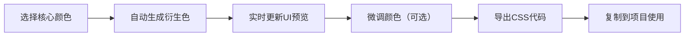

## 1. 产品概述
配色方案生成器是一款面向前端开发者的可视化配色工具，帮助用户通过直观的界面自定义主题配色并导出规范的CSS变量代码。
- 解决手动调配颜色、计算衍生色、编写CSS变量的繁琐问题，提升开发效率
- 目标用户为前端工程师、UI设计师，以及需要快速建立项目配色体系的团队

## 2. 核心功能

### 2.1 功能模块
1. **颜色选择面板**: 四个核心颜色（主色、辅色、背景色、文字色）的色盘选择器
2. **衍生色网格**: 基于核心颜色自动计算生成的9格衍生色展示区
3. **UI组件预览**: 实时应用配色主题的卡片、按钮、输入框、导航栏组件
4. **CSS代码导出**: 生成标准CSS自定义属性代码及组件样式示例

### 2.2 页面详情
| 页面名称 | 模块名称 | 功能描述 |
|-----------|-------------|---------------------|
| 主页面 | 颜色选择面板 | 色盘拖拽选取，光晕扩散动画，HEX/RGB实时显示与复制 |
| 主页面 | 衍生色网格 | HSL微调生成衍生色，3x3色块展示，hover放大与Tooltip |
| 主页面 | UI组件预览 | 毛玻璃卡片、按钮状态、输入框、导航栏的实时主题预览 |
| 主页面 | CSS代码导出 | 右侧滑入代码面板，等宽字体展示，一键复制功能 |

## 3. 核心流程
用户选择四个核心颜色 → 系统自动生成衍生色并更新预览组件 → 用户查看组件效果并微调颜色 → 点击导出按钮获取CSS变量代码 → 复制代码到项目中使用

## 4. 用户界面设计

### 4.1 设计风格
- 主色调：深色模式，背景#1a1a2e，卡片#16213e，文字#e0e0e0
- 强调色：用户选择的主色，透明度降低至0.8
- 按钮：圆角设计，hover/active状态颜色变化，按下缩放反馈
- 字体：系统等宽字体用于代码展示，系统无衬线字体用于界面
- 布局：桌面端左侧320px固定控制面板+右侧自适应预览区，移动端顶部抽屉式控制面板
- 动画：所有颜色过渡0.4s ease，色盘光晕0.3s ease-out，代码面板0.5s cubic-bezier滑入

### 4.2 页面设计概述
| 页面名称 | 模块名称 | UI元素 |
|-----------|-------------|-------------|
| 主页面 | 颜色选择面板 | 色盘、光晕动画、色值显示、复制按钮、按下反馈 |
| 主页面 | 衍生色网格 | 3x3等大色块、hover放大1.05倍、Tooltip淡入 |
| 主页面 | UI组件预览 | 毛玻璃卡片、按钮、输入框、导航栏，平滑过渡动画 |
| 主页面 | CSS代码导出 | 右侧滑入面板、等宽字体代码块、复制按钮 |

### 4.3 响应式
- 桌面端（≥768px）：左侧固定320px控制面板，右侧自适应预览区域
- 移动端（<768px）：控制面板折叠为顶部抽屉，带展开关闭动画
- 触控优化：色盘支持触摸拖拽，按钮点击区域放大
