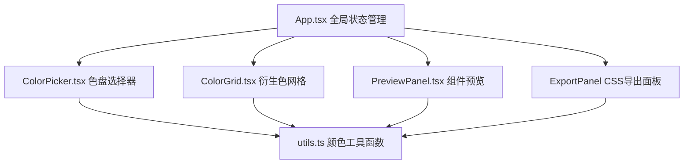

## 1. 架构设计



## 2. 技术描述
- 前端：React 18 + TypeScript 5 + Vite 5
- 构建工具：Vite，使用 @vitejs/plugin-react
- 状态管理：React useState + useMemo + React.memo 性能优化
- 样式：内联CSS（styled-jsx-free），使用CSS变量实现主题切换
- 无后端、无数据库，纯前端单页应用

## 3. 目录结构
```
/
├── package.json
├── vite.config.js
├── tsconfig.json
├── index.html
└── src/
    ├── App.tsx           # 主组件，状态管理与布局
    ├── ColorPicker.tsx   # 色盘选择器组件
    ├── ColorGrid.tsx     # 衍生色网格组件
    ├── PreviewPanel.tsx  # UI组件预览区
    └── utils.ts          # 颜色转换与衍生色生成工具
```

## 4. 核心数据结构

### 4.1 颜色状态
```typescript
interface ThemeColors {
  primary: string;    // 主色 HEX
  secondary: string;  // 辅色 HEX
  background: string; // 背景色 HEX
  text: string;       // 文字色 HEX
}
```

### 4.2 衍生色类型
```typescript
interface DerivedColor {
  name: string;       // 颜色名称
  value: string;      // HEX值
  rgb: string;        // RGB值
}
```

## 5. 性能优化策略
- 使用 React.memo 包裹 ColorPicker、ColorGrid、PreviewPanel 组件
- 使用 useMemo 缓存衍生色计算结果和CSS代码字符串
- 颜色变化通过CSS变量驱动，避免组件级重渲染
- 所有动画使用CSS transition/transform，保证60fps流畅度
