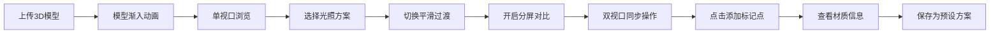

## 1. 产品概述

3D模型光照对比工具，帮助设计人员在线查看和比较3D模型在不同光照条件下的渲染效果差异，解决材质和光照方案选择时缺乏直观对比的痛点。

- 核心价值：提供即时、直观的多光照方案对比，加速设计决策流程
- 目标用户：3D设计师、产品设计师、材质工程师、渲染艺术家

## 2. 核心功能

### 2.1 用户角色

| 角色 | 注册方式 | 核心权限 |
|------|----------|----------|
| 设计人员 | 无需注册，直接使用 | 上传模型、切换光照、分屏对比、标记材质点、保存预设 |

### 2.2 功能模块

1. **3D场景渲染模块**：模型加载、光照系统、相机控制、动画效果
2. **光照预设管理模块**：预设方案切换、自定义保存、缩略图展示
3. **分屏对比模块**：双视口同步、分割线拖拽、水平/垂直分割切换
4. **材质标记模块**：点击标记、信息展示、拖拽移动、删除标记
5. **顶部工具栏**：模型上传、光照选择、分屏开关、帮助提示

### 2.3 页面详情

| 页面名称 | 模块名称 | 功能描述 |
|----------|----------|----------|
| 主应用 | 顶部工具栏 | 模型上传按钮、光照方案下拉框、分屏开关、帮助按钮、hover延迟提示 |
| 主应用 | 左侧工具面板 | 可折叠（280px/图标）、光照参数调节、标记工具控制 |
| 主应用 | 中央3D视口 | Three.js场景渲染、模型交互、标记点叠加层 |
| 主应用 | 右侧预设面板 | 预设卡片列表（64x64 webp缩略图）、点击应用、长按拖拽排序 |
| 主应用 | 分屏对比 | 双视口同步相机、30px拖拽手柄、平滑分割线调整 |

## 3. 核心流程

用户上传GLTF/GLB模型 → 模型旋转渐入动画展示 → 选择光照方案（平滑过渡动画）→ 开启分屏对比模式 → 左右设置不同光照 → 点击模型添加材质标记点 → 保存当前配置为预设方案

## 4. 用户界面设计

### 4.1 设计风格

- **主色调**：深色渐变背景 #1a1a2e → #16213e
- **强调色**：科技蓝 #4fc3f7、琥珀金 #ffb74d
- **按钮风格**：圆角8px、玻璃拟态半透明、hover发光效果
- **字体**：Inter 用于UI文字、JetBrains Mono 用于数值显示
- **布局风格**：三栏式布局 + 顶部工具栏、卡片式预设列表
- **图标风格**：Lucide 线性图标、细线描边2px

### 4.2 页面设计概览

| 页面名称 | 模块名称 | UI元素 |
|----------|----------|--------|
| 主应用 | 顶部工具栏 | 深色半透明背景、磨砂玻璃效果、按钮hover延迟200ms淡入提示 |
| 主应用 | 3D视口区域 | 最小宽度800px、渐变背景、鼠标滚轮缩放、左键旋转、右键平移 |
| 主应用 | 分屏分割线 | 30px宽拖拽区域、中央2px高亮条、hover发光反馈 |
| 主应用 | 标记点 | 半透明白色圆环20px、点击弹出浮动信息面板（材质名/法线/光照强度） |
| 主应用 | 预设卡片 | 圆角12px、64x64缩略图、hover抬升效果、长按拖拽排序动画 |

### 4.3 响应式设计

- 桌面端优先（min-width: 1200px）
- 左侧面板折叠适配小屏
- 右侧面板可完全隐藏
- 3D视口最小宽度800px保证操作空间

### 4.4 3D场景指引

- **环境**：深色渐变背景，支持6种预设光照方案（日光/阴天/黄昏/室内暖光/冷光/聚光灯）
- **光照设置**：每方案包含环境光+方向光+点光源组合，切换时1.5秒tween平滑过渡
- **相机动画**：OrbitControls控制，分屏模式双相机同步旋转/缩放/平移
- **模型动画**：加载时从0%透明度渐入+Y轴360°旋转，持续2秒
- **交互**：点击模型表面添加标记点，标记点可拖拽移动/删除
- **性能**：60fps帧率目标，光照切换≥30fps，模型面数≤10万三角面
