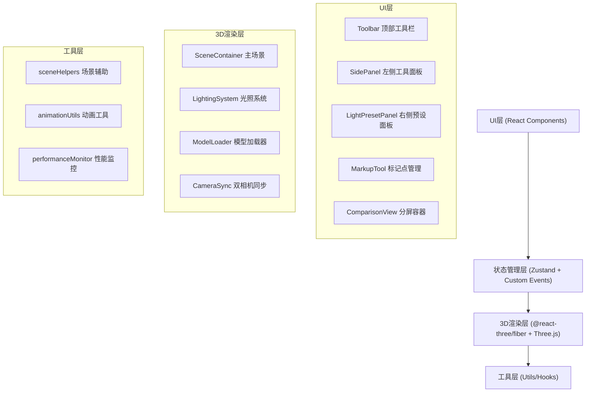

## 1. 架构设计



## 2. 技术说明

- **前端框架**: React@18 + TypeScript
- **构建工具**: Vite@5 + @vitejs/plugin-react
- **3D渲染**: Three@latest + @react-three/fiber@latest + @react-three/drei@latest
- **状态管理**: Zustand（跨组件状态共享）+ 自定义事件总线
- **工具库**: uuid（唯一ID生成）、lodash（深拷贝/防抖）
- **类型支持**: @types/three

## 3. 核心模块文件结构

```
src/
├── components/
│   ├── SceneContainer.tsx      # 3D场景主容器（光照/相机/模型）
│   ├── ComparisonView.tsx      # 分屏对比视图（双渲染器同步）
│   ├── LightPresetPanel.tsx    # 光照预设卡片列表面板
│   ├── MarkupTool.tsx          # 标记点管理组件
│   ├── Toolbar.tsx             # 顶部工具栏
│   ├── SidePanel.tsx           # 左侧可折叠工具面板
│   └── PresetCard.tsx          # 预设卡片组件
├── utils/
│   ├── sceneHelpers.ts         # 光照预设/模型加载/颜色插值
│   ├── animationUtils.ts       # 动画tween/缓动函数
│   └── performanceMonitor.ts   # FPS检测/LOD控制
├── store/
│   └── appStore.ts             # Zustand全局状态
├── App.tsx                     # 主应用入口
├── main.tsx                    # React挂载点
└── index.css                   # 全局样式
```

## 4. 核心数据模型

### 4.1 光照方案类型
```typescript
interface LightPreset {
  id: string;
  name: string;
  thumbnail?: string;
  ambient: { color: string; intensity: number };
  directional: { color: string; intensity: number; position: [number, number, number] };
  pointLights: Array<{ color: string; intensity: number; position: [number, number, number]; distance: number }>;
}
```

### 4.2 标记点类型
```typescript
interface MarkPoint {
  id: string;
  position: [number, number, number];
  normal: [number, number, number];
  materialName: string;
  lightIntensity: number;
  worldPosition: { x: number; y: number };
}
```

### 4.3 应用状态类型
```typescript
interface AppState {
  modelUrl: string | null;
  currentPresetId: string;
  comparisonPresetId: string;
  isSplitMode: boolean;
  splitDirection: 'vertical' | 'horizontal';
  splitRatio: number;
  markPoints: MarkPoint[];
  savedPresets: LightPreset[];
  leftPanelCollapsed: boolean;
  rightPanelVisible: boolean;
}
```

## 5. 关键实现策略

1. **分屏同步**: 使用共享Camera状态 + 双OrbitControls实例通过ref事件互相同步
2. **光照过渡**: 自定义tween函数线性插值颜色(rgb)和强度数值，requestAnimationFrame驱动，1.5s时长
3. **模型动画**: GLTFLoader加载后，useFrame钩子内控制opacity(0→1)和rotation.y(0→2π)，2秒后停止
4. **标记点拾取**: Three.js Raycaster实现点击拾取，读取face.normal和intersect.object.material.name
5. **缩略图生成**: renderer.domElement.toDataURL('image/webp') + canvas缩放至64x64
6. **性能监控**: requestAnimationFrame计算FPS平均值，超过阈值自动降低阴影分辨率/关闭抗锯齿
