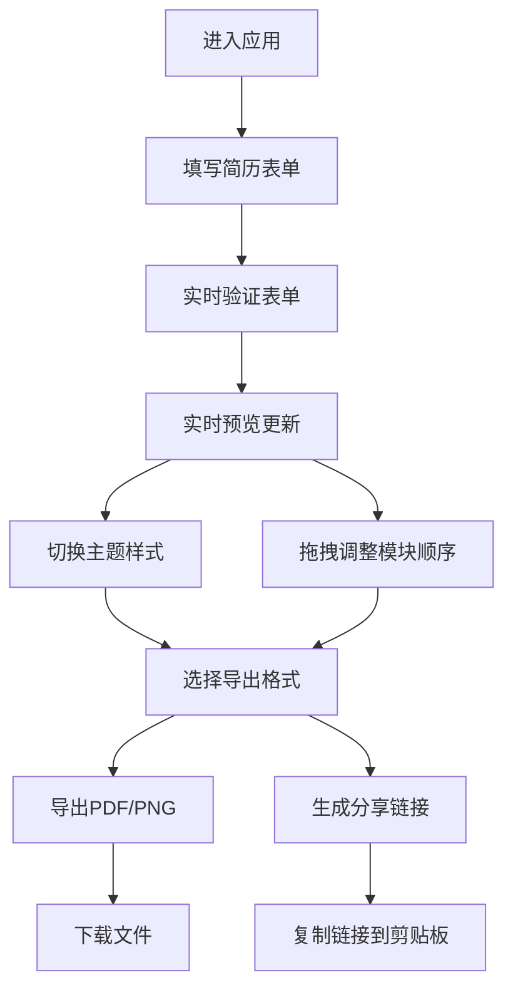

## 1. 产品概述
在线交互式简历生成器，帮助求职者快速创建、定制和导出专业简历。用户通过可视化表单填写个人信息，实时预览简历效果，支持多主题切换、模块拖拽排序和多格式导出功能。

- 核心价值：降低简历制作门槛，提供专业美观的简历模板，支持一键导出和分享
- 目标用户：求职者、应届毕业生、职场人士
- 产品定位：轻量级、专业级、易用的在线简历编辑工具

## 2. 核心功能

### 2.1 用户角色
| 角色 | 注册方式 | 核心权限 |
|------|----------|----------|
| 访客用户 | 无需注册 | 创建、编辑、导出、分享简历 |

### 2.2 功能模块
1. **编辑页面**：表单输入区域、实时预览区域、顶部导航栏
2. **简历表单**：个人信息、工作经历、教育背景、技能标签、项目经历
3. **实时预览**：A4比例预览、主题切换、模块拖拽排序
4. **导出功能**：PDF导出、PNG导出、分享链接生成
5. **后端服务**：简历数据CRUD、分享链接哈希生成

### 2.3 页面详情
| 页面名称 | 模块名称 | 功能描述 |
|---------|----------|----------|
| 编辑页面 | 顶部导航栏 | 应用名称、主题切换下拉菜单、导出按钮组、复制分享链接 |
| 编辑页面 | 左侧表单区域 | 个人信息表单、工作经历（最多5条）、教育背景（最多3条）、技能标签（动态增删，最多15个）、项目经历（最多4条）、表单实时验证 |
| 编辑页面 | 右侧预览区域 | A4纸比例预览（210mm x 297mm）、实时更新、网格背景、模块拖拽排序手柄 |

## 3. 核心流程
用户进入应用 → 填写简历表单（实时验证）→ 实时预览效果 → 切换主题样式 → 拖拽调整模块顺序 → 选择导出格式（PDF/PNG）或生成分享链接 → 下载文件或复制链接

## 4. 用户界面设计

### 4.1 设计风格
- 主色调：蓝色渐变（#2196F3 到 #1565C0）
- 背景色：中性灰 #F5F5F5
- 文字色：#333333
- 卡片样式：圆角8px、浅阴影（0 2px 8px rgba(0,0,0,0.08)）
- 交互反馈：hover时阴影加深、轻微缩放（200ms transition）
- 字体：使用 Playfair Display 作为标题字体，Lato 作为正文字体
- 动效：错误提示300ms淡入、主题切换0.5秒渐变、拖拽阴影提升效果、模块插入200ms缓动

### 4.2 页面设计概述
| 页面名称 | 模块名称 | UI元素 |
|---------|----------|--------|
| 编辑页面 | 顶部导航栏 | 固定定位、应用Logo、主题下拉菜单、导出按钮组、复制链接按钮 |
| 编辑页面 | 左侧表单 | 35%宽度、卡片分组、字段标签、输入框、错误提示（红色边框+文字）、添加/删除按钮、拖拽手柄 |
| 编辑页面 | 右侧预览 | 65%宽度、A4比例容器、白色背景、细微网格线、可拖拽模块卡片 |

### 4.3 响应式
- 桌面端（992px以上）：左右分栏布局（35% / 65%）
- 移动端（992px以下）：上下堆叠布局，表单在上预览在下
- 触摸优化：按钮最小点击区域48px，拖拽支持触摸操作

### 4.4 主题系统
| 主题名称 | 主色 | 背景色 | 文字色 | 强调色 | 卡片阴影 |
|---------|------|--------|--------|--------|----------|
| 简洁灰 | #607D8B | #FAFAFA | #37474F | #455A64 | 0 2px 8px rgba(96,125,139,0.15) |
| 商务蓝 | #1976D2 | #FFFFFF | #1A237E | #FFC107 | 0 2px 8px rgba(25,118,210,0.2) |
| 极简白 | #212121 | #FFFFFF | #212121 | #F44336 | 0 1px 4px rgba(0,0,0,0.08) |
| 暖橙 | #FF9800 | #FFF8E1 | #BF360C | #5D4037 | 0 2px 8px rgba(255,152,0,0.25) |
| 深色专业 | #1DE9B6 | #263238 | #ECEFF1 | #00BFA5 | 0 4px 16px rgba(0,0,0,0.3) |
