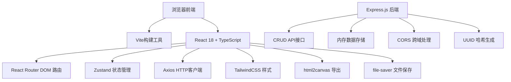
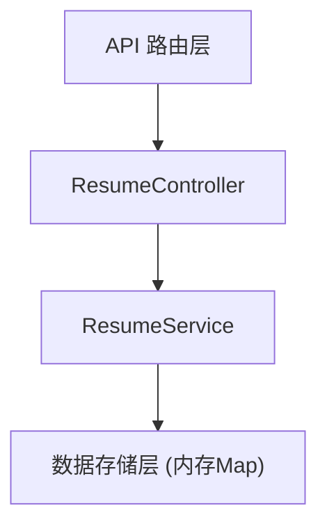
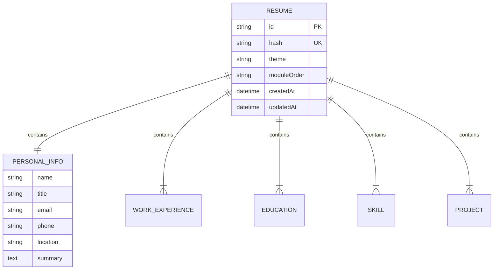

## 1. 架构设计



## 2. 技术描述

- **前端框架**: React@18 + TypeScript@5 + Vite@5
- **路由管理**: react-router-dom@6
- **状态管理**: zustand@4
- **样式方案**: TailwindCSS@3
- **HTTP客户端**: axios@1
- **导出功能**: html2canvas@1 + file-saver@2
- **后端服务**: Express@4 + TypeScript@5
- **后端工具**: cors@2 + uuid@9 + nodemailer@6
- **初始化工具**: vite-init

## 3. 目录结构

```
auto31/
├── package.json
├── vite.config.js
├── tsconfig.json
├── index.html
├── src/
│   ├── App.tsx
│   ├── main.tsx
│   ├── pages/
│   │   └── EditorPage.tsx
│   ├── components/
│   │   ├── ResumePreview.tsx
│   │   ├── FormSection.tsx
│   │   ├── DragHandle.tsx
│   │   └── ThemeSelector.tsx
│   ├── data/
│   │   └── resumeModel.ts
│   ├── store/
│   │   └── useResumeStore.ts
│   ├── utils/
│   │   ├── exportUtils.ts
│   │   └── validationUtils.ts
│   └── styles/
│       ├── resumeStyles.ts
│       └── index.css
└── server/
    └── index.ts
```

## 4. 路由定义

| 路由 | 页面 | 说明 |
|------|------|------|
| / | 编辑器页面 | 主页面，包含表单和预览 |
| /share/:hash | 简历分享页面 | 通过分享链接访问的简历预览页面 |

## 5. API 定义

### 5.1 类型定义

```typescript
interface PersonalInfo {
  name: string;
  title: string;
  email: string;
  phone: string;
  location: string;
  summary: string;
}

interface WorkExperience {
  id: string;
  company: string;
  position: string;
  startDate: string;
  endDate: string;
  description: string;
}

interface Education {
  id: string;
  school: string;
  degree: string;
  major: string;
  graduationDate: string;
}

interface Skill {
  id: string;
  name: string;
}

interface Project {
  id: string;
  name: string;
  role: string;
  startDate: string;
  endDate: string;
  description: string;
  achievements: string[];
}

interface ResumeData {
  personalInfo: PersonalInfo;
  workExperience: WorkExperience[];
  education: Education[];
  skills: Skill[];
  projects: Project[];
  theme: string;
  moduleOrder: string[];
}

interface ResumeEntity extends ResumeData {
  id: string;
  hash: string;
  createdAt: string;
  updatedAt: string;
}
```

### 5.2 API 接口

| 方法 | 路径 | 说明 |
|------|------|------|
| POST | /api/resumes | 创建简历 |
| GET | /api/resumes/:hash | 根据哈希获取简历 |
| PUT | /api/resumes/:id | 更新简历 |
| DELETE | /api/resumes/:id | 删除简历 |
| POST | /api/resumes/share | 生成分享链接 |

### 5.3 请求响应示例

**POST /api/resumes**
```typescript
// Request
{
  personalInfo: { name: "张三", title: "前端工程师", ... },
  workExperience: [...],
  ...
}

// Response
{
  id: "uuid",
  hash: "abc123",
  ...resumeData,
  createdAt: "2024-01-01T00:00:00Z"
}
```

## 6. 服务器架构



## 7. 数据模型

### 7.1 实体关系



### 7.2 验证规则

| 字段 | 验证规则 |
|------|----------|
| name | 必填，最大50字符 |
| email | 必填，邮箱格式 |
| phone | 必填，手机号格式 |
| workExperience | 最多5条 |
| education | 最多3条 |
| skills | 最多15个 |
| projects | 最多4条 |
| 日期字段 | 结束日期 >= 开始日期 |
