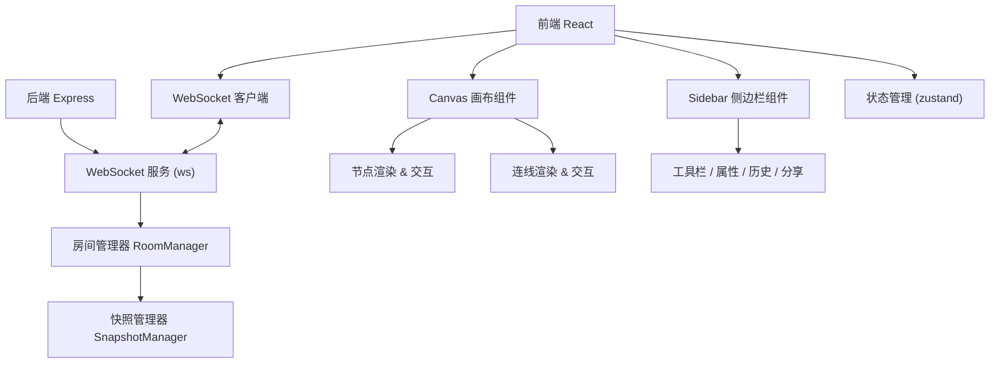

## 1. 架构设计



## 2. 技术描述

- **前端**: React@18 + TypeScript + Vite + zustand + html2canvas
- **后端**: Express@4 + ws (WebSocket库) + cors
- **构建工具**: Vite
- **状态管理**: zustand
- **WebSocket**: ws 库
- **图片导出**: html2canvas

## 3. 项目结构

```
auto34/
├── package.json
├── vite.config.js
├── tsconfig.json
├── index.html
└── src/
    ├── client/
    │   ├── App.tsx              # 主组件，路由和全局状态
    │   ├── components/
    │   │   ├── Canvas.tsx       # 画布组件
    │   │   └── Sidebar.tsx      # 侧边栏组件
    │   ├── store/
    │   │   └── useFlowStore.ts  # 状态管理
    │   ├── types/
    │   │   └── index.ts         # 类型定义
    │   └── utils/
    │       └── websocket.ts     # WebSocket工具
    └── server/
        ├── server.ts            # 主服务
        ├── roomManager.ts       # 房间管理器
        └── snapshotManager.ts   # 快照管理器
```

## 4. 路由定义

| 路由 | 用途 |
|------|------|
| `/` | 首页，输入房间名进入 |
| `/room/:roomId` | 编辑器主页面 |
| `/share/:shareCode` | 分享只读页面 |

## 5. API 定义

### 5.1 WebSocket 消息类型

```typescript
// 客户端 -> 服务端
type ClientMessage =
  | { type: 'join'; roomId: string; userId: string; userName: string }
  | { type: 'leave'; roomId: string; userId: string }
  | { type: 'node-add'; data: FlowNode }
  | { type: 'node-update'; data: Partial<FlowNode> & { id: string } }
  | { type: 'node-delete'; id: string }
  | { type: 'edge-add'; data: FlowEdge }
  | { type: 'edge-update'; data: Partial<FlowEdge> & { id: string } }
  | { type: 'edge-delete'; id: string }
  | { type: 'cursor-move'; userId: string; x: number; y: number };

// 服务端 -> 客户端
type ServerMessage =
  | { type: 'init-state'; nodes: FlowNode[]; edges: FlowEdge[]; users: User[] }
  | { type: 'user-join'; user: User }
  | { type: 'user-leave'; userId: string }
  | { type: 'node-add'; data: FlowNode }
  | { type: 'node-update'; data: Partial<FlowNode> & { id: string } }
  | { type: 'node-delete'; id: string }
  | { type: 'edge-add'; data: FlowEdge }
  | { type: 'edge-update'; data: Partial<FlowEdge> & { id: string } }
  | { type: 'edge-delete'; id: string }
  | { type: 'cursor-move'; userId: string; x: number; y: number }
  | { type: 'snapshot-created'; snapshot: Snapshot };
```

### 5.2 HTTP 接口

```typescript
// 生成分享链接
POST /api/share/:roomId
Response: { shareCode: string }

// 通过分享码获取房间
GET /api/share/:shareCode
Response: { roomId: string }

// 获取版本列表
GET /api/snapshots/:roomId
Response: Snapshot[]

// 恢复版本
POST /api/snapshots/:roomId/restore
Request: { snapshotId: string }
Response: { success: boolean }

// 导出PNG (前端处理)
```

## 6. 数据模型

### 6.1 数据定义

```typescript
interface FlowNode {
  id: string;
  type: 'rectangle' | 'diamond' | 'circle' | 'text';
  x: number;
  y: number;
  width: number;
  height: number;
  title: string;
  description: string;
  color: string;
  createdAt: number;
}

interface FlowEdge {
  id: string;
  sourceId: string;
  targetId: string;
  label?: string;
  createdAt: number;
}

interface User {
  id: string;
  name: string;
  color: string;
  roomId: string;
}

interface Snapshot {
  id: string;
  roomId: string;
  nodes: FlowNode[];
  edges: FlowEdge[];
  createdBy: string;
  createdAt: number;
}
```

### 6.2 房间状态管理

```typescript
class RoomManager {
  rooms: Map<string, Room>;
  
  joinRoom(roomId: string, user: User): void;
  leaveRoom(roomId: string, userId: string): void;
  broadcast(roomId: string, message: ServerMessage, excludeId?: string): void;
  applyOperation(roomId: string, op: ClientMessage): void;
}

class SnapshotManager {
  snapshots: Map<string, Snapshot[]>;
  lastActivity: Map<string, number>;
  activityTimer: Map<string, NodeJS.Timeout>;
  
  recordActivity(roomId: string, userId: string): void;
  createSnapshot(roomId: string, userId: string): Snapshot;
  getSnapshots(roomId: string): Snapshot[];
  restoreSnapshot(roomId: string, snapshotId: string): void;
}
```
