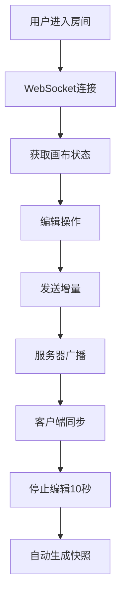

## 1. 产品概述

多用户在线协作流程图编辑器，解决团队远程协作时难以直观共同设计业务流程、编辑同步延迟高、版本管理混乱的问题。支持节点拖拽编辑、连线管理、实时协作、版本回溯、导出分享等核心功能，为团队提供高效的流程可视化协作工具。

## 2. 核心功能

### 2.1 用户角色

| 角色 | 进入方式 | 核心权限 |
|------|----------|----------|
| 协作用户 | 输入房间名进入 | 完整编辑权限（增删改节点/连线） |
| 只读用户 | 输入分享码进入 | 仅查看权限，禁止编辑 |

### 2.2 功能模块

1. **画布编辑器**：节点拖拽、连线绘制、缩放平移、多用户光标显示
2. **节点工具栏**：四种节点（矩形、菱形、圆形、文本）拖拽添加、搜索过滤
3. **属性面板**：选中节点/连线的属性编辑（标题、描述、颜色）
4. **版本历史**：自动快照生成、历史列表展示、预览与恢复
5. **分享导出**：PNG导出、分享链接生成、分享码查看

### 2.3 页面详情

| 页面名称 | 模块名称 | 功能描述 |
|---------|---------|---------|
| 主编辑器 | 三栏布局 | 左侧工具栏、中间画布、右侧属性面板 |
| 主编辑器 | 底部抽屉 | 移动端适配，工具栏/属性面板折叠为底部导航 |
| 分享查看 | 只读画布 | 分享码进入，仅展示流程，禁止编辑 |

## 3. 核心流程

### 3.1 协作编辑流程
用户进入房间 → 连接WebSocket → 获取当前画布状态 → 拖拽添加/编辑节点 → 发送增量操作 → 服务器广播 → 所有客户端同步更新 → 停止编辑10秒后自动生成快照

### 3.2 分享查看流程
用户生成分享链接（8位随机码） → 其他用户输入分享码 → 进入只读模式 → 查看流程图

## 4. 用户界面设计

### 4.1 设计风格
- **主色调**：深色主题，主背景 `#1e1e2e`，画布背景 `#2a2a3e`，节点填充 `#3a3a5e`，选中边框 `#6c8cff`
- **16色调色板**：提供16种预设颜色供节点自定义
- **字体**：现代无衬线字体，层次清晰
- **交互反馈**：所有操作有明确的动画反馈，节点弹性进入、连线高亮、侧边栏平滑切换

### 4.2 页面设计概述

| 页面名称 | 模块名称 | UI元素 |
|---------|---------|--------|
| 主编辑器 | 左侧工具栏 | 搜索框、节点类型卡片、拖拽预览、弹性动画 |
| 主编辑器 | 中间画布 | 网格背景、节点（四种形状）、贝塞尔连线、多用户彩色光标、拖拽跟随动画 |
| 主编辑器 | 右侧面板 | 属性编辑表单、版本历史列表（时间戳+创建人）、分享功能 |
| 主编辑器 | 顶部栏 | 房间名、在线用户数、导出按钮 |
| 分享页面 | 只读画布 | 流程图展示、返回按钮 |

### 4.3 动画效果
- 节点进入：`scale` 从0到1，`overshoot` 弹性效果，400ms
- 侧边栏切换：`translateX` + `opacity`，300ms ease
- 版本恢复：淡入过渡，300ms ease
- 节点拖拽：`requestAnimationFrame` 驱动平滑跟随
- 导出loading：旋转齿轮图标 + 进度百分比

### 4.4 响应式
- 桌面端（≥768px）：三栏布局，左240px + 自适应画布 + 右300px
- 移动端（<768px）：左右侧栏折叠为底部抽屉式导航，点击图标展开

## 5. 性能指标
- 支持50个节点 + 100条连线同时编辑
- 帧率不低于50fps
- 实时同步延迟低于200ms
