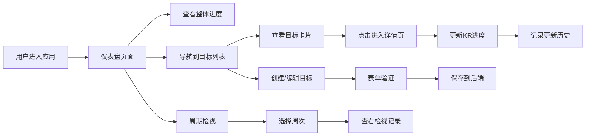

## 1. 产品概述
OKR追踪应用是一个在线团队目标管理平台，帮助团队设定、跟踪和评估季度目标与关键成果。通过可视化的进度展示和数据驱动的周期检视，提升团队目标对齐和执行效率。

- 核心价值：将抽象的团队目标转化为可量化的关键结果，通过持续追踪和定期检视，确保团队聚焦于最重要的事项
- 目标用户：团队管理者、产品负责人、项目经理及团队成员

## 2. 核心功能

### 2.1 用户角色
| 角色 | 注册方式 | 核心权限 |
|------|----------|----------|
| 团队成员 | 无需注册（演示版） | 创建/编辑目标、更新关键结果进度、查看仪表盘 |

### 2.2 功能模块
1. **目标列表页**：目标卡片矩阵展示、状态标签、新建目标入口
2. **目标详情页**：整体进度环、KR时间线、进度更新记录、进度趋势图
3. **仪表盘页**：团队整体进度统计、风险预警、高优先级目标列表、周期检视

### 2.3 页面详情
| 页面名称 | 模块名称 | 功能描述 |
|---------|---------|----------|
| 目标列表页 | 目标卡片网格 | 两列响应式布局，展示目标标题、负责人、季度标签、KR进度条、置信度滑块 |
| 目标列表页 | 新建/编辑表单 | 受控组件表单，支持设置目标标题、描述、负责人、季度、2-5个关键结果 |
| 目标详情页 | 进度环动画 | SVG圆环动画，颜色从红到绿渐变，数值变化过渡0.5s |
| 目标详情页 | 时间线记录 | 按时间顺序展示所有KR进度更新记录，包含日期、更新者、完成百分比、备注 |
| 目标详情页 | 进度趋势图 | recharts折线图，X轴为日期，Y轴为完成百分比，支持缩放和拖拽 |
| 仪表盘页 | 顶部横幅 | 显示团队整体完成度XX%，渐变进度条从蓝到绿 |
| 仪表盘页 | 风险预警 | 统计有风险的目标数量，橙色预警标识 |
| 仪表盘页 | 周期检视 | 左侧周次列表，右侧检视记录，点击平滑切换数据 |

## 3. 核心流程
用户进入应用后，首先看到仪表盘页面展示团队整体进度概览。用户可以导航到目标列表页查看所有目标卡片，点击卡片进入详情页查看详细进度和历史记录。在详情页可以更新关键结果的完成百分比和置信度，系统会自动记录更新历史。每周进行周期检视时，可以在仪表盘页按周查看进度变化。

## 4. 用户界面设计

### 4.1 设计风格
- 主色调：深蓝色 #1a237e，搭配白色和浅灰色
- 按钮风格：圆角按钮，hover时背景色加深10%，点击时scale(0.95)反馈
- 字体：标题使用白色粗体，正文使用深色常规字重
- 布局风格：卡片式布局，圆角12px，柔和阴影
- 动效：全局过渡使用 cubic-bezier(0.4, 0, 0.2, 1)，卡片hover上浮4px并增加阴影

### 4.2 页面设计概述
| 页面名称 | 模块名称 | UI元素 |
|---------|---------|--------|
| 仪表盘 | 顶部横幅 | 深蓝色背景，白色粗体标题，渐变进度条 |
| 仪表盘 | 统计卡片 | 白色背景，圆角12px，柔和阴影，图标+数值展示 |
| 仪表盘 | 目标矩阵网格 | 两列布局，卡片hover上浮效果，状态标签色彩区分 |
| 目标列表 | 目标卡片 | 左上角状态标签（绿/蓝/橙/灰），KR进度条填充动画 |
| 目标详情 | 进度环 | SVG圆环动画，颜色渐变过渡 |
| 目标详情 | 时间线 | 左侧竖线连接，右侧记录卡片，日期标识 |
| 表单 | 输入框 | 不符合规则时边框变红并左右抖动0.2秒 |
| 全局 | Toast提示 | 从顶部滑入，红色背景，2秒后自动消失，带关闭按钮 |

### 4.3 响应式
- 桌面端（≥768px）：目标卡片两列网格布局
- 平板（<768px）：目标卡片单列布局
- 触控优化：按钮最小高度44px，表单输入框充足内边距

### 4.4 动画设计
- 页面加载：staggered reveal动画，卡片依次出现
- 卡片hover：上浮4px，阴影增强，0.3s ease-out
- KR进度条：从左到右填充动画，1s ease-in
- 数据切换：0.4s fade淡出淡入效果
- 按钮交互：hover背景加深，点击scale(0.95)
- 表单校验：错误时左右抖动0.2秒，边框变红
- Toast：从顶部滑入，2秒后滑出
