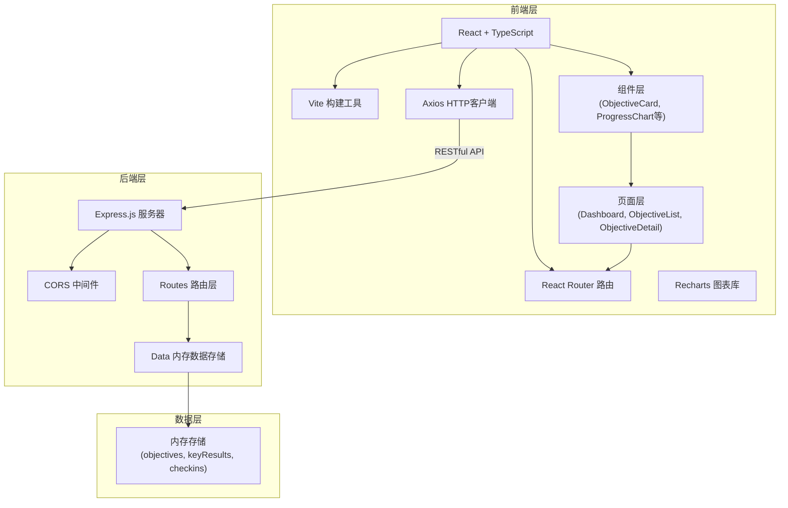
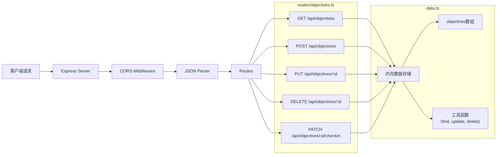
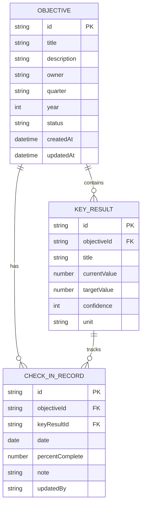

## 1. 架构设计



## 2. 技术描述
- 前端：React@18 + TypeScript@5 + Vite@5
- 状态管理：React Hooks (useState, useEffect, useContext)
- 路由：react-router-dom@6
- HTTP客户端：axios@1
- 图表库：recharts@2
- 唯一标识：uuid@9
- 后端：Express@4 + TypeScript@5
- 后端运行：ts-node@10
- 构建工具：Vite@5 + @vitejs/plugin-react@4
- 开发代理：Vite proxy 转发 /api 到 Express 服务器

## 3. 路由定义
| 前端路由 | 页面组件 | 用途 |
|---------|---------|------|
| / | Dashboard | 仪表盘首页 |
| /objectives | ObjectiveList | 目标列表页 |
| /objectives/:id | ObjectiveDetail | 目标详情页 |

| 后端API路由 | 方法 | 用途 |
|------------|------|------|
| /api/objectives | GET | 获取所有目标列表 |
| /api/objectives | POST | 创建新目标 |
| /api/objectives/:id | PUT | 更新目标信息 |
| /api/objectives/:id | DELETE | 删除目标 |
| /api/objectives/:id/checkin | PATCH | 更新目标KR进度（周期检视） |

## 4. API 定义

### 4.1 数据类型定义
```typescript
interface KeyResult {
  id: string;
  title: string;
  currentValue: number;
  targetValue: number;
  confidence: number; // 1-5
  unit: string;
}

interface CheckInRecord {
  id: string;
  keyResultId: string;
  date: string;
  percentComplete: number;
  note: string;
  updatedBy: string;
}

interface Objective {
  id: string;
  title: string;
  description: string;
  owner: string;
  quarter: 'Q1' | 'Q2' | 'Q3' | 'Q4';
  year: number;
  keyResults: KeyResult[];
  checkIns: CheckInRecord[];
  status: 'not_started' | 'in_progress' | 'at_risk' | 'completed';
  createdAt: string;
  updatedAt: string;
}
```

### 4.2 API 响应格式
```typescript
// GET /api/objectives
interface GetObjectivesResponse {
  success: boolean;
  data: Objective[];
}

// POST /api/objectives
interface CreateObjectiveRequest {
  title: string;
  description: string;
  owner: string;
  quarter: 'Q1' | 'Q2' | 'Q3' | 'Q4';
  year: number;
  keyResults: Omit<KeyResult, 'id'>[];
}

// PATCH /api/objectives/:id/checkin
interface CheckInRequest {
  keyResultId: string;
  percentComplete: number;
  note: string;
  updatedBy: string;
}
```

## 5. 服务器架构图



## 6. 数据模型

### 6.1 数据模型定义



### 6.2 初始示例数据
```typescript
// data.ts 中的初始数据
const initialObjectives: Objective[] = [
  {
    id: '1',
    title: '提升产品用户体验',
    description: '通过优化核心流程和减少用户摩擦点，提升整体产品满意度',
    owner: '张明',
    quarter: 'Q2',
    year: 2026,
    status: 'in_progress',
    keyResults: [
      { id: 'kr1', title: '用户满意度NPS达到50+', currentValue: 42, targetValue: 50, confidence: 4, unit: '分' },
      { id: 'kr2', title: '核心流程转化率提升15%', currentValue: 68, targetValue: 75, confidence: 3, unit: '%' },
      { id: 'kr3', title: '用户反馈响应时间<24小时', currentValue: 32, targetValue: 100, confidence: 5, unit: '%' }
    ],
    checkIns: [
      { id: 'c1', keyResultId: 'kr1', date: '2026-04-07', percentComplete: 75, note: '本周完成了3个体验优化', updatedBy: '张明' },
      { id: 'c2', keyResultId: 'kr1', date: '2026-04-14', percentComplete: 80, note: 'NPS提升至42', updatedBy: '张明' }
    ],
    createdAt: '2026-04-01T00:00:00Z',
    updatedAt: '2026-06-10T00:00:00Z'
  }
];
```
