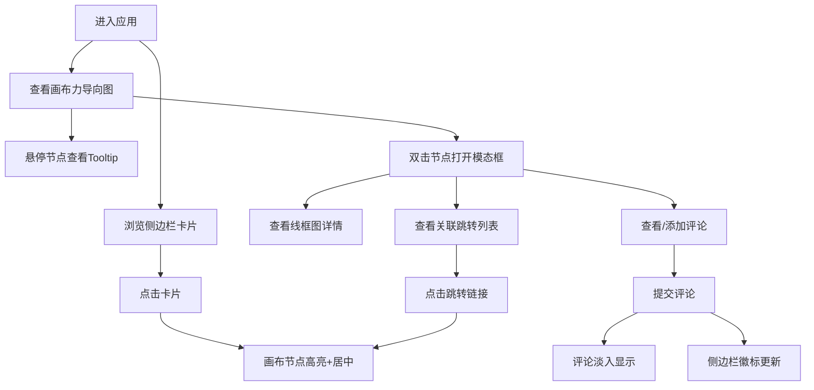

## 1. 产品概述

交互式UI线框图协作展示应用，面向远程协作的设计团队，提供线框图卡片化展示、页面间跳转关系可视化绘制、标注与评论功能，解决传统文档方式缺乏直观交互和即时反馈的问题。

- 目标用户：远程协作的UI/UX设计团队
- 核心价值：将线框图页面以力导向图形式可视化展示页面间跳转关系，支持实时评论与标注，提升设计沟通效率

## 2. 核心功能

### 2.1 用户角色

| 角色 | 注册方式 | 核心权限 |
|------|----------|----------|
| 设计师 | 邀请制 | 浏览、评论、标注线框图 |
| 产品经理 | 邀请制 | 浏览、评论线框图 |

### 2.2 功能模块

1. **画布页面**：力导向布局的线框图节点与连线图、缩放平移、节点交互
2. **侧边栏**：线框图卡片列表、选中联动、评论计数徽标
3. **详情模态框**：线框图详情展示、关联跳转列表、评论系统

### 2.3 页面详情

| 页面名称 | 模块名称 | 功能描述 |
|----------|----------|----------|
| 画布页面 | 力导向画布 | 使用d3-force绘制节点与连线，节点显示标题和缩略图，悬停放大1.15倍并显示Tooltip，双击打开模态框 |
| 画布页面 | 缩放平移 | 鼠标滚轮缩放（0.3-2.0），拖拽空白区域平移，边缘渐变遮罩 |
| 画布页面 | 节点高亮 | 侧边栏选中后对应节点金色边框呼吸闪烁，画布自动居中该节点 |
| 侧边栏 | 卡片列表 | 展示页面标题、创建时间、128x80缩略预览图，hover上升4px加浅蓝边框 |
| 侧边栏 | 评论徽标 | 红色圆形徽标显示评论数，从0到n弹出放大动画 |
| 详情模态框 | 线框图详情 | SVG占位图、关联跳转列表（蓝色链接）、评论列表（用户名+时间戳+内容） |
| 详情模态框 | 评论输入 | 输入框聚焦高亮（主色边框+光晕），提交按钮点击波纹效果，提交后淡入显示 |

## 3. 核心流程

1. 用户进入应用，看到左侧侧边栏展示所有线框图卡片列表，右侧画布以力导向图展示节点与跳转关系
2. 用户在侧边栏点击某卡片 → 画布对应节点高亮并自动居中
3. 用户在画布上双击节点 → 弹出模态框查看线框图详情和关联跳转
4. 用户在模态框内点击关联跳转链接 → 跳转到对应节点并高亮
5. 用户在模态框内添加评论 → 评论即时显示，侧边栏徽标更新

## 4. 用户界面设计

### 4.1 设计风格

- 主色调：柔和蓝白灰色系（背景#F5F7FA，主色#3B82F6，强调色#F59E0B）
- 按钮样式：圆角8px，主色填充，点击波纹效果
- 字体：标题使用 Outfit（几何感现代字体），正文使用 Noto Sans SC（中文友好）
- 布局：左侧固定280px侧边栏 + 右侧画布区域
- 图标风格：线条型，使用 lucide-react 图标库

### 4.2 页面设计概述

| 页面名称 | 模块名称 | UI元素 |
|----------|----------|--------|
| 画布页面 | 力导向画布 | 圆形节点（40-80px）+ 缩略图+标题，连线带渐变色箭头，背景#F5F7FA，边缘渐变遮罩 |
| 画布页面 | 节点Tooltip | 白色背景黑字，圆角8px，0.2s延迟出现，显示页面名称和引用次数 |
| 侧边栏 | 卡片列表 | 白色背景带阴影分割线，卡片圆角12px，128x80缩略预览图，hover上升4px+浅蓝边框 |
| 侧边栏 | 评论徽标 | 红色圆形徽标，白色数字，弹出放大动画 |
| 详情模态框 | 模态框主体 | 缩放淡入动画0.3s cubic-bezier，SVG线框图占位，蓝色跳转链接，评论列表 |
| 详情模态框 | 评论输入 | 输入框聚焦主色边框+光晕，提交按钮波纹效果0.4s |

### 4.3 响应式适配

- 桌面端（≥768px）：左侧固定侧边栏280px + 右侧画布
- 移动端（<768px）：侧边栏折叠为底部抽屉式导航条，显示卡片标题缩略，点击弹起覆盖半屏
