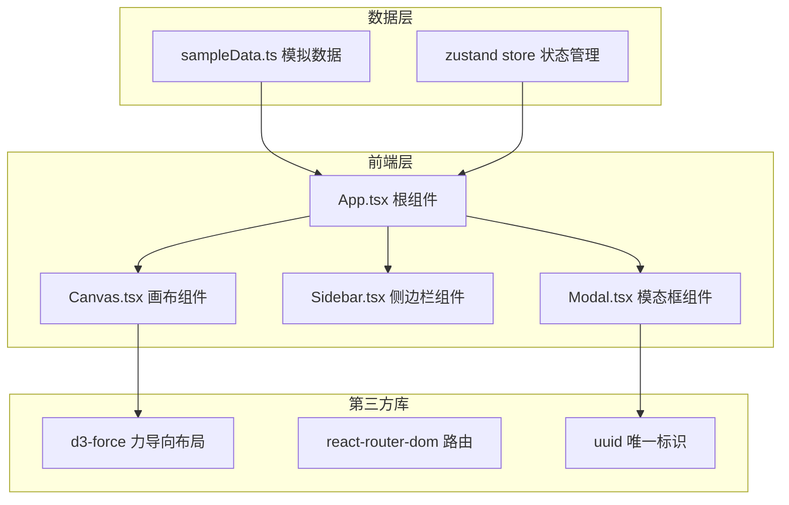
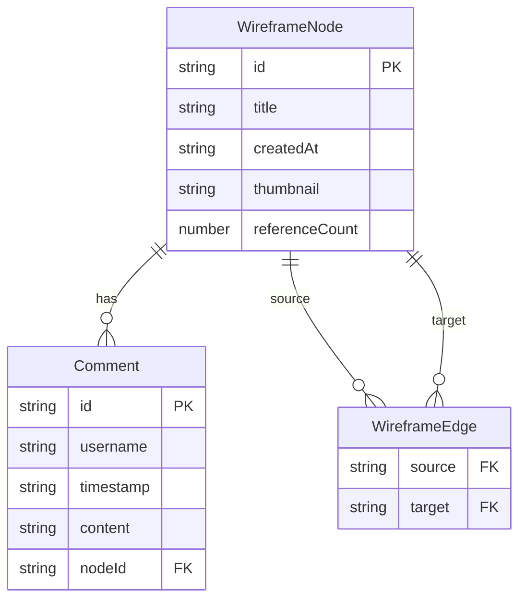

## 1. 架构设计



**数据流向**：
- `sampleData.ts` 提供初始节点和连线数据 → `App.tsx` 初始化状态
- `App.tsx` 将节点/连线数据传递给 `Canvas.tsx`，将卡片列表传递给 `Sidebar.tsx`
- `Sidebar.tsx` 点击卡片 → 输出选中ID → `App.tsx` 更新选中态 → `Canvas.tsx` 高亮对应节点
- `Canvas.tsx` 双击节点 → 输出节点ID → `App.tsx` 打开模态框 → `Modal.tsx` 显示详情
- `Modal.tsx` 提交评论 → 输出评论数据 → `App.tsx` 更新评论列表 → `Sidebar.tsx` 徽标更新

## 2. 技术说明

- 前端：React@18 + TypeScript + Vite
- 初始化工具：vite-init（react-ts 模板）
- 样式：Tailwind CSS 3
- 状态管理：zustand
- 力导向布局：d3-force
- 路由：react-router-dom（单页应用，仅一个主路由）
- 后端：无（纯前端，使用模拟数据）
- 数据库：无（使用内存状态 + 模拟数据）

## 3. 路由定义

| 路由 | 用途 |
|------|------|
| / | 主页面，包含画布、侧边栏和模态框 |

## 4. API定义

无后端API，所有数据通过 `sampleData.ts` 模拟提供。

### 数据类型定义

```typescript
interface WireframeNode {
  id: string;
  title: string;
  createdAt: string;
  thumbnail: string;
  referenceCount: number;
  comments: Comment[];
}

interface WireframeEdge {
  source: string;
  target: string;
}

interface Comment {
  id: string;
  username: string;
  timestamp: string;
  content: string;
}

interface AppState {
  nodes: WireframeNode[];
  edges: WireframeEdge[];
  selectedNodeId: string | null;
  modalNodeId: string | null;
  selectNode: (id: string | null) => void;
  openModal: (id: string) => void;
  closeModal: () => void;
  addComment: (nodeId: string, comment: Comment) => void;
}
```

## 5. 服务器架构图

无后端服务。

## 6. 数据模型

### 6.1 数据模型定义


