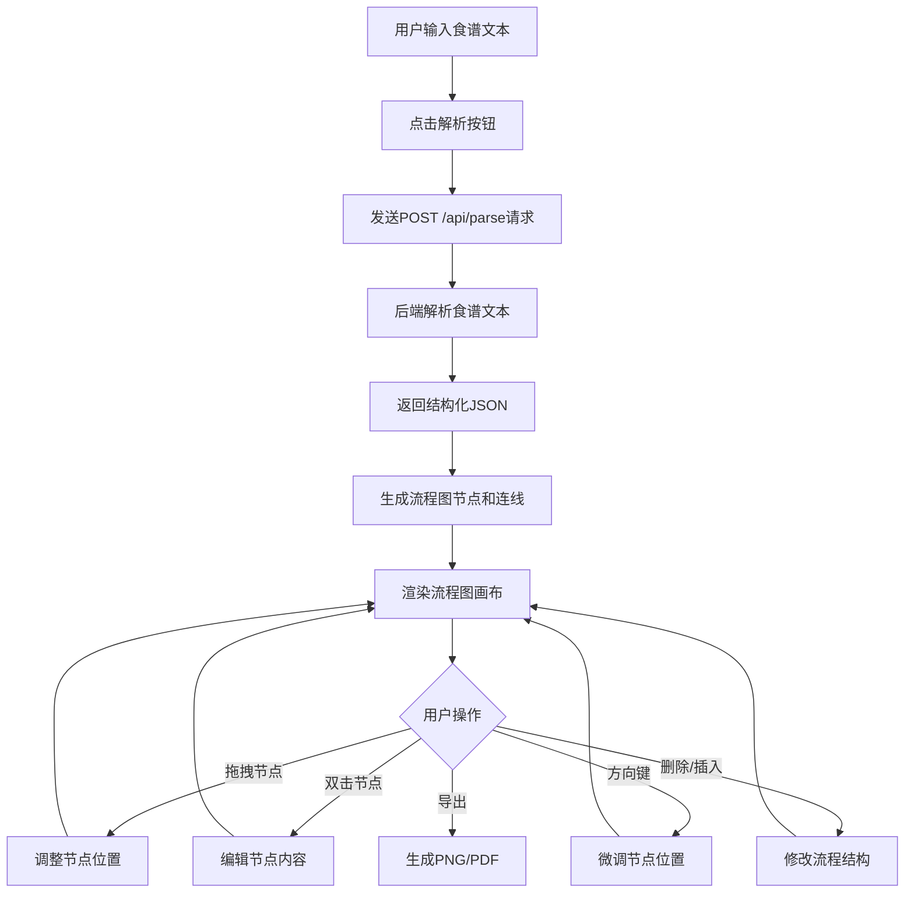

## 1. 产品概述

食谱流程图生成器是一款将文字食谱自动转换为可视化烹饪流程图的工具应用，解决传统菜谱信息密集、步骤顺序容易混淆、难以快速抓住关键时间点的问题。目标用户为家庭烹饪爱好者、食谱博主和烹饪教学工作者。

## 2. 核心功能

### 2.1 用户角色
| 角色 | 注册方式 | 核心权限 |
|------|----------|----------|
| 普通用户 | 无需注册 | 输入食谱、生成流程图、编辑流程图、导出流程图 |

### 2.2 功能模块
1. **食谱输入页**：文本输入区域、Markdown支持、解析触发按钮
2. **流程图编辑页**：可视化流程画布、节点卡片、连线、工具栏

### 2.3 页面详情
| 页面名称 | 模块名称 | 功能描述 |
|----------|----------|----------|
| 食谱输入页 | 文本输入区域 | 支持纯文本和Markdown格式的食谱输入，包含原材料清单和分步描述 |
| 食谱输入页 | 解析按钮 | 发送解析请求到后端API，处理返回的结构化数据 |
| 流程图编辑页 | 流程画布 | 解析数据生成节点和连线，支持鼠标滚轮缩放（0.5x-3.0x）和平移拖拽 |
| 流程图编辑页 | 节点卡片 | 显示步骤编号、操作图标（emoji）、简短描述、时间估算 |
| 流程图编辑页 | 连线 | 带箭头直线，颜色根据操作类型着色，淡入动画0.4s ease |
| 流程图编辑页 | 编辑功能 | 拖拽节点、双击编辑、方向键微调（10px）、删除/插入节点 |
| 流程图编辑页 | 导出功能 | 导出PNG（1920x1080）、导出PDF、预览打印效果 |

## 3. 核心流程

用户在输入区域粘贴或输入食谱文本（含原材料清单和分步描述），点击解析按钮后系统自动解析出每个步骤的食材、工具、时间和操作类型，生成流程图节点并渲染在画布上。用户可手动编辑流程图（拖拽、编辑、删除、插入节点），最后导出为PNG或PDF。

## 4. 用户界面设计

### 4.1 设计风格
- 主色：#E67E22（暖橙色），辅色：#F39C12（金黄色），背景色：#FFF8E1（暖白色）
- 按钮：圆角8px，按压缩放效果（scale(0.97)，transition 0.15s）
- 字体：标题使用 Playfair Display，正文使用 Noto Sans SC
- 布局：左右分栏（输入区+画布区），移动端上下堆叠
- 图标：根据操作类型自动匹配emoji图标（🔪切、🍳煮、🥘炖、🔥烤、🥣调、🫕蒸等）

### 4.2 页面设计概述
| 页面名称 | 模块名称 | UI元素 |
|----------|----------|--------|
| 食谱输入页 | 文本输入区域 | 暖色背景卡片，圆角14px，柔和阴影0 2px 8px rgba(0,0,0,0.1)，多行文本框 |
| 食谱输入页 | 解析按钮 | 主色#E67E22背景，白色文字，hover变深，按压缩放 |
| 流程图编辑页 | 流程画布 | 浅色背景，支持缩放平移，网格辅助线 |
| 流程图编辑页 | 节点卡片 | 白色背景，圆角14px，柔和阴影，操作类型emoji图标，步骤编号徽章 |
| 流程图编辑页 | 连线 | 带箭头，颜色按操作类型（煮橙色、切蓝色、烤红色、调绿色），淡入动画0.4s ease |
| 流程图编辑页 | 工具栏 | 顶部固定，导出按钮、缩放控制、插入节点按钮 |

### 4.3 响应式设计
- 桌面端（>1024px）：左右分栏布局，输入区占30%，画布区占70%
- 平板端（768px-1024px）：上下布局，输入区可折叠
- 移动端（360px-768px）：上下堆叠，画布区全宽，底部工具栏

### 4.4 交互细节
- 节点拖拽时：缩放至1.05倍，增加阴影
- 节点点击时：scale(0.97)，transition 0.15s
- 新节点插入：从顶部掉落动画，悬停200ms后落下
- 连线淡入动画：0.4s ease
- 画布缩放：0.5x至3.0x，鼠标滚轮控制
- 画布平移：鼠标拖拽空白区域
