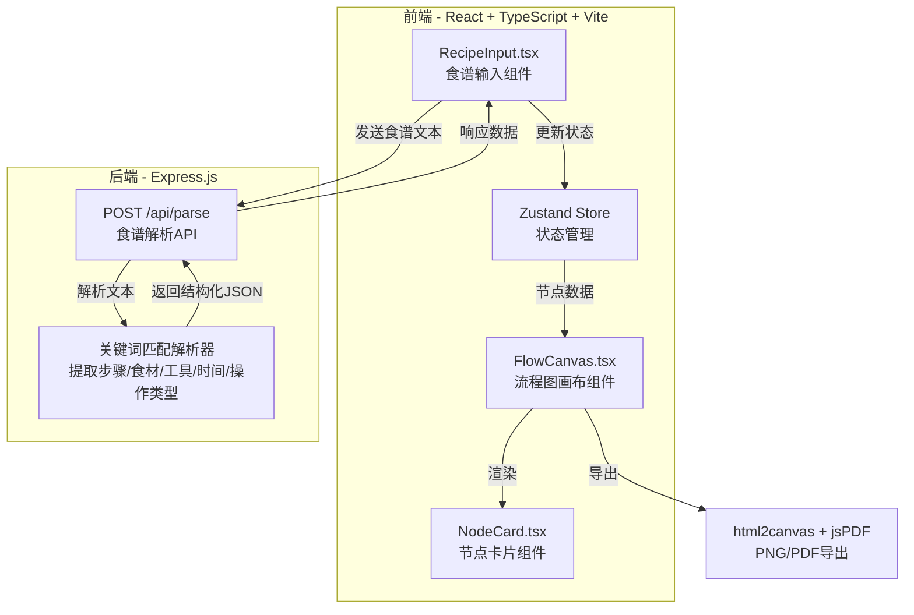
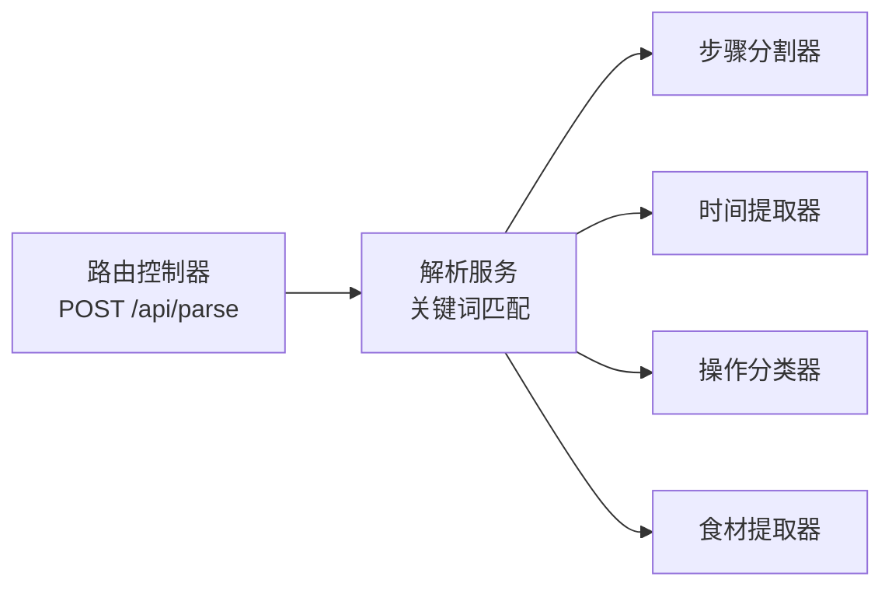
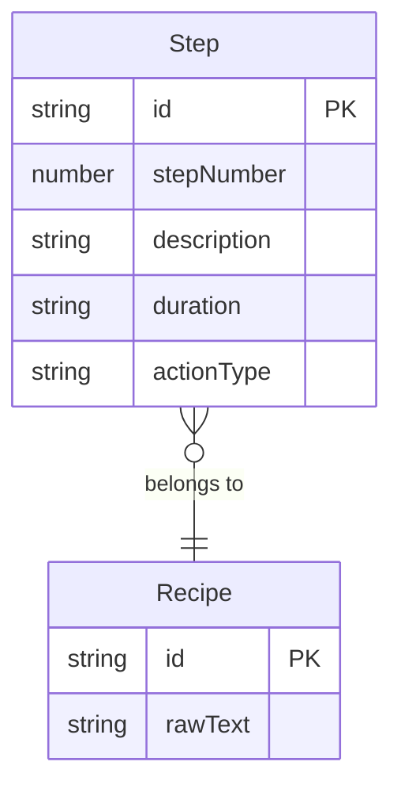

## 1. 架构设计



## 2. 技术说明
- 前端：React 18 + TypeScript + Vite + TailwindCSS
- 初始化工具：vite-init（react-express-ts模板）
- 后端：Express 4 + TypeScript
- 状态管理：Zustand
- 导出：html2canvas（PNG）+ jsPDF（PDF）
- 无数据库，解析结果仅在前端状态中维护

## 3. 路由定义
| 路由 | 用途 |
|------|------|
| / | 主页面，包含食谱输入和流程图编辑 |

## 4. API定义

### POST /api/parse

**请求体：**
```typescript
interface ParseRequest {
  text: string;
}
```

**响应体：**
```typescript
interface ParsedStep {
  id: string;
  stepNumber: number;
  description: string;
  ingredients: string[];
  tools: string[];
  duration: string;
  actionType: 'cut' | 'boil' | 'bake' | 'stew' | 'mix' | 'steam' | 'fry' | 'other';
}

interface ParseResponse {
  steps: ParsedStep[];
  ingredients: string[];
}
```

**解析规则：**
- 按行或编号分割步骤（匹配"步骤1"、"1."、"第一步"等模式）
- 提取时间信息（匹配"X分钟"、"X小时"、"X秒"等）
- 匹配操作关键词：切/砍/剁→cut，煮/焯→boil，烤/烘→bake，炖/焖→stew，调/拌/搅→mix，蒸→steam，煎/炒/炸→fry
- 提取食材名称（匹配常见食材关键词库）
- 提取工具（匹配常见烹饪工具关键词：刀、锅、烤箱、碗、盘等）

## 5. 服务器架构图



## 6. 数据模型

### 6.1 数据模型定义



### 6.2 前端状态模型（Zustand Store）

```typescript
interface FlowNode {
  id: string;
  stepNumber: number;
  description: string;
  ingredients: string[];
  tools: string[];
  duration: string;
  actionType: ActionType;
  x: number;
  y: number;
}

interface FlowState {
  nodes: FlowNode[];
  scale: number;
  offsetX: number;
  offsetY: number;
  selectedNodeId: string | null;
  editingNodeId: string | null;
  addNode: (node: FlowNode) => void;
  removeNode: (id: string) => void;
  updateNode: (id: string, updates: Partial<FlowNode>) => void;
  setNodes: (nodes: FlowNode[]) => void;
  setScale: (scale: number) => void;
  setOffset: (x: number, y: number) => void;
  setSelectedNode: (id: string | null) => void;
  setEditingNode: (id: string | null) => void;
}
```
