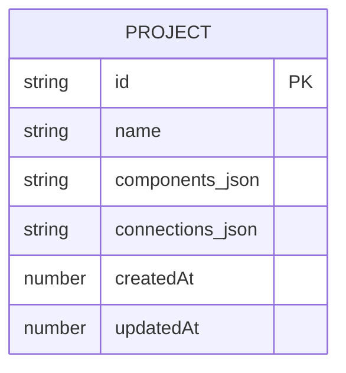

## 1. 架构设计

```mermaid
graph TD
    "浏览器" --> "Vite Dev Server (5173)"
    "Vite Dev Server (5173)" --> "React SPA"
    "React SPA" --> "Express Backend (3001)"
    "Express Backend (3001)" --> "内存存储"
    "React SPA" --> "Canvas组件"
    "React SPA" --> "Toolbar组件"
    "React SPA" --> "PropertyPanel组件"
    "Canvas组件" --> "组件渲染层"
    "Canvas组件" --> "连线渲染层"
    "Canvas组件" --> "交互处理层"
    "React SPA" --> "generatePrototype工具"
    "generatePrototype工具" --> "导出独立HTML"
```

## 2. 技术描述

- **前端**：React@18 + TypeScript + Vite@5 + @vitejs/plugin-react
- **状态管理**：React useState/useReducer（撤销重做） + Context
- **路由**：react-router-dom@6
- **HTTP客户端**：axios
- **唯一ID**：uuid
- **后端**：Express@4 + TypeScript + cors
- **数据存储**：内存存储（Map）
- **类型**：ESNext模块，严格模式

## 3. 路由定义

| 路由 | 用途 |
|-------|---------|
| `/` | 主编辑器页面 |
| `/prototype/:projectId` | 原型预览页面（独立HTML在新窗口打开） |

## 4. API 定义

### 4.1 保存项目

```typescript
// POST /api/projects
interface SaveProjectRequest {
  name: string;
  components: CanvasComponent[];
  connections: Connection[];
}

interface SaveProjectResponse {
  id: string;
  name: string;
  createdAt: number;
  updatedAt: number;
}
```

### 4.2 加载项目

```typescript
// GET /api/projects/:id
interface LoadProjectResponse {
  id: string;
  name: string;
  components: CanvasComponent[];
  connections: Connection[];
  createdAt: number;
  updatedAt: number;
}
```

### 4.3 项目列表

```typescript
// GET /api/projects
interface ProjectListResponse {
  projects: Array<{
    id: string;
    name: string;
    updatedAt: number;
  }>;
}
```

## 5. 服务器架构图

```mermaid
graph TD
    "app.ts" --> "routes/projects.ts"
    "routes/projects.ts" --> "controllers/projectController.ts"
    "controllers/projectController.ts" --> "stores/memoryStore.ts"
    "stores/memoryStore.ts" --> "内存Map存储"
```

简化版：所有后端逻辑集中在 `server/index.ts`，包含路由和内存存储。

## 6. 数据模型

### 6.1 数据模型定义



### 6.2 TypeScript 类型定义

```typescript
// 组件类型
type ComponentType = 'rectangle' | 'circle' | 'text' | 'image';

interface CanvasComponent {
  id: string;
  type: ComponentType;
  x: number;
  y: number;
  width: number;
  height: number;
  rotation: number;
  style: {
    backgroundColor?: string;
    borderColor?: string;
    borderWidth?: number;
    borderRadius?: number;
    color?: string;
    fontSize?: number;
    fontWeight?: number;
    src?: string;
  };
  content: string;
  zIndex: number;
}

interface Connection {
  id: string;
  fromComponentId: string;
  toComponentId: string;
  label: string;
}

interface Project {
  id: string;
  name: string;
  components: CanvasComponent[];
  connections: Connection[];
  createdAt: number;
  updatedAt: number;
}

// 历史状态
interface HistoryState {
  components: CanvasComponent[];
  connections: Connection[];
}
```

## 7. 项目文件结构

```
.
├── package.json
├── vite.config.js
├── tsconfig.json
├── index.html
├── server/
│   └── index.ts          # Express后端服务
└── src/
    ├── types.ts          # 全局类型定义
    ├── App.tsx           # 主应用组件
    ├── main.tsx          # 入口文件
    ├── components/
    │   ├── Canvas.tsx        # 画布组件
    │   ├── Toolbar.tsx       # 左侧组件面板
    │   └── PropertyPanel.tsx # 右侧属性面板
    └── utils/
        └── generatePrototype.ts  # 原型生成工具
```

## 8. 撤销重做设计

- 使用 `useHistory` hook 管理历史栈
- `past[]`：过去的状态（最多50条）
- `present`：当前状态
- `future[]`：未来的状态（重做队列）
- 每次修改组件/连线时 push 到 past，超出50条则丢弃最早记录
- Ctrl+Z：从 past 弹出，present 入 future
- Ctrl+Shift+Z：从 future 弹出，present 入 past
