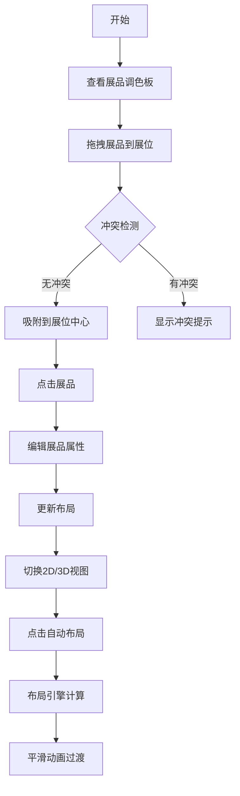

## 1. 产品概述

虚拟展厅布局编辑器是一个为数字艺术品展览平台设计的后台管理工具，专为策展人提供直观的展品布局规划功能。策展人可以通过拖拽方式将展品放置到展位，预览整体展览效果，实现高效的展览布局设计。

- 核心目标：简化策展流程，提供可视化布局规划能力
- 目标用户：策展人、展览设计师
- 市场价值：提升策展效率，降低布局规划的可视化程度

## 2. 核心功能

### 2.1 用户角色

| 角色 | 注册方式 | 核心权限 |
|------|----------|----------|
| 策展人 | 系统登录 | 展品管理、展位布局规划、预览展览效果 |

### 2.2 功能模块

1. **展品调色板**：展品缩略图列表，展品拖拽
2. **展厅编辑器**：2D/3D视图切换，缩放平移
3. **展位管理**：3x3网格展位，选中高亮
4. **展品编辑**：展品属性编辑（标题、尺寸、旋转角度）
5. **布局引擎**：冲突检测、自动布局算法

### 2.3 页面详情

| 页面名称 | 模块名称 | 功能描述 |
|-----------|-----------|------------------|
| 主编辑器 | 展品调色板 | 左侧面板展示待放置展品缩略图，支持拖拽 |
| 主编辑器 | 展厅视图 | 中央区域SVG渲染展厅平面图，支持缩放平移 |
| 主编辑器 | 工具栏 | 视图切换、自动布局按钮 |
| 主编辑器 | 编辑弹窗 | 点击展品弹出编辑面板，修改展品属性 |

## 3. 核心流程

## 4. 用户界面设计

### 4.1 设计风格
- 主色调：深蓝灰 #0f172a
- 强调色：青蓝色 #06b6d4
- 深色科技主题，毛玻璃效果
- 按钮：圆角8px，悬停scale(1.05)
- 字体：现代无衬线字体，标题加粗
- 布局：左侧窄面板 + 中央主体区域
- 阴影：多层阴影营造科技感
- 图标：线性简约风格

### 4.2 页面设计概览

| 页面名称 | 模块名称 | UI元素 |
|-----------|-----------|----------|
| 主编辑器 | 展品调色板 | 深色背景卡片、展品缩略图、拖拽状态、悬停效果 |
| 主编辑器 | 展厅视图 | SVG平面图、网格展位、展品渲染、缩放控件 |
| 主编辑器 | 工具栏 | 视图切换按钮、自动布局按钮、缩放控制 |
| 主编辑器 | 编辑弹窗 | 毛玻璃背景、表单输入、确认取消按钮 |

### 4.3 响应式设计
- 桌面端：左右布局，左侧调色板，中央展厅
- 移动端（<768px）：上下布局，上方调色板，下方展厅
- 触控优化：拖拽手势支持

### 4.4 动画与交互
- 拖拽跟随：平滑跟随鼠标
- 放置吸附：动画过渡到展位中心
- 视图切换：平滑旋转/缩放过渡
- 自动布局：平滑动画过渡
- 悬停效果：颜色微变 + scale(1.05)
