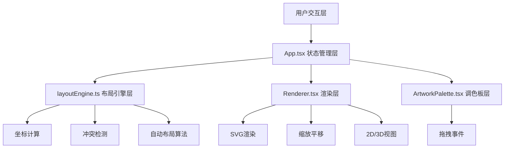

## 1. 架构设计



## 2. 技术选型

- 前端：React@18 + TypeScript + Tailwind CSS@3 + Vite@5
- 构建工具：Vite
- 状态管理：React useState/useReducer
- 渲染引擎：原生 SVG
- 动画：CSS transitions + requestAnimationFrame

## 3. 核心模块说明

### 3.1 类型定义

```typescript
interface Artwork {
  id: string;
  title: string;
  width: number;
  height: number;
  rotation: 0 | 45 | 90;
  thumbnail: string;
  color: string;
}

interface Booth {
  id: string;
  x: number;
  y: number;
  width: number;
  height: number;
  row: number;
  col: number;
}

interface PlacedArtwork extends Artwork {
  boothId: string;
  x: number;
  y: number;
}

interface LayoutState {
  booths: Booth[];
  placedArtworks: PlacedArtwork[];
  selectedBoothId: string | null;
  selectedArtworkId: string | null;
  viewMode: '2d' | '3d';
  scale: number;
  offset: { x: number; y: number };
}
```

### 3.2 布局引擎接口

```typescript
// 添加展品到展位
addArtwork(artwork: Artwork, booth: Booth, placed: PlacedArtwork[]): { x: number; y: number } | null

// 移除展品
removeArtwork(artworkId: string, placed: PlacedArtwork[]): PlacedArtwork[]

// 冲突检测
checkOverlap(newPos: { x: number; y: number; width: number; height: number, existing: PlacedArtwork[], excludeId?: string): boolean

// 获取放置建议
getPlacementSuggestions(artworks: Artwork[], booths: Booth[]): PlacedArtwork[]
```

### 3.3 渲染组件

```typescript
// 核心渲染逻辑
- SVG 平面图渲染
- 缩放变换
- 平移变换
- 2D/3D 视图切换
- 拖拽交互
```

## 4. 文件结构

```
auto4/
├── package.json
├── vite.config.js
├── tsconfig.json
├── index.html
└── src/
│   ├── App.tsx
│   ├── layoutEngine.ts
│   ├── Renderer.tsx
│   ├── ArtworkPalette.tsx
│   ├── main.tsx
│   └── index.css
```

## 5. 性能优化策略

- 拖拽优化：requestAnimationFrame 节流
- 渲染优化：React.memo 避免不必要重渲染
- 冲突检测：空间分区算法
- 动画优化：CSS transform 硬件加速
- 状态最小化：避免不必要的状态更新
```
