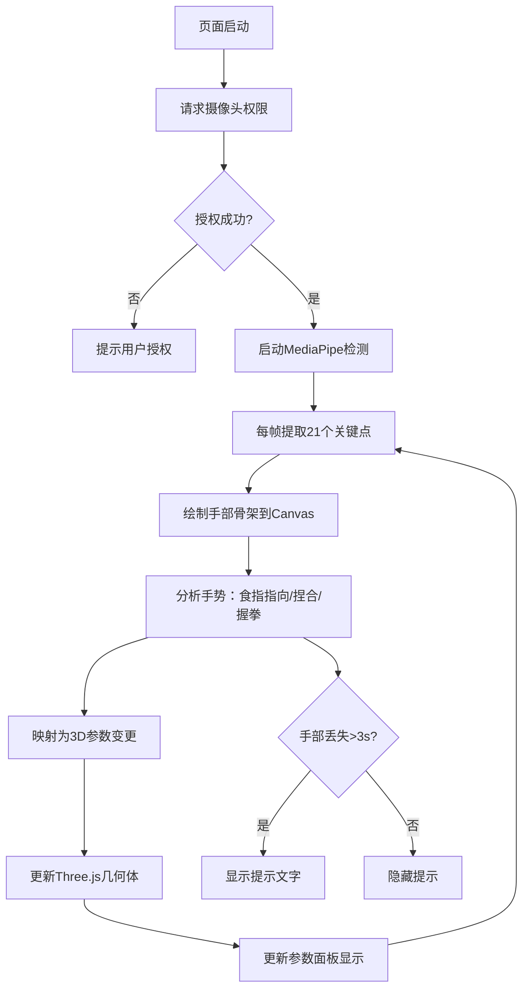

## 1. 产品概述
浏览器端手势识别与3D动效控制面板，用户通过摄像头捕捉手部动作，实时控制3D几何体的颜色、旋转角度和缩放比例，类似手势操作的乐高积木拼搭预览工具。
- 核心价值：零接触的自然交互体验，将手势识别与3D可视化结合，提供直观的参数调节方式
- 目标用户：创意设计师、3D爱好者、交互体验展示场景

## 2. 核心功能

### 2.1 功能模块
1. **手势识别模块**：摄像头视频采集、手部21个关键点实时检测、骨架可视化绘制
2. **3D场景模块**：Three.js渲染立方体、球体、环面结三个几何体，支持变换动画
3. **交互控制模块**：食指指向选中、捏合缩放、握拳旋转控制
4. **参数面板模块**：实时显示当前选中几何体的缩放、旋转速度等参数
5. **状态提示模块**：检测状态标签、手部缺失提示文字

### 2.2 页面详情
| 页面名称 | 模块名称 | 功能描述 |
|-----------|-------------|---------------------|
| 主页 | 摄像头预览区 | 320x240视频窗口，绘制手部骨架（白色连线+浅蓝色圆点），检测状态标签 |
| 主页 | 提示层 | 手部离开画面超3秒时显示半透明提示文字（淡入淡出0.5s） |
| 主页 | 3D场景区 | 右侧Three.js场景，三个悬浮几何体带半透明光圈 |
| 主页 | 选中反馈 | 食指指向保持1.5s选中，光圈变橙色脉冲动画（0.8s周期），几何体上下浮动（5px/2s周期） |
| 主页 | 手势控制 | 拇食指捏合控制缩放（0.5-2.0），握拳/张开控制旋转速度 |
| 主页 | 参数面板 | 左下角半透明毛玻璃面板，实时显示参数（圆角12px，padding 16px） |

## 3. 核心流程
用户启动页面后授权摄像头权限，系统开始实时检测手部。用户通过食指指向选中几何体，通过捏合手势调整缩放，通过握拳张开控制旋转，所有变化实时反馈到3D场景和参数面板。

## 4. 用户界面设计

### 4.1 设计风格
- 主色调：背景 #1a1a2e（深蓝紫夜空色），文字 #e0e0e0（浅灰白）
- 强调色：橙色 #ff9500（选中状态）、浅蓝色 #64b5f6（关键点）、绿色 #4caf50（检测中）、红色 #f44336（未检测）
- 边框色：#4a4a6a（深紫灰）
- 风格：深色科技风、毛玻璃质感、赛博朋克极简
- 过渡动画：所有状态变更 0.3s ease-out

### 4.2 页面设计概述
| 页面名称 | 模块名称 | UI元素 |
|-----------|-------------|-------------|
| 主页 | 摄像头预览 | 左上角固定320x240，圆角8px，细边框，下方状态标签（圆点+文字） |
| 主页 | 3D场景 | 右侧自适应区域，深色背景微粒子效果，三个几何体水平排列 |
| 主页 | 光圈效果 | 几何体周围半透明圆形光环，选中脉冲放大（scale 1.0→1.3→1.0） |
| 主页 | 参数面板 | 左下角backdrop-filter: blur(12px)，rgba(30,30,60,0.6)背景，圆角12px |
| 主页 | 提示文字 | Canvas中央，rgba(255,255,255,0.7)，字体24px，opacity淡入淡出 |

### 4.3 响应式
- 桌面端优先（≥1280px），布局：左列摄像头+参数面板，右列3D场景
- 小屏幕（<1280px）：上下布局，摄像头预览在上，3D场景居中，参数面板悬浮左下角

### 4.4 3D场景指导
- **环境与氛围**：纯深色 #1a1a2e 背景，添加少量星点粒子营造太空感
- **光照设置**：AmbientLight(0xffffff, 0.4) 环境光 + DirectionalLight(0xffffff, 0.8) 主光源 + PointLight 彩色点光源增强几何体质感
- **相机设置**：PerspectiveCamera(fov=60)，位置 z=8，固定视角不旋转
- **构图**：三个几何体在X轴上等距分布（x=-3, 0, 3），y=0，z=0
- **交互动画**：未选中时缓慢自转（Y轴），选中时上下浮动（sin函数偏移y），缩放/旋转参数平滑过渡
- **后期效果**：轻微抗锯齿，几何体使用 MeshStandardMaterial 带金属度0.3、粗糙度0.4
- **性能预算**：单页面场景，目标60fps，几何体面数控制在合理范围

## 5. 性能指标
- 手势检测帧率：≥25fps
- 手势识别到参数更新延迟：≤100ms
- 3D渲染帧率：60fps稳定
- 手部缺失判定窗口：3000ms
