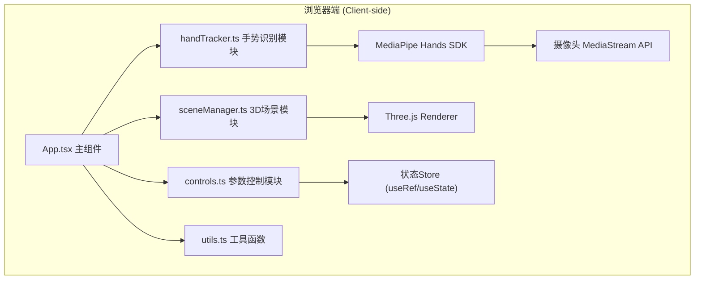

## 1. 架构设计



## 2. 技术描述
- **前端框架**：React@18 + TypeScript@5
- **构建工具**：Vite@5 + @vitejs/plugin-react
- **3D渲染**：Three.js@0.160（直接使用，不使用@react-three/fiber，按用户指定模块拆分要求）
- **手势识别**：@mediapipe/hands@0.4 + @mediapipe/camera_utils@0.3
- **样式方案**：原生CSS（CSS Modules嵌入React组件内，使用style属性 + CSS变量）
- **性能优化**：requestAnimationFrame合并渲染循环、useRef存储高频变化数据避免重渲染

### 依赖版本建议
```
react: ^18.2.0
react-dom: ^18.2.0
three: ^0.160.0
@mediapipe/hands: ^0.4.1675469240
@mediapipe/camera_utils: ^0.3.1675466124
@types/three: ^0.160.0
typescript: ^5.3.0
vite: ^5.0.0
@vitejs/plugin-react: ^4.2.0
```

## 3. 路由定义
| 路由 | 用途 |
|-------|---------|
| / | 主页：唯一页面，包含所有手势识别和3D交互功能 |

## 4. 模块详细设计

### 4.1 src/utils.ts - 工具函数
```typescript
// 坐标转换：归一化(0-1)MediaPipe坐标 → Canvas像素坐标
export function normalizeToPixel(
  normalized: { x: number; y: number },
  canvasWidth: number,
  canvasHeight: number
): { x: number; y: number };

// 两点间欧氏距离
export function distance(
  p1: { x: number; y: number; z?: number },
  p2: { x: number; y: number; z?: number }
): number;

// 数值范围映射 [inMin,inMax] → [outMin,outMax]
export function mapRange(
  value: number,
  inMin: number,
  inMax: number,
  outMin: number,
  outMax: number
): number;

// 数值夹紧 [min,max]
export function clamp(value: number, min: number, max: number): number;

// 线性插值（平滑过渡）
export function lerp(a: number, b: number, t: number): number;
```

### 4.2 src/handTracker.ts - 手势识别模块
```typescript
export interface HandLandmarks {
  landmarks: Array<{ x: number; y: number; z: number }>; // 21个归一化关键点
}

export type GestureType = 'pinch' | 'fist' | 'open' | 'pointing' | 'none';

export interface HandState {
  detected: boolean;                    // 是否检测到手
  landmarks: HandLandmarks | null;      // 原始关键点
  gesture: GestureType;                 // 当前手势
  pointingDirection: { x: number; y: number } | null; // 食指指向方向（归一化屏幕坐标）
  pinchDistance: number;                // 拇食指捏合距离（像素）
  fistStrength: number;                 // 握拳强度 0-1（1=完全握拳）
  lastDetectedTime: number;             // 上次检测到时间戳
  fps: number;                          // 检测帧率
}

export class HandTracker {
  constructor(videoElement: HTMLVideoElement, canvasElement: HTMLCanvasElement);
  start(): Promise<void>;               // 启动摄像头和检测
  stop(): void;                         // 停止
  getState(): HandState;                // 获取当前手部状态
  onUpdate(callback: (state: HandState) => void): void; // 状态更新回调
  drawSkeleton(): void;                 // 绘制骨架（白色连线+浅蓝6px圆点）
}
```

### 4.3 src/sceneManager.ts - 3D场景模块
```typescript
export interface GeometryParams {
  scale: number;          // 缩放 0.5-2.0
  rotationSpeed: number;  // 旋转速度系数 0-2（0=停止）
  color: string;          // 当前颜色hex
}

export interface SceneGeometry {
  id: 'cube' | 'sphere' | 'torusknot';
  mesh: THREE.Mesh;
  haloMesh: THREE.Mesh;    // 光圈网格
  params: GeometryParams;
  selected: boolean;
  floatOffset: number;     // 浮动动画相位
}

export class SceneManager {
  constructor(container: HTMLElement);
  init(): void;                          // 初始化场景、相机、光照、几何体
  dispose(): void;                       // 清理资源
  updateGeometry(id: string, params: Partial<GeometryParams>): void;
  setSelected(id: string | null): void;  // 设置选中
  render(): void;                        // 每帧渲染（调用动画循环）
  onFrame(callback: () => void): void;   // 每帧回调
  // 射线检测：屏幕坐标 → 是否击中某个几何体
  raycast(screenX: number, screenY: number): string | null;
}
```

### 4.4 src/controls.ts - 控制逻辑模块
```typescript
export interface ControlState {
  selectedId: string | null;             // 选中几何体ID
  selectedTimestamp: number;             // 选中时刻
  pointingAtId: string | null;           // 食指当前指向
  pointingStartTime: number;             // 开始指向时刻
  params: Record<string, GeometryParams>; // 各几何体参数
  lastPinchDistance: number;             // 用于缩放基准
  isPinching: boolean;
}

export class GestureController {
  constructor();
  // 每帧更新：输入手部状态 + 射线检测结果，输出参数变更
  update(
    handState: HandState,
    hitGeometryId: string | null,
    timestamp: number
  ): Partial<ControlState>;
  
  getState(): ControlState;
  reset(): void;
}
```

### 4.5 src/App.tsx - 主组件
```tsx
// 组件职责：
// 1. 声明周期管理：组件挂载→启动HandTracker+SceneManager，卸载→清理
// 2. 连接模块：handTracker.onUpdate → controller.update → sceneManager.updateGeometry
// 3. UI渲染：摄像头预览Canvas、3D容器div、状态标签、提示文字、参数面板
// 4. 动画循环统一调度：单个requestAnimationFrame驱动所有模块update
```

## 5. 文件结构
```
auto42/
├── package.json
├── vite.config.js
├── tsconfig.json
├── index.html
└── src/
    ├── App.tsx           # 主组件（UI+模块编排）
    ├── handTracker.ts    # MediaPipe手势识别
    ├── sceneManager.ts   # Three.js 3D场景
    ├── controls.ts       # 手势→参数映射逻辑
    └── utils.ts          # 工具函数
```

## 6. 关键时序与性能

### 6.1 主循环时序（单帧60fps≈16.6ms）
```
requestAnimationFrame(16ms)
  ├─ handTracker.getState()            [~1ms] 读取MediaPipe输出
  ├─ handTracker.drawSkeleton()        [~1ms] 2D Canvas绘制
  ├─ raycast(pointerX, pointerY)       [~0.5ms] Three.js射线检测
  ├─ controller.update(...)            [~0.2ms] 手势映射逻辑
  ├─ sceneManager.updateGeometry(...)  [~0.3ms] 参数应用（带平滑插值）
  └─ sceneManager.render()             [~3ms] WebGL渲染
  合计: < 7ms → 稳定60fps，延迟<100ms目标满足
```

### 6.2 选中判定机制
- 食指指尖点 + 方向向量投影到屏幕 → 得到屏幕坐标 pointX, pointY
- raycast(pointX, pointY) 检查是否击中某几何体ID
- 若同一ID连续被击中 ≥ 1500ms（1.5s），则置为 selected
- 若选中后食指离开或检测丢失，保持选中状态直到指向其他几何体或明确取消

### 6.3 手势判定阈值
- 捏合手势：拇指尖(4)与食指尖(8)距离 < 30px → pinch=true，距离值用于缩放映射
- 握拳强度：5个指尖(4,8,12,16,20)到掌根(0)的平均距离归一化后取反
  - 距离 < 阈值A → 完全握拳（fistStrength=1, rotationSpeed=0）
  - 距离 > 阈值B → 完全张开（fistStrength=0, rotationSpeed=2）
  - 中间线性插值
