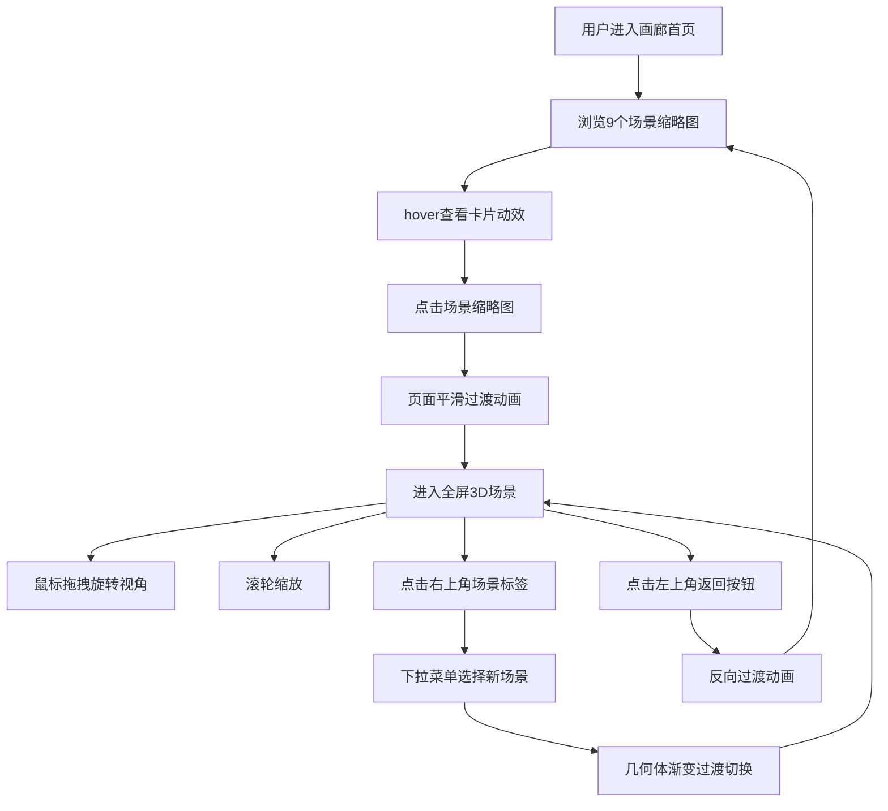

## 1. 产品概述

3D作品集画廊应用，以缩略图墙的方式呈现多个3D场景，用户点击后进入对应的全屏交互演示。主要用于数据可视化展示作品集项目，提供沉浸式的3D交互体验。

- 主要目的：展示多样化的3D数据可视化场景，提供流畅的浏览和交互体验
- 目标用户：设计师、开发者、作品集浏览者
- 市场价值：创新的3D画廊展示方式，提升作品集的视觉冲击力和用户体验

## 2. 核心功能

### 2.1 用户角色

| 角色 | 注册方式 | 核心权限 |
|------|----------|----------|
| 普通用户 | 无需注册 | 浏览场景缩略图、进入全屏3D演示、场景切换交互 |

### 2.2 功能模块

1. **画廊首页**：场景缩略图网格展示、响应式布局、hover交互动画
2. **全屏3D场景**：可交互3D几何体集群、鼠标/触摸操控、平滑相机跟随
3. **场景切换系统**：缩略图点击切换、下拉菜单切换、平滑过渡动画

### 2.3 页面详情

| 页面名称 | 模块名称 | 功能描述 |
|---------|----------|----------|
| 画廊首页 | 缩略图网格 | 9个场景卡片，响应式布局（桌面3列/平板2列/手机1列），卡片hover缩放阴影效果 |
| 全屏3D场景 | 3D渲染区 | 20+几何体动态集群，Y轴旋转，上下浮动，鼠标拖拽旋转视角，滚轮缩放 |
| 全屏3D场景 | 导航控件 | 左上角返回按钮，右上角场景名称标签及下拉切换菜单 |
| 过渡动画 | 页面切换 | 缩略图到全屏的淡出淡入+缩放过渡，场景间几何体透明度渐变过渡 |

## 3. 核心流程

用户浏览画廊首页 → 点击感兴趣的场景缩略图 → 页面平滑过渡到全屏3D演示 → 与3D场景交互（旋转视角、缩放）→ 点击右上角标签切换其他场景 → 点击返回按钮回到画廊首页

## 4. 用户界面设计

### 4.1 设计风格

- **主色调**：深色背景 #1a1a2e，全屏场景纯黑背景 #000000
- **配色方案**：每个场景拥有独特的主题色（橙色、蓝色、绿色、紫色、粉色、青色、红色、黄色、青色渐变等），用于卡片背景和几何体材质
- **按钮样式**：返回按钮为圆形，半透明黑色背景，hover增加透明度；场景标签为白色半透明背景，圆角8px
- **字体**：场景名称使用加粗字体，24px，白色
- **布局风格**：卡片式网格布局，圆角12px，gap 24px
- **动效风格**：所有交互元素拥有平滑过渡动画（0.2s-0.8s），ease-out缓动函数

### 4.2 页面设计概述

| 页面名称 | 模块名称 | UI元素 |
|---------|----------|--------|
| 画廊首页 | 缩略图网格 | 9张纯色卡片，居中白色粗体名称，圆角12px，hover缩放1.05倍+阴影，CSS Grid响应式布局 |
| 全屏3D场景 | 3D画布 | Three.js渲染的几何体集群，环境光+平行光，光泽材质，相机平滑跟随 |
| 全屏3D场景 | 返回按钮 | 左上角圆形按钮，半透明黑底，hover透明度提升，transition 0.2s |
| 全屏3D场景 | 场景切换 | 右上角白色半透明标签，点击展开下拉菜单，场景切换时几何体透明度渐变0.8s |

### 4.3 响应式

- 桌面端：3列网格布局，全屏3D场景鼠标操控
- 平板端：2列网格布局，全屏3D场景支持触摸和鼠标
- 移动端：1列网格布局，全屏3D场景支持触摸拖拽旋转、双指缩放

### 4.4 3D场景指引

- **环境与氛围**：全屏场景纯黑背景，营造沉浸感；几何体集群为视觉焦点
- **光照设置**：环境光（强度0.4）+ 平行光（强度1.0，位置[5,5,5]），创造材质光泽感
- **相机设置**：透视相机，初始位置[0,0,8]，fov 60，支持OrbitControls轨道控制
- **相机运动**：鼠标/触摸拖拽旋转，滚轮缩放，启用damping平滑跟随
- **构图与焦点**：20+几何体分布在x:[-5,5], y:[-3,3], z:[-2,2]空间，集群整体Y轴旋转（0.2 rad/s）
- **交互与动画**：每个几何体上下浮动（振幅0.2，周期1-2秒随机），场景切换时透明度渐变过渡（0.8s）
- **后处理效果**：几何体使用MeshStandardMaterial，metalness 0.3，roughness 0.4，呈现光泽质感
- **性能预算**：帧率≥30fps，初始加载≤2秒

### 4.5 性能约束

- 3D场景渲染帧率不低于30fps
- 场景切换动画流畅无卡顿
- 页面初始加载时间不超过2秒
