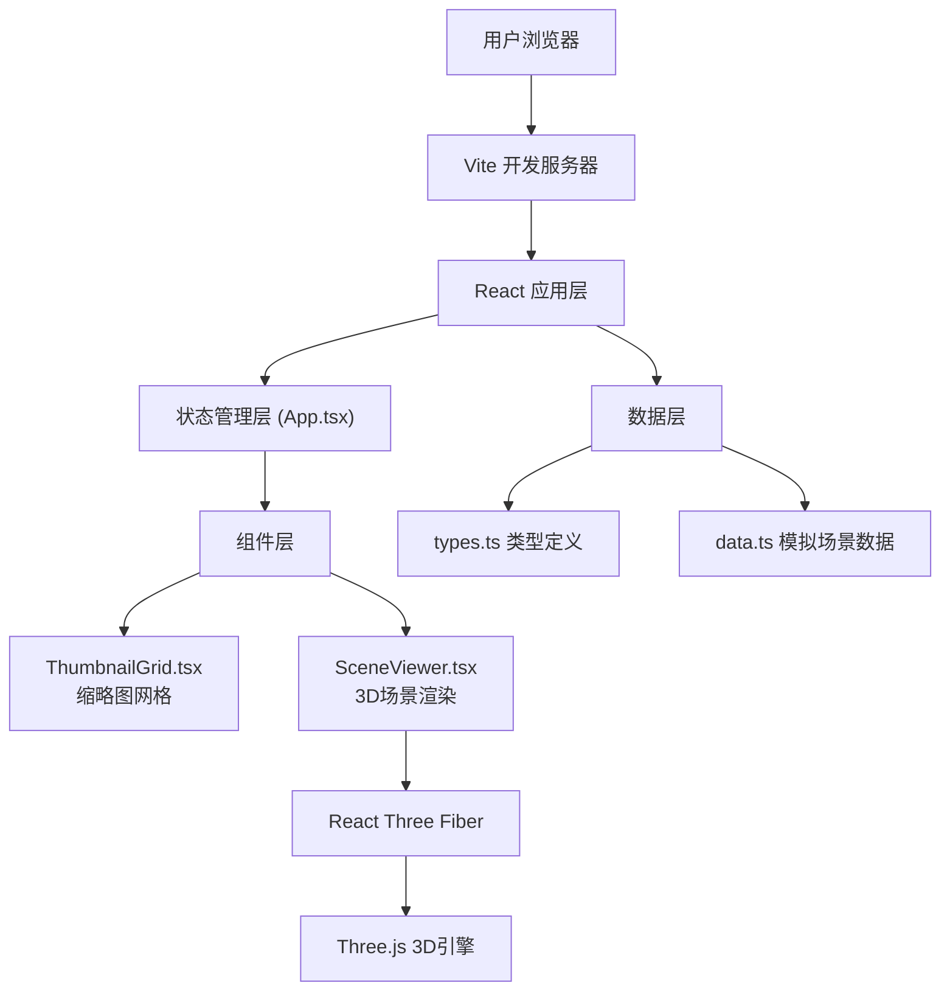

## 1. 架构设计



## 2. 技术描述

- **前端框架**：React@18 + TypeScript@5
- **构建工具**：Vite@5 + @vitejs/plugin-react@4
- **3D渲染引擎**：Three.js@0.160 + @react-three/fiber@8 + @react-three/drei@9
- **其他依赖**：uuid@9（用于生成唯一ID）
- **样式方案**：原生CSS（配合CSS Grid和CSS动画）
- **状态管理**：React Hooks (useState) 本地状态管理

## 3. 项目结构与数据流向

### 3.1 文件结构

```
src/
├── types.ts          # 类型定义 (SceneData)
├── data.ts           # 模拟场景数据 (9个场景)
├── App.tsx           # 根组件，状态管理
└── components/
    ├── ThumbnailGrid.tsx   # 缩略图网格组件
    └── SceneViewer.tsx     # 全屏3D场景组件
```

### 3.2 数据流向

1. **src/data.ts** → 提供模拟场景数据数组
2. **src/App.tsx** → 从data.ts获取数据，管理currentScene状态
3. **src/components/ThumbnailGrid.tsx** → 接收scenes数组和onSceneClick回调
4. **src/components/SceneViewer.tsx** → 接收currentScene数据，渲染3D内容

### 3.3 调用关系

- App.tsx 引入 types.ts、data.ts、ThumbnailGrid.tsx、SceneViewer.tsx
- ThumbnailGrid.tsx 引入 types.ts
- SceneViewer.tsx 引入 types.ts、@react-three/fiber、@react-three/drei、three

## 4. 核心数据模型

### 4.1 类型定义 (types.ts)

```typescript
interface SceneData {
  id: string;           // 场景唯一标识
  name: string;         // 场景名称
  primaryColor: string; // 主色调 (hex)
  accentColor: string;  // 辅助色 (hex)
  description: string;  // 缩略图描述
  geometryTypes: string[]; // 几何体类型配置
}
```

### 4.2 模拟数据 (data.ts)

包含9个不同主题的场景数据：
1. 橙色能量 (Orange Energy)
2. 深海探索 (Deep Ocean)
3. 森林秘境 (Forest Mystery)
4. 紫色星云 (Purple Nebula)
5. 粉色梦境 (Pink Dream)
6. 青色极光 (Cyan Aurora)
7. 熔岩核心 (Lava Core)
8. 金色沙丘 (Golden Dunes)
9. 量子空间 (Quantum Space)

每个场景包含独特的配色方案和几何体组合。

## 5. 核心组件设计

### 5.1 App.tsx (根组件)

- **状态**：currentScene: SceneData | null, isTransitioning: boolean
- **渲染逻辑**：
  - currentScene为null时渲染ThumbnailGrid
  - currentScene非null时渲染SceneViewer
- **过渡动画**：使用CSS类切换实现fade-in/out和scale效果

### 5.2 ThumbnailGrid.tsx (缩略图网格)

- **Props**：scenes: SceneData[], onSceneClick: (scene: SceneData) => void
- **布局**：CSS Grid，响应式断点：
  - ≥1024px: 3列
  - ≥768px: 2列
  - <768px: 1列
- **卡片样式**：纯色背景（来自primaryColor），圆角12px，hover缩放1.05，阴影增强

### 5.3 SceneViewer.tsx (3D场景渲染)

- **Props**：scene: SceneData, onBack: () => void, onSceneChange: (scene: SceneData) => void
- **3D元素**：
  - Canvas (React Three Fiber)
  - OrbitControls (相机控制)
  - ambientLight + directionalLight (光照)
  - 20+ 几何体（Box, Sphere, TorusKnot, Cone等）
  - 动画：组旋转 + 个体浮动
- **UI覆盖层**：返回按钮、场景标签下拉菜单
- **切换动画**：几何体opacity从1→0→1渐变过渡（0.8s）

## 6. 性能优化

- **Three.js 优化**：
  - 使用InstancedMesh替代多个独立Mesh（几何体数量多时）
  - 几何体几何信息复用
  - 材质共享减少GPU开销
- **React 优化**：
  - 使用useMemo缓存几何体数据
  - 使用useCallback避免不必要的重渲染
- **动画优化**：
  - 使用requestAnimationFrame（R3F内置useFrame）
  - 限制几何体数量在合理范围（20-30个）
