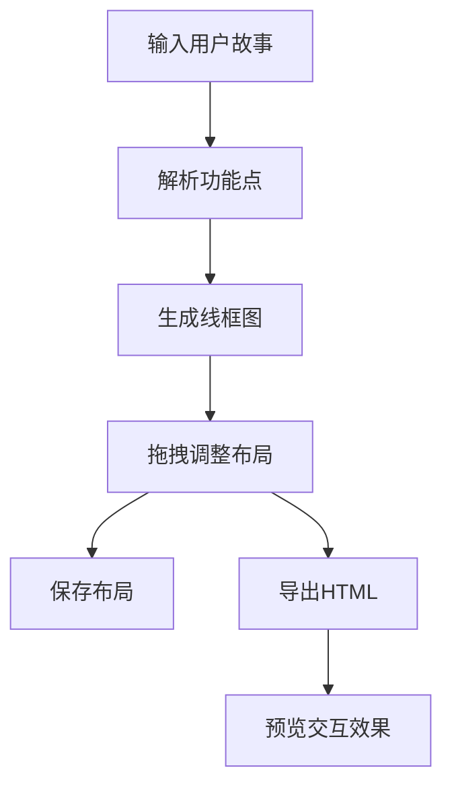

## 1. 产品概述

用户故事转线框图工具，帮助产品经理和开发团队将用户故事和功能描述自动转换为可交互的原型线框图，解决需求文档与视觉设计之间理解偏差大、沟通反复修改成本高的问题。

- 目标用户：产品经理、UI设计师、前端开发工程师
- 核心价值：将文字需求快速可视化，减少沟通成本，提升协作效率

## 2. 核心功能

### 2.1 用户角色

| 角色 | 注册方式 | 核心权限 |
|------|----------|----------|
| 普通用户 | 无需注册 | 输入用户故事、生成线框图、调整布局、导出HTML |

### 2.2 功能模块

1. **用户故事解析模块**：Markdown格式输入、自动解析角色/行动/预期结果、提取核心功能点
2. **线框图生成模块**：自动生成页面卡片、3列自适应网格布局、基础UI元素渲染
3. **拖拽调整模块**：元素拖拽移动、对齐辅助线、4px吸附、弹性回弹动画
4. **导出模块**：导出HTML预览文件、响应式布局、交互动画
5. **主题切换模块**：浅色/深色主题一键切换、平滑过渡动画

### 2.3 页面详情

| 页面名称 | 模块名称 | 功能描述 |
|----------|----------|----------|
| 主应用页面 | 顶部导航栏 | 应用名称、导出按钮、主题切换开关 |
| 主应用页面 | 左侧输入区 | Markdown编辑器、用户故事输入 |
| 主应用页面 | 垂直分割线 | 可拖拽调整左右区域宽度 |
| 主应用页面 | 右侧展示区 | 线框图网格、可拖拽元素、导出进度条 |

## 3. 核心流程

用户在左侧Markdown输入区输入用户故事列表，系统自动解析并提取功能点，右侧实时生成对应的线框图页面。用户可以拖拽调整线框图内元素位置，调整完成后点击导出按钮生成可交互的HTML预览文件。

## 4. 用户界面设计

### 4.1 设计风格

- 主色调：Indigo-500 `#6366f1`
- 强调色：Orange-500 `#f97316`
- 背景色：浅色 `#f8fafc` / 深色 `#0f172a`
- 按钮样式：圆角8px、按下缩放0.95、0.1s弹回动画
- 字体：等宽字体用于代码区，现代无衬线字体用于界面
- 布局风格：卡片式网格布局、固定顶部导航、左右分栏可调整

### 4.2 页面设计概述

| 页面名称 | 模块名称 | UI元素 |
|----------|----------|----------|
| 主应用 | 顶部导航栏 | 高度56px、白色背景、底部浅灰分隔线 |
| 主应用 | 左侧输入区 | 深色背景`#1e293b`、等宽字体、行高1.6、文本色`#e2e8f0` |
| 主应用 | 垂直分割线 | 宽度4px、hover变主色、可拖拽 |
| 主应用 | 线框图卡片 | 浅蓝灰色`#e2e8f0`填充、圆角8px、hover上移6px、阴影过渡 |
| 主应用 | 导出进度条 | 0-100%填充动画1.2s、淡出效果 |

### 4.3 响应式

- Desktop-first设计，移动端自适应
- 导出HTML在宽度小于768px时切换为竖排布局
- 导航栏变为汉堡菜单，点击展开菜单项交错飞入动画

### 4.4 交互动效

- 按钮点击：按下缩放0.95，0.1s弹回
- 输入框焦点：边框色从`#cbd5e1`渐变为主色，2px发光阴影，过渡0.2s
- 卡片hover：上移6px，阴影y偏移从2px变6px，过渡0.25s ease
- 拖拽结束：0.15s弹性回弹动画（scale略大于1后恢复）
- 主题切换：背景色和文字色0.4s渐变过渡
- 导出进度条：1.2s填充动画 + 淡出效果
